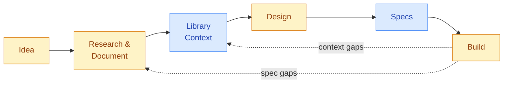

# Clarity Loop


**Stop generating code from vibes.** Clarity Loop is a [Claude Code](https://claude.ai/code) plugin that takes you from a vague idea to working code through structured research, reviewed documentation, visual design, and tracked implementation — with a human making every decision.

---

## The Problem

AI coding tools are great at writing code. They're terrible at knowing *what* to write.

Ask an LLM to "build me a todo app with auth" and you'll get plausible-looking code that falls apart as complexity grows: inconsistent data models across files, API contracts that contradict each other, Tailwind v3 patterns when you're using v4, stale imports from a library version that doesn't exist anymore. The bigger the project, the worse the drift.

The root cause isn't code generation — it's everything that happens *before* code generation. When your docs are vague, your specs are inconsistent, and your LLM thinks `better-sqlite3` is still on version 9, no amount of prompting fixes the output.

**Clarity Loop fixes the inputs so the outputs are correct.**

---

## What It Does

Clarity Loop manages five stages between "I have an idea" and "I have working code":

**1. Research and document.** You describe what you want to build. The plugin researches the problem, drafts system documentation (PRD, Architecture, TDD), and iterates with you through multi-round conversations. Every document is reviewed, cross-referenced against all other documents, and verified before moving forward.

**2. Build accurate library knowledge.** Before generating any code, the plugin researches the *actual current state* of every library in your tech stack — correct imports, breaking changes, working patterns, common gotchas. This knowledge is distilled into curated context files that get loaded during implementation. No more debugging stale API calls.

**3. Design the UI.** If your project has a user interface, the plugin runs a design discovery conversation, generates a design token system and reusable component library, then creates screen mockups. With [Pencil MCP](https://www.pencil.dev/), you get live visual artifacts. Without it, you get equivalent structured specs.

**4. Generate implementation specs.** Once all documentation is stable and verified, the plugin generates structured, implementation-ready specs — concrete types, enumerated edge cases, acceptance criteria. These are the bridge between "what to build" and "how to build it."

**5. Implement with tracking.** The plugin generates a unified task queue from specs, processes tasks front-to-back with acceptance criteria verification, handles runtime failures, reconciles external code changes on resume, and feeds spec gaps back into the documentation pipeline.

At every stage, the pattern is the same: **AI generates, human reviews, feedback refines, human approves.** Nothing advances without your judgment. And when implementation reveals that something upstream was wrong — a spec gap, a stale library pattern, an incomplete design — the pipeline loops back to fix the source, not paper over the symptom.

---

## What It Looks Like

```bash
# Start a new project
/doc-researcher bootstrap
# -> Auto-scaffolds docs directory structure
# -> Discovery conversation about your project
# -> Initial system docs generated (PRD, Architecture, TDD)
# -> "Your Architecture doc references 4 libraries. Create context files? [Y/n]"

# Research a feature
/doc-researcher research "user authentication"
# -> Multi-turn conversation grounded in your existing docs
# -> Research doc generated with findings and recommendations

# Generate a proposal
/doc-researcher proposal
# -> Concrete change manifest: what changes, where, why
# -> "Proposal generated. Read it over and let me know when you'd like to review."

# Review and merge
/doc-reviewer review
# -> Six-dimension review against all system docs
# -> Fix cycle until approved, then merge to protected system docs

# Generate specs and implement
/doc-spec-gen generate
/implementer start
/implementer run
# -> Task queue with acceptance criteria, context-aware implementation,
#    fix tasks for regressions, spec gap feedback to the pipeline
```

---

## Why Not Just Prompt and Ship?

For small projects, you should. Clarity Loop is for when "describe it and ship it" starts breaking:

- **5+ interconnected documents** that drift from each other without structured review
- **Complex tech stacks** where the LLM's training data doesn't match your library versions
- **Multi-day projects** where context compression loses decisions you made yesterday
- **Systems where correctness matters** — your auth flow can't just "look right," it has to *be* right

The tradeoff is deliberate: more process upfront, significantly more consistent output at the end. The pipeline catches cross-document contradictions, stale library patterns, incomplete specs, and implementation regressions — problems that compound silently in single-pass generation.

---

## Installation

```bash
# Marketplace
/plugin marketplace add dev-eloper1/clarity-loop
/plugin install clarity-loop@clarity-loop

# Or from source
git clone https://github.com/dev-eloper1/clarity-loop.git
claude --plugin-dir ./clarity-loop
```

Then start your project — bootstrap handles everything:

```bash
/doc-researcher bootstrap
```

This auto-scaffolds the directory structure, runs a discovery conversation about your project, and generates initial system docs. If collisions are detected with existing directories, you'll be prompted to choose an alternative docs root.

### Updating

```bash
# Marketplace
/plugin update clarity-loop

# Source
cd path/to/clarity-loop && git pull origin main
```

Updates never touch your project's docs — only the plugin's skills, hooks, and scripts.

---

## The Five Skills

| Skill | Command | What It Does |
|-------|---------|-------------|
| **doc-researcher** | `/doc-researcher` | Bootstraps initial docs, triages complexity, runs multi-turn research conversations, plans document structure, generates proposals, creates per-library context files |
| **doc-reviewer** | `/doc-reviewer` | Reviews proposals against all system docs, manages fix cycles, merges to protected system docs, verifies merges, runs system-wide audits, checks code-doc alignment, reviews designs |
| **doc-spec-gen** | `/doc-spec-gen` | Generates implementation-ready specs from verified system docs, runs cross-spec consistency checks |
| **ui-designer** | `/ui-designer` | Runs design discovery conversations, generates design tokens and component libraries, creates screen mockups with visual feedback loops, produces implementation task breakdowns |
| **implementer** | `/implementer` | Generates unified task queues from specs, tracks implementation progress, handles runtime failures and regressions, reconciles external changes, feeds spec gaps back into the pipeline |

---

## How the Pipeline Works



> Amber = human-in-the-loop. Blue = AI-driven. Dotted = feedback loops.

It's called Clarity **Loop** because problems flow backward, not just forward.

**Every stage loops internally.** AI generates a draft, you review it, give feedback, it refines, you approve. This micro-loop runs at every stage — research docs, proposals, design mockups, specs. Nothing advances until you're satisfied.

**Implementation loops back to the source.** When a build error traces to a wrong API call, that's a *context gap* — the pipeline routes it back to library context, not a code-level hack. When a spec is missing an edge case, that's a *spec gap* — it feeds back to research, gets documented, and flows forward again through review and specs. The fix happens where the mistake originated.

**Audits catch what individual changes miss.** Each proposal might be fine in isolation, but cumulative drift across 10 proposals can silently move the system away from its goals. Periodic audits compare the full documentation set against itself, flagging contradictions, stale claims, and goal drift — then feeding findings back into targeted research cycles.

### Key Mechanisms

**Protected system docs** — A `PreToolUse` hook blocks all direct writes to `{docsRoot}/system/`. Changes go through the pipeline: research, proposal, review, merge, verify.

**Library context files** — Per-library curated knowledge with three-layer progressive disclosure. The researcher creates them from official docs and context7.com. The implementer loads only what's relevant per task (~50-2000 tokens). Context is version-pinned — it matches the library version in use, not a calendar date.

**Manifest-based orientation** — Skills read a lightweight auto-generated index instead of every system doc. Targeted reads keep token costs low.

**Persistent state** — Every decision, task status, spec gap, and fix task is recorded in markdown files. Sessions crash, context compresses, models change — the pipeline picks up where it left off.

**Audit and drift detection** — Periodic health checks across all system docs. Drift analysis compares audit trends over time. Code-doc sync checks claims in docs against the actual codebase.

---

## Design Principles

> **AI does the work. Humans make the calls. Files hold the truth.**

1. **React, don't originate.** The human never faces a blank page. The AI generates first — a draft, a mockup, a task queue — and the human reacts.

2. **Judgment is the bottleneck, not effort.** The pipeline minimizes human effort but maximizes human judgment. Every gate is an approval.

3. **The system remembers.** Decisions are recorded with rationale in persistent files. Conversations are ephemeral; artifacts are permanent.

4. **Structured iteration beats one-shot generation.** Everything loops: generate, present, feedback, refine. The antidote to AI slop.

5. **Process protects the product — proportionally.** Triage determines depth. Trivial changes skip gates; complex changes get the full pipeline.

6. **Tools enhance, never gate.** The pipeline works with zero external tools. Pencil MCP and library context add richness, but the core is always available.

---

## Prior Art

Clarity Loop was designed after studying [BMAD](https://docs.bmad-method.org/) (enterprise-grade AI SDLC with 21 agent personas) and [GSD](https://github.com/glittercowboy/get-shit-done) (anti-bureaucracy spec-driven framework). It borrows BMAD's complexity routing and GSD's human discussion phase, but adds what neither has:

- Multi-round human discussion loops with persistent state across sessions
- Cross-document consistency verification (docs reviewed as a system, not individually)
- Visual design generation from written requirements
- Per-library context files with progressive disclosure for accurate implementation
- Audit and drift detection with trend analysis
- Implementation tracking with reconciliation, fix tasks, and spec gap feedback

For the full analysis: [Design Decisions](docs/research/DOC_PIPELINE_PLUGIN.md)

---

## Documentation

| Document | Covers |
|----------|--------|
| [doc-researcher](docs/doc-researcher.md) | Bootstrap, triage, research, structure, proposal, context modes |
| [doc-reviewer](docs/doc-reviewer.md) | Review, re-review, fix, merge, verify, audit, correct, sync, design-review modes |
| [doc-spec-gen](docs/doc-spec-gen.md) | Spec generation, waterfall gate, cross-spec consistency review |
| [ui-designer](docs/ui-designer.md) | Setup, tokens, mockups, build-plan modes, Pencil MCP integration |
| [implementer](docs/implementer.md) | Start, run, verify, status, sync modes, task queue, fix tasks, reconciliation |
| [Pipeline Concepts](docs/pipeline-concepts.md) | System doc protection, manifest, tracking files, context files, configuration |
| [Hooks](docs/hooks.md) | PreToolUse protection, PostToolUse manifest generation |

### Pencil MCP (Optional)

The ui-designer works with or without [Pencil](https://www.pencil.dev/) — a design-as-code tool with an MCP server. With Pencil, you get live visual design on an infinite canvas. Without it, you get equivalent structured markdown specs. See [Pencil setup](docs/ui-designer.md#pencil-setup) for installation.

---

## Project Structure

```
clarity-loop/
  .claude-plugin/
    plugin.json                     Plugin manifest
    marketplace.json                Marketplace catalog
  skills/
    doc-researcher/                 Research, proposals, library context
      SKILL.md
      references/
        bootstrap-guide.md
        research-template.md
        proposal-template.md
        document-plan-template.md
        context-mode.md
    doc-reviewer/                   Review, merge, verify, audit
      SKILL.md
      references/
        re-review-mode.md
        verify-mode.md
        audit-mode.md
        correction-mode.md
        merge-mode.md
        fix-mode.md
        sync-mode.md
        design-review-mode.md
    doc-spec-gen/                   Spec generation
      SKILL.md
      references/
        spec-consistency-check.md
    implementer/                    Task queue, implementation tracking
      SKILL.md
      references/
        start-mode.md
        run-mode.md
        verify-mode.md
        sync-mode.md
    ui-designer/                    Design system, mockups
      SKILL.md
      references/
        setup-mode.md
        tokens-mode.md
        mockups-mode.md
        build-plan-mode.md
        design-checklist.md
  hooks/
    hooks.json
    config.js
    protect-system-docs.js
    generate-manifest.js
  scripts/
    init.js
    init.sh
  templates/
    research-ledger.md
    proposal-tracker.md
    status.md
  docs/                             Detailed documentation
```

---

## Requirements

- [Claude Code](https://claude.ai/code) v1.0.33+
- Node.js v18+ (init script and hooks)
- No other dependencies

Optional: [Pencil](https://www.pencil.dev/) for visual design generation.

---

## Troubleshooting

**Skills don't show up** — Restart your Claude Code session. Skills load at session start.

**SSH auth error during install** — Claude Code clones via git. If SSH isn't configured for GitHub:
```bash
git config --global url."https://github.com/".insteadOf "git@github.com:"
```

**Install shows "(no content)"** — Known CLI feedback gap. Restart and check if `/doc-` autocomplete works.

---

## License

MIT
