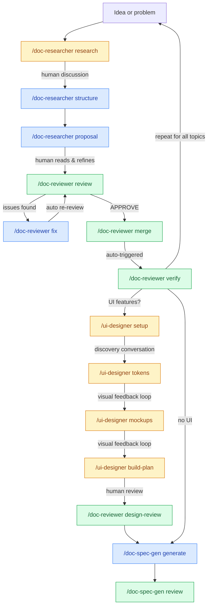
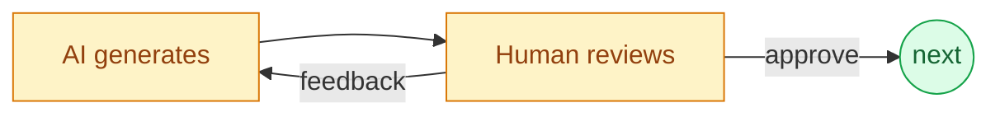
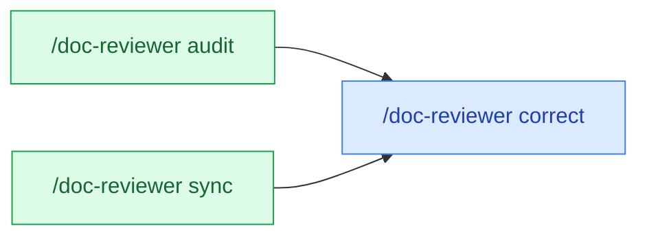
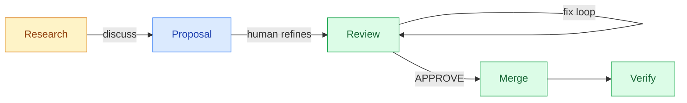

# Clarity Loop

A spec-first documentation and design pipeline plugin for [Claude Code](https://claude.ai/code). Research, review, and refine system documentation through structured gates — then generate design systems, screen mockups, and implementation specs. From vague idea to buildable artifact, with a human in the loop at every step.

## Philosophy

> **AI does the work. Humans make the calls. Files hold the truth.**

Six principles that shape every design decision in this plugin:

1. **React, don't originate.** The human never faces a blank page. The AI generates first — a token table, a screen mockup, a proposal draft — and the human reacts: "warmer blues", "too much spacing", "merge these sections." It's easier for humans to evaluate and refine than to create from scratch.

2. **Judgment is the bottleneck, not effort.** The pipeline minimizes human effort (the AI writes, researches, cross-references, tracks state) but maximizes human judgment (every gate is an approval, every artifact is reviewed). The human is the quality mechanism — the system does the work to make that judgment effective.

3. **The system remembers so the human doesn't have to.** Every decision is recorded with rationale in persistent files — DESIGN_PROGRESS.md, PROPOSAL_TRACKER.md, STATUS.md. Conversations are ephemeral; artifacts are permanent. If a session crashes or context compresses, the pipeline picks up from the last recorded state.

4. **Structured iteration beats one-shot generation.** No artifact is generated once and trusted. Everything loops: generate, present, feedback, refine. This is the antidote to AI slop — any single generation might be wrong, but structured iteration with human gates converges on quality.

5. **Process protects the product — proportionally.** System docs are pipeline-protected. You can't just edit them. But not everything needs the full pipeline — triage determines depth, corrections bypass research, trivial changes skip gates entirely. The ceremony matches the risk.

6. **Tools enhance, never gate.** Pencil MCP or markdown fallback, the documentation output is identical. The pipeline works with no specialized tools. Better tools add visual feedback loops, but the core value — vague idea to implementable spec — is always available.

---

## What It Does

Clarity Loop manages the lifecycle of system documentation through four skills:

| Skill | Command | Purpose |
|-------|---------|---------|
| **[doc-researcher](docs/doc-researcher.md)** | `/doc-researcher` | Bootstrap initial docs, triage complexity, research topics, plan document structure, generate proposals |
| **[doc-reviewer](docs/doc-reviewer.md)** | `/doc-reviewer` | Review proposals, fix issues, re-review, merge to system docs, verify merges, audit doc sets, apply corrections, check code-doc sync, review designs |
| **[doc-spec-gen](docs/doc-spec-gen.md)** | `/doc-spec-gen` | Generate structured specs from verified system docs, cross-spec consistency checks |
| **[ui-designer](docs/ui-designer.md)** | `/ui-designer` | Design discovery conversation, design token generation, reusable component library, screen mockups with visual feedback loops, implementation task breakdown |

The design pipeline bridges the gap between written requirements and visual output. Through a conversational discovery process ("What's the mood? What colors? What apps do you admire?"), it generates a complete design system — tokens, components, and screen mockups — then breaks it into phased implementation tasks. With [Pencil MCP](https://www.tldraw.com/), you get live visual artifacts with a generate-screenshot-feedback-refine loop. Without it, you get equivalent structured markdown specs.

---

## Not Vibe Coding

Clarity Loop is not a tool for generating code from loose descriptions. It is an AI-assisted engineering and product development tool — the kind of process you'd run at a well-managed team, compressed into a human-AI collaboration.

This means it will consume more tokens than a "describe it and ship it" workflow. Every document goes through research, proposal drafting, structured review, fix cycles, verification, and audit. That's intentional. The pipeline exists because single-pass AI generation produces plausible-looking output that drifts from reality as complexity grows. Structured iteration with human gates at every step is how you get documentation precise enough to generate reliable implementation specs.

The tradeoff is deliberate: more rigorous process upfront, significantly more consistent and trustworthy output at the end.

### How It Compares

Clarity Loop was designed after studying two established frameworks in this space:

**[BMAD](https://docs.bmad-method.org/)** (Breakthrough Method of Agile AI-Driven Development) structures the full software development lifecycle with 21 specialized AI agent personas — PM, Architect, Developer, QA, and more. It excels at scale-adaptive document generation and enterprise-grade phased pipelines. Clarity Loop borrows BMAD's complexity routing (not everything needs the full pipeline) and implementation readiness gates, but takes a different position on human involvement: where BMAD's review is validate-or-edit, Clarity Loop's is a multi-round conversation.

**[GSD](https://github.com/glittercowboy/get-shit-done)** (Get Shit Done) is an anti-bureaucracy spec-driven framework focused on shipping speed. It solves context rot through fresh subagent contexts per task and keeps ceremony minimal with four core commands. Clarity Loop borrows GSD's human discussion phase before planning and its subagent context isolation strategy, but diverges on scope — GSD optimizes for velocity to working code, Clarity Loop optimizes for documentation quality before any code is written.

| Capability | BMAD | GSD | Clarity Loop |
|-----------|------|-----|-------------|
| Scope | Full SDLC (idea to code) | Spec to code (shipping focus) | Idea to spec (documentation focus) |
| Human role | Validate/edit at gates | Discuss before planning | Conversational loop at every step |
| Review model | Tri-modal (create/validate/edit) | Plan verification | Multi-round review with cumulative issue tracking |
| Cross-doc consistency | Per-document validation | None | System-wide audit, drift detection, code-doc sync |
| Design generation | None | None | Visual design system + screen mockups (Pencil MCP) |
| Emerged concepts | None | None | Tracked and queued for future research |
| Token cost | Moderate | Low (optimized for speed) | Higher (optimized for thoroughness) |

What none of the existing frameworks do — and what Clarity Loop was built for:
- Iterative human discussion loops with persistent state tracking across sessions
- Cross-document consistency verification (docs reviewed as a system, not individually)
- Visual design generation from written requirements
- Audit and drift detection (periodic health checks + code-doc alignment)
- Pipeline-protected system docs with authorization markers

For the full prior art analysis and design decisions, see [DOC_PIPELINE_PLUGIN.md](docs/DOC_PIPELINE_PLUGIN.md).

---

## Lifecycle



Every amber node follows this pattern before advancing to the next step:



> Amber = human-in-the-loop. Blue = AI-driven. Green = approval gate.

**Correction shortcut** — when audit or review finds fixable issues, skip the full pipeline:



The audit report IS the research — no separate research cycle needed. The sync check compares doc claims against actual code and produces an advisory report.

---

## Installation

### From marketplace

```bash
# Add the Clarity Loop marketplace
/plugin marketplace add dev-eloper1/clarity-loop

# Install the plugin
/plugin install clarity-loop@clarity-loop
```

After installation, all four skills are available as slash commands in any Claude Code session.

### From source

Clone the repository and point Claude Code at it directly:

```bash
git clone https://github.com/dev-eloper1/clarity-loop.git
claude --plugin-dir ./clarity-loop
```

This is useful for development, customization, or contributing changes back.

---

## Setup

After installing, initialize your project's doc structure:

```bash
node clarity-loop/scripts/init.js
```

The init script checks for existing directories that might collide with Clarity Loop's default `docs/` structure. If collisions are found, you'll be prompted to choose an alternative docs root (e.g., `clarity-docs`). The choice is saved to `.clarity-loop.json`.

This creates:

```
.clarity-loop.json              Config file (commit to git)
docs/
  system/                       Protected system docs (pipeline-managed only)
  research/                     Research docs (R-NNN-slug.md)
  proposals/                    Proposals (P-NNN-slug.md)
  reviews/
    proposals/                  Review artifacts (auto-generated)
    audit/                      System audit reports + sync reports
    design/                     Design review artifacts
  specs/                        Generated specs (waterfall output)
  designs/                      Design files (.pen, DESIGN_PROGRESS.md)
  RESEARCH_LEDGER.md
  PROPOSAL_TRACKER.md
  STATUS.md
```

---

## Quick Start

### New project (no existing docs)

```bash
node clarity-loop/scripts/init.js       # Scaffold directory structure
/doc-researcher bootstrap               # Conversation -> initial system docs
```

### Existing project with docs

```bash
node clarity-loop/scripts/init.js       # Scaffold (collision detection runs)
/doc-researcher bootstrap               # Detects existing docs, offers to import
```

### Existing code, no docs

```bash
node clarity-loop/scripts/init.js       # Scaffold directory structure
/doc-researcher bootstrap               # Analyzes codebase, generates docs from conversation
```

After bootstrap, use the normal pipeline: `/doc-researcher research "topic"` to start a research cycle, then proposal, review, merge, verify.

---

## Pipeline Depth

Not every change needs the full pipeline. Triage determines the right level:

| Level | When | Pipeline |
|-------|------|----------|
| **0 — Trivial** | Typo, config tweak | Direct edit (no pipeline) |
| **1 — Contained** | Single feature, clear scope | Research note, then system doc update |
| **2 — Complex** | Cross-cutting, multi-doc impact | Full: research, proposal, review, merge, specs |
| **3 — Exploratory** | Unclear idea, needs discovery | Extended research, then full pipeline |

---

## Configuration

Clarity Loop stores its configuration in `.clarity-loop.json` at the project root:

```json
{
  "version": 1,
  "docsRoot": "docs"
}
```

| Field | Default | Description |
|-------|---------|-------------|
| `version` | `1` | Config format version |
| `docsRoot` | `"docs"` | Base path for all documentation directories |

All paths derive from `docsRoot`: `{docsRoot}/system/`, `{docsRoot}/research/`, `{docsRoot}/proposals/`, etc.

**When to change `docsRoot`**: If your project already uses `docs/system/` for other purposes. The init script detects collisions and prompts you automatically.

Commit `.clarity-loop.json` to git so all team members use the same docs root. If the file is missing, all tools fall back to `docs/`.

---

## How It Works

### Document Pipeline



Every proposal includes a **[Change Manifest](docs/doc-researcher.md#change-manifest)** — a table mapping each change to its target doc, section, change type, and research finding. The [reviewer](docs/doc-reviewer.md#review) verifies this contract. The [verify step](docs/doc-reviewer.md#verify) confirms the merge was complete.

### Design Pipeline


The design pipeline supports **Pencil MCP** (generates .pen files from scratch with visual feedback loops) and a **markdown fallback** (same documentation, no visual artifacts). Both produce DESIGN_SYSTEM.md, UI_SCREENS.md, and DESIGN_TASKS.md. See [ui-designer docs](docs/ui-designer.md) for full details.

### System Doc Protection

A [`PreToolUse` hook](docs/hooks.md#protect-system-docs) blocks all direct writes to `{docsRoot}/system/`. Three operations can temporarily authorize edits via a `.pipeline-authorized` marker:

| Operation | When | Purpose |
|-----------|------|---------|
| `bootstrap` | Initial doc creation | First-time setup |
| `merge` | Applying approved proposals | Pipeline-reviewed changes |
| `correct` | Targeted fixes from audit/review | Diagnosis already clear |

The marker is created before edits and removed immediately after. If a skill finds a stale marker on startup, it helps clean up the interrupted operation. See [pipeline concepts](docs/pipeline-concepts.md#system-doc-protection) for details.

### Manifest-Based Context Loading

Instead of reading every system doc to orient, skills read `{docsRoot}/system/.manifest.md` — a lightweight auto-generated index with file metadata, section headings with line ranges, and cross-references. Skills then do targeted reads of only the sections they need. The manifest auto-regenerates via a [`PostToolUse` hook](docs/hooks.md#generate-manifest) whenever system docs change.

### Emerged Concepts

During any pipeline phase, if a new idea surfaces that isn't tracked, it gets captured in STATUS.md. The [emerged concepts](docs/pipeline-concepts.md#emerged-concepts) table is a parking lot — concepts can be scoped into the research queue, deferred, or discarded.

---

## Documentation

Detailed documentation for every feature:

| Document | Covers |
|----------|--------|
| [doc-researcher](docs/doc-researcher.md) | Bootstrap, triage, research, structure, proposal modes |
| [doc-reviewer](docs/doc-reviewer.md) | Review, re-review, fix, merge, verify, audit, correct, sync, design-review modes |
| [doc-spec-gen](docs/doc-spec-gen.md) | Spec generation, waterfall gate, cross-spec consistency review |
| [ui-designer](docs/ui-designer.md) | Setup, tokens, mockups, build-plan modes, Pencil MCP integration |
| [Pipeline Concepts](docs/pipeline-concepts.md) | System doc protection, manifest, tracking files, pipeline depth, configuration, emerged concepts |
| [Hooks](docs/hooks.md) | PreToolUse protection, PostToolUse manifest generation, init script |

### Tracking Files

| File | Purpose |
|------|---------|
| `RESEARCH_LEDGER.md` | All research cycles — ID, topic, type, status, open questions |
| `PROPOSAL_TRACKER.md` | All proposals — ID, title, research ref, status, review round, conflicts |
| `STATUS.md` | High-level dashboard — pipeline state, emerged concepts, research queue |

See [Pipeline Concepts: Tracking Files](docs/pipeline-concepts.md#tracking-files) for field definitions and lifecycle details.

---

## Project Structure

```
clarity-loop/
  .claude-plugin/
    plugin.json                     Plugin manifest
    marketplace.json                Marketplace catalog
  skills/
    doc-researcher/
      SKILL.md
      references/
        research-template.md
        proposal-template.md
        document-plan-template.md
        bootstrap-guide.md
    doc-reviewer/
      SKILL.md
      references/
        re-review-mode.md
        verify-mode.md
        audit-mode.md
        correction-mode.md
        merge-mode.md
        fix-mode.md
        sync-mode.md
        design-review-mode.md
    doc-spec-gen/
      SKILL.md
      references/
        spec-consistency-check.md
    ui-designer/
      SKILL.md
      references/
        setup-mode.md
        tokens-mode.md
        mockups-mode.md
        build-plan-mode.md
        design-checklist.md
  hooks/
    hooks.json
    config.js                       Shared config loader
    protect-system-docs.js          PreToolUse: blocks direct system doc edits
    generate-manifest.js            PostToolUse: auto-regenerates manifest
  scripts/
    init.js                         Init script (Node.js, cross-platform)
    init.sh                         Thin wrapper
  templates/
    research-ledger.md
    proposal-tracker.md
    status.md
  docs/
    doc-researcher.md               doc-researcher skill documentation
    doc-reviewer.md                 doc-reviewer skill documentation
    doc-spec-gen.md                 doc-spec-gen skill documentation
    ui-designer.md                  ui-designer skill documentation
    pipeline-concepts.md            Core pipeline concepts
    hooks.md                        Hook system documentation
    DOC_PIPELINE_PLUGIN.md          Design lineage and decision log
```

---

## Pencil MCP Setup

The ui-designer skill works in two modes: **visual** (with Pencil MCP) and **markdown fallback** (without it). Both produce the same documentation artifacts, but Pencil gives you live visual design on an infinite canvas with a generate-screenshot-feedback-refine loop.

**What is Pencil?** A design-as-code tool that runs as a VS Code/Cursor extension or standalone desktop app. It uses `.pen` files (JSON-based, git-friendly) and exposes an MCP server locally — no cloud dependency. AI assistants can read, create, and modify designs programmatically through MCP tools like `batch_design`, `get_screenshot`, `set_variables`, and `snapshot_layout`.

### Install Pencil

| Platform | How |
|----------|-----|
| **VS Code / Cursor** | Search "Pencil" in Extensions, click Install |
| **macOS** | Download `.dmg` from [pencil.dev](https://www.pencil.dev/) |
| **Linux** | `.deb` package or `.AppImage` from [pencil.dev](https://www.pencil.dev/) |

### Verify MCP Connection

1. Open Pencil (extension or desktop app)
2. Open or create a `.pen` file
3. The MCP server starts automatically — no manual configuration needed
4. In Claude Code, the ui-designer skill auto-detects Pencil via `ToolSearch` at startup

If Pencil isn't detected, the skill falls back to structured markdown specs. You can install Pencil later and re-run `/ui-designer setup` to switch to visual mode.

For full documentation: [docs.pencil.dev](https://docs.pencil.dev/) | [AI Integration Guide](https://docs.pencil.dev/getting-started/ai-integration) | [.pen File Format](https://docs.pencil.dev/core-concepts/pen-files)

---

## Requirements

- [Claude Code](https://claude.ai/code) v1.0.33 or later
- Node.js v18+ (for init script and hooks)
- No other dependencies

Optional: [Pencil](https://www.pencil.dev/) for visual design generation in the ui-designer skill (see setup above).

---

## Troubleshooting

**Skills don't show up after install**

Restart your Claude Code session. The plugin system loads skills at session start — a fresh install mid-session won't be picked up until you restart.

**SSH authentication error during install**

```
git@github.com: Permission denied (publickey).
```

Claude Code clones plugins via git. If your machine doesn't have SSH keys configured for GitHub, the clone fails. Fix by telling git to use HTTPS:

```bash
git config --global url."https://github.com/".insteadOf "git@github.com:"
```

Then retry the install.

**Install shows "(no content)" with no confirmation**

This is a known feedback gap in the CLI — the plugin likely installed successfully. Verify by restarting your session and checking if the slash commands appear (type `/doc-` to see autocomplete).

---

## License

MIT
