# System Design

Comprehensive architecture reference for Clarity Loop — the spec-first documentation pipeline for Claude Code. This document explains how the system works at the architecture level: pipeline flow, state management, protection model, spec generation, implementation tracking, verification, and all feedback loops.

For what Clarity Loop does and why, see the [README](../README.md). For per-skill usage, see the [skill docs](#related-documentation). This document covers **how**.

---

## Table of Contents

1. [Architecture Overview](#1-architecture-overview)
2. [End-to-End Pipeline Flow](#2-end-to-end-pipeline-flow)
3. [cl-researcher Architecture](#3-cl-researcher-architecture)
4. [cl-reviewer Architecture](#4-cl-reviewer-architecture)
5. [cl-designer Architecture](#5-cl-designer-architecture)
6. [cl-implementer Architecture](#6-cl-implementer-architecture)
7. [State Management](#7-state-management)
8. [Protection Model](#8-protection-model)
9. [Context System](#9-context-system)
10. [Configuration System](#10-configuration-system)
11. [Decision Journal System](#11-decision-journal-system)
12. [Spec Generation Pipeline](#12-spec-generation-pipeline)
13. [Implementation Tracking](#13-implementation-tracking)
14. [Verification and Audit Systems](#14-verification-and-audit-systems)
15. [Feedback Loops and Error Recovery](#15-feedback-loops-and-error-recovery)
16. [Warmth Gradient](#16-warmth-gradient)
17. [Complete File Inventory](#17-complete-file-inventory)

---

## 1. Architecture Overview

Clarity Loop is a Claude Code plugin — a directory of skills, hooks, scripts, and templates that extend Claude Code's capabilities. It is not a standalone application; it runs inside Claude Code sessions and operates on project files.

### Plugin Structure

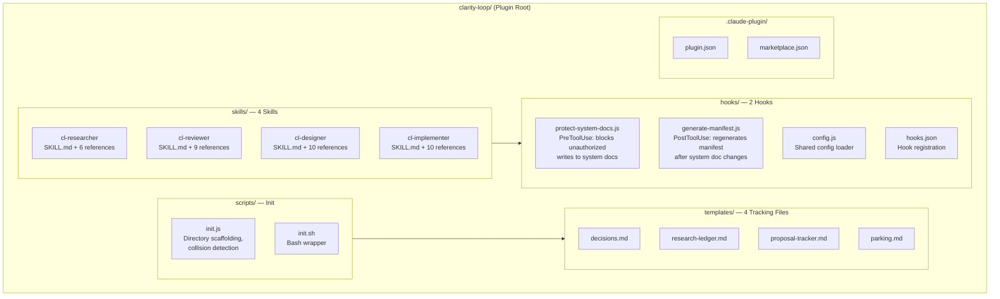

### Created Directory Structure

When a user runs `/cl-researcher bootstrap`, the init script creates this directory structure inside the user's project:

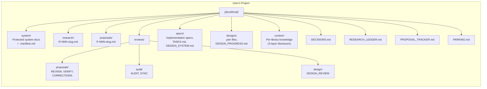

The `docsRoot` path defaults to `docs/` but is configurable via `.clarity-loop.json`. All skills resolve paths relative to this root.

### Reference File Convention

All reference files follow one of two templates based on their execution model.

**Tier 1: Structured** — For deterministic pipeline modes where step order is fixed and
outputs are predictable. Files have: YAML frontmatter, Variables table, Workflow section
with globally numbered steps, Verify checkpoints, inline error handling, and a Report
section with parseable summary lines.

**Tier 2: Guided** — For judgment-driven and conversational modes where the agent
exercises discretion. Files have: YAML frontmatter, Variables table, Guidelines section,
Process section with named Phases and Checkpoints, and an Output section.

Both tiers share: frontmatter, Variables, and a defined output section. The difference is
in the middle — Workflow (rigid) vs. Guidelines+Process (flexible).

**Frontmatter fields**: `mode`, `tier`, `depends-on`, `state-files`.

**Tier assignment**: 14 Tier 1 files, 21 Tier 2 files. See Section 17 for the complete
assignment table.

**Convention enforcement**: Skills instruct the agent to read frontmatter when loading a
reference file. A future lint script may validate compliance.

### Skill Responsibilities

| Skill | Responsibility | Modes |
|-------|---------------|-------|
| **cl-researcher** | Research, document, propose | bootstrap, triage, research, structure, proposal, context (7 modes) |
| **cl-reviewer** | Review, merge, verify, audit | review, re-review, fix, merge, verify, audit, correct, sync, design-review (9 modes) |
| **cl-designer** | Visual design and components | setup, tokens, mockups, build-plan (4 modes) |
| **cl-implementer** | Specs, tasks, implementation | spec, spec-review, start, run, autopilot, verify, status, sync (8 modes) |

**Total: 4 skills, 28 modes, 35 reference files.**

---

## 2. End-to-End Pipeline Flow

The pipeline is a forward path with multiple backward loops. Problems flow upstream to their source rather than being patched downstream.

### Main Forward Path

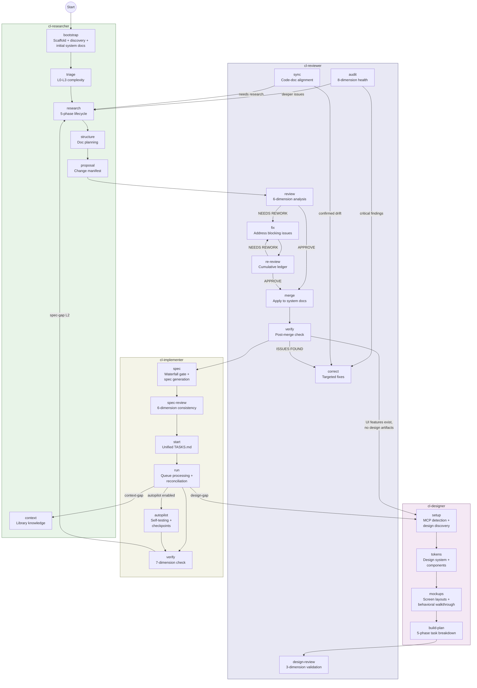

### Typical Full-Pipeline Walkthrough

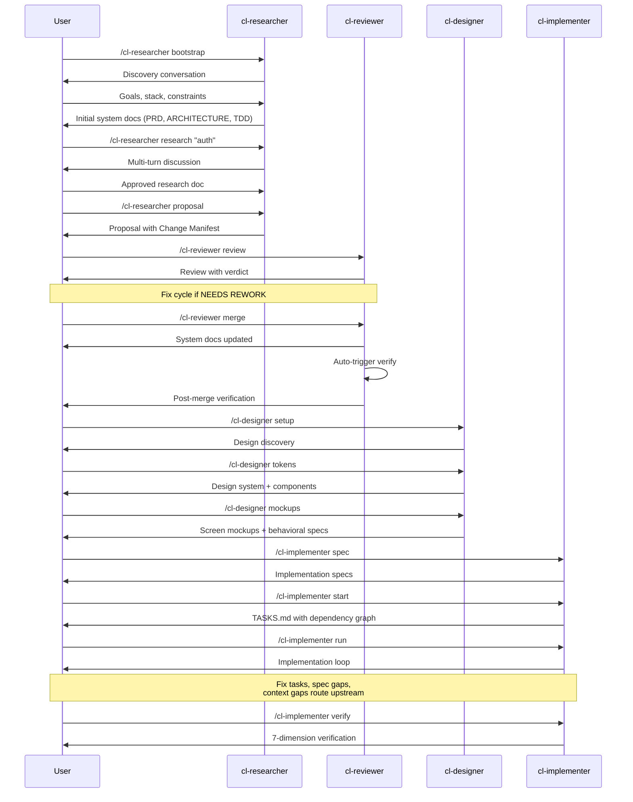

### Shortcut Paths

Not every change needs the full pipeline. Triage determines depth:

| Level | Pipeline Depth | Example |
|-------|---------------|---------|
| **L0 — Trivial** | Direct edit, no pipeline | Typo, config tweak |
| **L1 — Contained** | Lightweight research note → update | Single feature, clear scope |
| **L2 — Complex** | Full pipeline | Cross-cutting, multi-doc impact |
| **L3 — Exploratory** | Extended research, then full pipeline | Unclear idea, multiple approaches |

**Correction mode** (`/cl-reviewer correct`) bypasses the full pipeline for targeted fixes where the diagnosis is already clear — from an audit, verify, or sync report.

---

## 3. cl-researcher Architecture

The research skill has 7 modes that cover the full path from zero docs to a reviewable proposal.

### Bootstrap Decision Tree

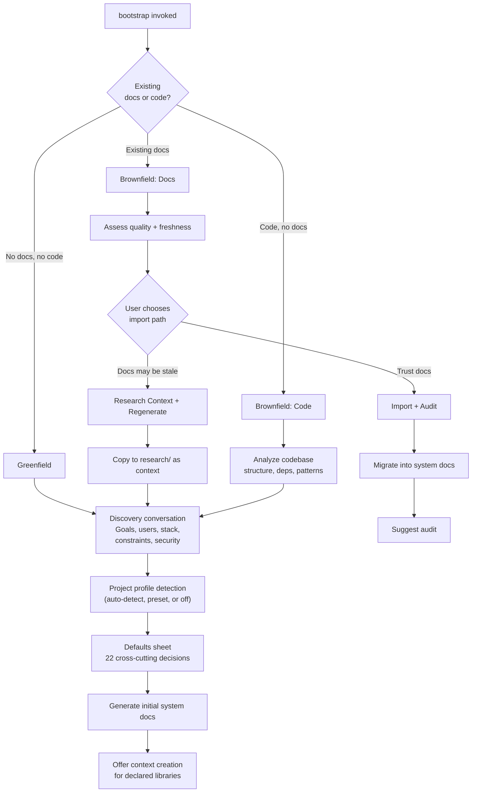

### Research Mode State Machine

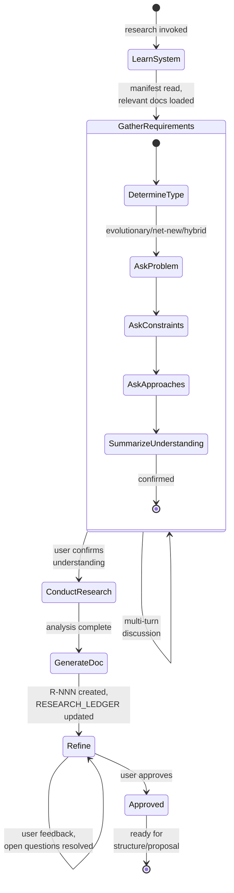

### Mode Summary

| Mode | Purpose | Key Outputs |
|------|---------|-------------|
| **bootstrap** | Scaffold and create initial docs | System docs, DECISIONS.md, tracking files |
| **bootstrap-brownfield** | Import/assess existing docs or generate from code | System docs from existing material |
| **triage** | Evaluate complexity (L0-L3) | Pipeline depth recommendation |
| **research** | Multi-phase conversational research | `docs/research/R-NNN-slug.md` |
| **structure** | Plan document structure post-research | Doc change plan with dependency graph |
| **proposal** | Generate concrete proposal from approved research | `docs/proposals/P-NNN-slug.md` with Change Manifest |
| **context** | Create per-library knowledge files | `docs/context/{library}/_meta.md` + topic files |

### Profile System

Bootstrap uses a project profile system to capture ~22 cross-cutting decisions efficiently:

1. **Auto-detect** (Level 1): Reads `package.json`, directory structure, existing config files to infer decisions (e.g., "Vitest detected from config")
2. **Quick research** (Level 2): For gaps auto-detect can't fill, brief web searches for library conventions
3. **Presets** (Level 3): Fallback defaults by project type ("Web Application", "API Service", "Library")
4. **Defaults sheet**: All decisions presented as a table — user confirms or overrides

Each decision is logged to DECISIONS.md with its source (`auto-detected`, `research-generated`, `preset:Web Application`, `user override`).

---

## 4. cl-reviewer Architecture

The reviewer skill has 9 modes that cover the full quality gate lifecycle.

### Review → Fix → Merge Path

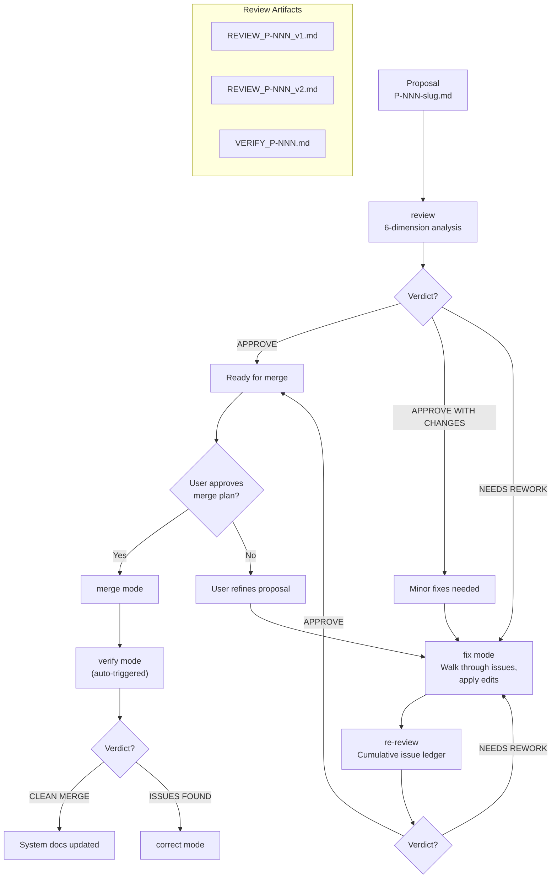

### Merge Mode Authorization Flow

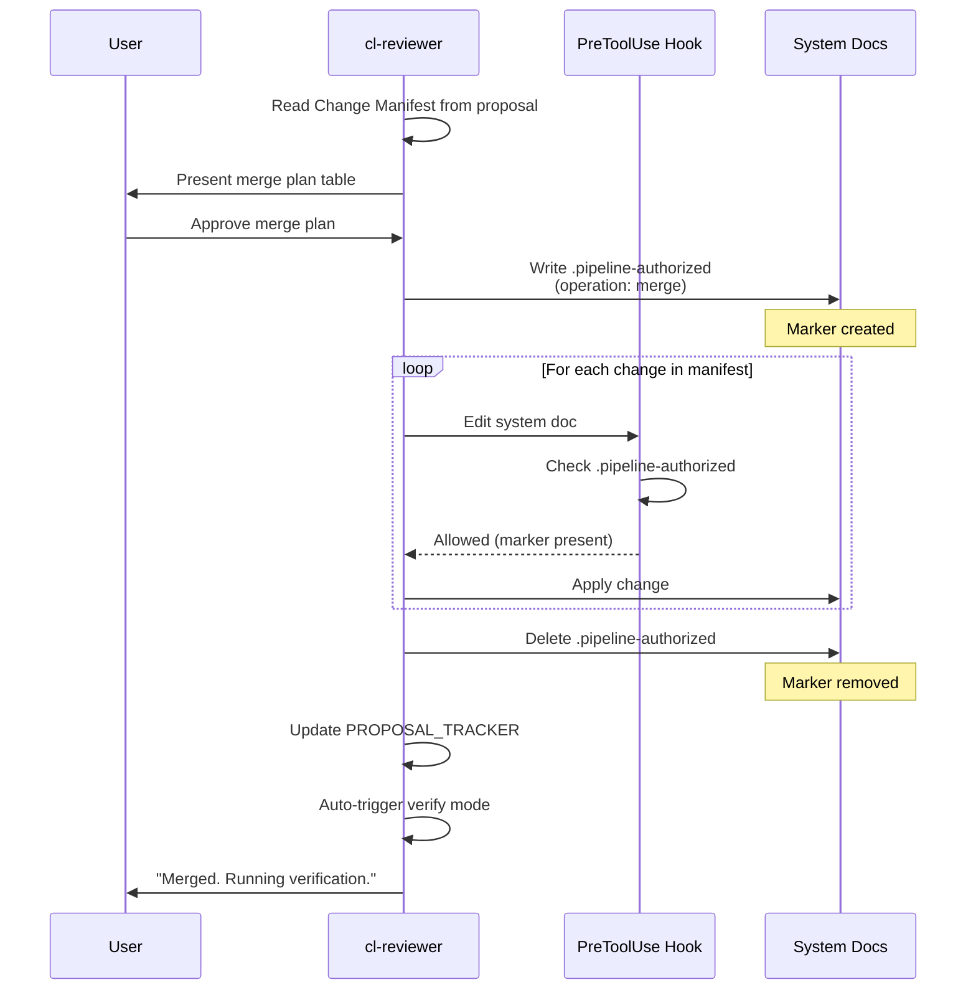

### Mode Summary

| Mode | Purpose | Output |
|------|---------|--------|
| **review** | 6-dimension analysis of proposal | `REVIEW_P-NNN_v1.md` |
| **re-review** | Cumulative ledger check after fixes | `REVIEW_P-NNN_v[N].md` |
| **fix** | Walk through blocking issues, apply edits | Modified proposal |
| **merge** | Apply approved proposal to system docs | Updated system docs |
| **verify** | Post-merge fidelity + consistency check | `VERIFY_P-NNN.md` |
| **audit** | 8-dimension system-wide health check | `AUDIT_YYYY-MM-DD.md` |
| **correct** | Targeted fixes from audit/verify/sync | `CORRECTIONS_DATE.md` |
| **sync** | Code-doc drift detection | `SYNC_YYYY-MM-DD.md` |
| **design-review** | 3-dimension design validation | `DESIGN_REVIEW_YYYY-MM-DD.md` |

### Six Review Dimensions

| # | Dimension | What It Catches |
|---|-----------|----------------|
| 1 | Value Assessment | Does this solve a real problem? Is complexity justified? |
| 2 | Internal Coherence | Later sections contradict earlier ones? Terms shift? |
| 3 | External Consistency | Conflicts with system docs? Redefines established terms? |
| 4 | Technical Soundness | Feasible? Scalability/security concerns? Edge cases? |
| 5 | Completeness | Unstated assumptions? Missing failure modes? |
| 6 | Spec-Readiness | Types concrete enough for spec generation? |

### Eight Audit Dimensions

| # | Dimension | Research Required |
|---|-----------|-----------------|
| 1 | Cross-Document Consistency | No |
| 2 | Within-Document Consistency | No |
| 3 | Technical Correctness | Yes — web search to verify claims |
| 4 | Goal Alignment & Drift | No — compares against previous audits |
| 5 | Completeness | No |
| 6 | Abstraction Coherence | No |
| 7 | Design Completeness | No |
| 8 | Staleness | No |

### Cumulative Issue Ledger (Re-Review)

Re-reviews do not check only the latest review's issues. They build a cumulative ledger from ALL previous reviews:

1. Collect every blocking issue and non-blocking suggestion from `REVIEW_P-NNN_v1.md`, `v2.md`, ..., `v[N-1].md`
2. Check each item: **Fixed**, **Partially fixed**, **Not fixed**, or **Regressed**
3. Regressions (fixed in an earlier round, re-broken by a later fix) are the highest-priority finding

This catches the pattern where fixing issue A silently re-breaks issue B from round 1.

---

## 5. cl-designer Architecture

The designer skill has 4 modes that bridge written requirements (PRD) to visual design artifacts.

### Designer Pipeline

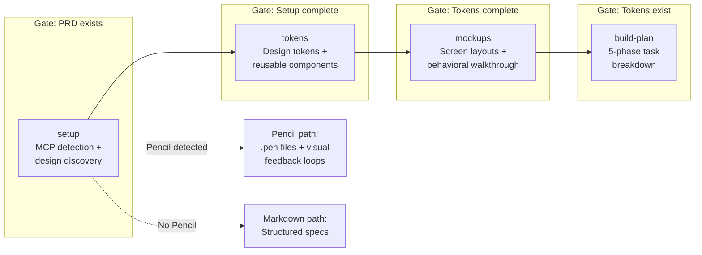

### Two Workflow Paths

| Aspect | Pencil Path | Markdown Fallback |
|--------|------------|-------------------|
| **Visual artifacts** | `.pen` files on infinite canvas | None |
| **Feedback loop** | Generate → screenshot → feedback → refine | Generate → present spec → feedback → refine |
| **Components** | Reusable nodes (`reusable: true`) | Structured component specs |
| **Mockups** | `ref` nodes instantiate components | Text descriptions reference components |
| **Output docs** | DESIGN_SYSTEM.md + UI_SCREENS.md + DESIGN_TASKS.md | Same three files |

Both paths produce identical documentation output. Pencil adds the visual feedback loop.

### Mode Summary

| Mode | Key Activities | Output |
|------|---------------|--------|
| **setup** | Detect Pencil MCP, run design discovery conversation, capture preferences | `DESIGN_PROGRESS.md` |
| **tokens** | Derive token values, generate color/type/spacing showcase, create reusable components with behavioral states + accessibility + boundary behavior | `DESIGN_SYSTEM.md`, `.pen` file |
| **mockups** | Screen inventory, layout generation, behavioral walkthrough per screen (states, interactions, navigation, content) | `UI_SCREENS.md` |
| **build-plan** | 5-phase task breakdown from design artifacts | `DESIGN_TASKS.md` |

### Behavioral Specification

A key design principle: mockups are not just visual layouts. Each screen gets a **behavioral walkthrough** that captures:

| Category | Content |
|----------|---------|
| **Screen states** | Default, empty (first-use), empty (filtered), loading, error (fetch), error (action), partial, offline, permission denied |
| **Interaction flows** | Per-action: trigger, happy path, error path, loading feedback, result |
| **Navigation context** | Route, auth required, back behavior, state persistence, focus on arrival |
| **Content decisions** | Actual copy for empty states, error messages, confirmation dialogs |

These behavioral contracts flow into UI_SCREENS.md and become acceptance criteria in DESIGN_TASKS.md.

### Canvas Layout Rules (Pencil)

- **Separate frames per section** arranged in a 2-column grid (not vertical column)
- **Auto-layout on every container** (`layoutMode: "VERTICAL"` or `"HORIZONTAL"` with explicit `gap`)
- **`snapshot_layout` after every `batch_design` call** to detect overlaps before showing screenshots
- **Components created with `reusable: true`** during tokens mode, referenced via `ref` nodes in mockups
- **One `.pen` file per project** — tokens, components, and mockups on the same infinite canvas

---

## 6. cl-implementer Architecture

The implementer skill has 8 modes that own the full build pipeline from specs to verified implementation.

### Spec Generation Pipeline

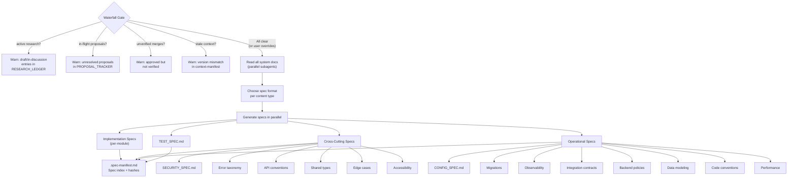

### Run Mode Task Processing Loop

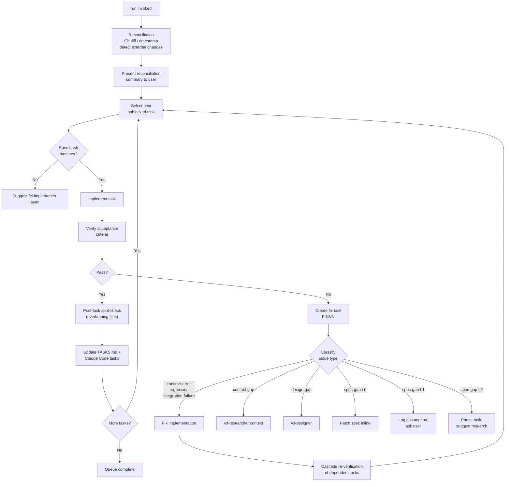

### Task Lifecycle States

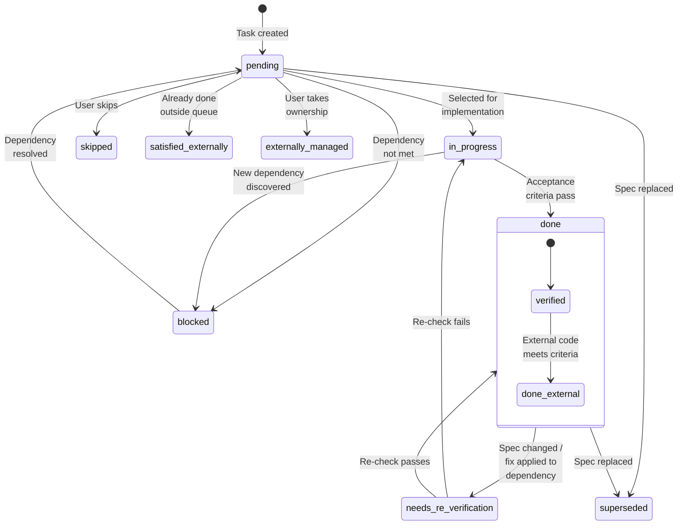

### Verify Mode — 7 Dimensions

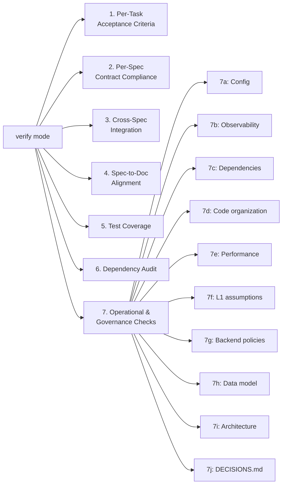

### Mode Summary

| Mode | Purpose | Key Output |
|------|---------|-----------|
| **spec** | Generate implementation specs (waterfall gate enforced) | `docs/specs/*.md`, `.spec-manifest.md`, `TEST_SPEC.md` |
| **spec-review** | Cross-spec consistency check (6 dimensions) | Inline consistency report |
| **start** | Generate unified task queue from all specs | `TASKS.md` |
| **run** | Reconcile, implement, verify, handle failures | Updated tasks, fix tasks |
| **autopilot** | Self-testing + configurable checkpoints + integration gates | Autonomous implementation with tests |
| **verify** | Post-implementation holistic check (7 dimensions) | Verification results in `TASKS.md` (Session Log section) |
| **status** | Progress report | Console output |
| **sync** | Adjust queue when specs change mid-implementation | Updated TASKS.md |

### Autopilot Additions

Autopilot extends run mode with three capabilities:

| Capability | How It Works |
|-----------|-------------|
| **Self-testing** | After each task, translates acceptance criteria → test cases, runs tests. On failure: 3 attempts, then stop. |
| **Integration testing** | At milestone boundaries (last task in area, all boundary tasks done), runs integration tests. Full suite gate before declaring complete. |
| **Autonomous progression** | Only stops at user-configured checkpoints (`none`, `phase`, `N`, `every`) or genuine blockers (L2 gaps, repeated failures, cascade regressions). |

---

## 7. State Management

Clarity Loop uses markdown files for all persistent state. No database, no binary formats. State survives session crashes, context compression, and multi-day breaks.

### Tracking Files

| File | Purpose | Updated By |
|------|---------|-----------|
| `DECISIONS.md` | System-wide decision journal | All skills |
| `RESEARCH_LEDGER.md` | Research cycle tracking | cl-researcher |
| `PROPOSAL_TRACKER.md` | Proposal lifecycle tracking | cl-researcher, cl-reviewer |
| `PARKING.md` | Parked findings, gaps, and ideas — classified by impact | All skills |

### Progress Files

| File | Purpose | Updated By |
|------|---------|-----------|
| `TASKS.md` (Session Log section) | Implementation session state, spec gaps, fix tasks, verification results | cl-implementer |
| `DESIGN_PROGRESS.md` | Design session state, MCP path, user decisions, component approvals | cl-designer |

### Manifests

| File | Purpose | Generated By |
|------|---------|-------------|
| `docs/system/.manifest.md` | System doc index — files, sections, line ranges, cross-references, content hash | `generate-manifest.js` (PostToolUse hook) |
| `docs/specs/.spec-manifest.md` | Spec index — files, source docs, format, content hashes | cl-implementer spec mode |
| `docs/context/.context-manifest.md` | Context file index — libraries, versions, file inventory | cl-researcher context mode |

### Tracking File Relationships

```mermaid
erDiagram
    DECISIONS ||--o{ RESEARCH_LEDGER : "decisions from research"
    DECISIONS ||--o{ PROPOSAL_TRACKER : "decisions from proposals"
    DECISIONS ||--o{ TASKS : "decisions from implementation"

    RESEARCH_LEDGER ||--o{ PROPOSAL_TRACKER : "research → proposal"
    PROPOSAL_TRACKER ||--o{ PARKING : "merged count, parked findings"

    PARKING ||--o{ RESEARCH_LEDGER : "parked ideas → research"

    DESIGN_PROGRESS ||--|| TASKS : "design tasks → TASKS.md"
    PROPOSAL_TRACKER ||--|| TASKS : "all verified → spec gate"

    MANIFEST["system/.manifest.md"] ||--o{ RESEARCH_LEDGER : "orient research"
    MANIFEST ||--o{ PROPOSAL_TRACKER : "orient review"
    SPEC_MANIFEST[".spec-manifest.md"] ||--o{ TASKS : "spec hashes"
    CONTEXT_MANIFEST[".context-manifest.md"] ||--o{ TASKS : "context loading"
```

### Session Start Protocol

Every skill follows the same session start protocol:

1. **Read `.clarity-loop.json`** — resolve `docsRoot`
2. **Check for stale `.pipeline-authorized` marker** — if present, a previous session crashed mid-operation
3. **Read tracking files** — DECISIONS.md, PARKING.md, and the skill's relevant tracker
4. **Orient the user** — 2-3 sentence summary of where things stand

This ensures skills never start blind, even after context compression or a new session.

---

## 8. Protection Model

System docs (`{docsRoot}/system/`) are the source of truth. They are protected from direct edits to prevent unreviewed changes from introducing contradictions and terminology drift.

### Write Flow with Hooks

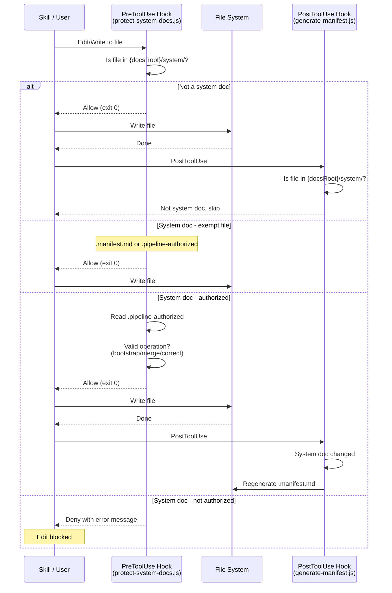

### Authorization Marker Lifecycle

The `.pipeline-authorized` marker is a temporary file that enables system doc writes:

| Phase | Action |
|-------|--------|
| **Create** | Skill writes marker with operation type, source, timestamp |
| **Write** | PreToolUse hook reads marker, allows edits to system docs |
| **Remove** | Skill deletes marker immediately after all edits are complete |
| **Stale detection** | Next session's startup check finds orphaned marker, helps clean up |

Three operations create markers:

| Operation | Created By | Purpose |
|-----------|-----------|---------|
| `bootstrap` | cl-researcher | Initial system doc creation |
| `merge` | cl-reviewer | Apply approved proposal |
| `correct` | cl-reviewer | Targeted fixes from audit/verify |

### Exempt Files

Two files in `{docsRoot}/system/` are always writable (no marker needed):
- `.manifest.md` — auto-generated index, written by PostToolUse hook
- `.pipeline-authorized` — the marker itself, written/deleted by skills

---

## 9. Context System

Context files capture the delta between LLM training data and current library reality. They prevent stale library patterns (wrong imports, removed APIs, deprecated patterns) from poisoning implementation.

### Three-Layer Progressive Disclosure

| Layer | File | Loads When | Token Cost | Content |
|-------|------|-----------|-----------|---------|
| **1 — Index** | `.context-manifest.md` | Always (task start) | ~50/library | Library list, versions, file inventory |
| **2 — Overview** | `{library}/_meta.md` | Working with that library | ~500-2000 | Breaking changes, correct imports, key patterns |
| **3 — Detail** | `{library}/{topic}.md` | On demand | Variable | Topic-specific patterns, code snippets, gotchas |

### Standard Loading Protocol

All skills follow the same loading sequence:

1. Read `.context-manifest.md` (Layer 1) — always loaded, minimal cost
2. When a task involves library X, load `{library}/_meta.md` (Layer 2)
3. When a specific topic within library X is needed, load `{library}/{topic}.md` (Layer 3)

### Staleness Detection (3 Signals)

Context staleness is **version-pinned**, not time-based:

| Signal | Source | Action |
|--------|--------|--------|
| **Version mismatch** | `package.json` version ≠ `_meta.md` pinned version | Trigger context update/versioning |
| **1-week soft check** | Time since creation | Check for errata within current version range |
| **Implementation failure** | cl-implementer reports `context-gap` | Route to `/cl-researcher context` for refresh |

### Storage and Precedence

| Location | Scope | Committed to Git |
|----------|-------|-----------------|
| `{docsRoot}/context/` | Project-local | Yes |
| `~/.claude/context/` | Global (cross-project) | No |

**Precedence**: Project-local > Global. Local context can be promoted to global after validation across multiple projects.

---

## 10. Configuration System

All configuration lives in `.clarity-loop.json` at the project root.

### Field Reference

| Field | Type | Default | Description |
|-------|------|---------|-------------|
| `version` | number | `1` | Config format version |
| `docsRoot` | string | `"docs"` | Base path for all documentation directories |
| `implementer.checkpoint` | string/number | `"every"` | Autopilot oversight: `"none"`, `"phase"`, a number, or `"every"` |
| `implementer.l1ScanFrequency` | number | `5` | Tasks between L1 assumption accumulation scans (0 = disabled) |
| `ux.reviewStyle` | string | `"batch"` | Artifact review style: `"batch"`, `"serial"`, `"minimal"` |
| `ux.profileMode` | string | `"auto"` | Profile detection: `"auto"`, `"preset"`, `"off"` |
| `ux.autoDefaults` | string | `"tier3"` | Auto-proceed boundary: `"none"`, `"tier3"`, `"tier2-3"` |
| `ux.parallelGeneration` | boolean | `true` | Pre-generate downstream work during review |
| `testing.integrationGate` | boolean | `true` | Run integration tests at milestone boundaries |
| `testing.fullSuiteGate` | boolean | `true` | Run full test suite before declaring completion |

### Tier Threshold Logic

The `ux.autoDefaults` setting controls which checkpoint tiers proceed without user input:

| Setting | Tier 1 | Tier 2 | Tier 3 |
|---------|--------|--------|--------|
| `"none"` | Review | Review | Review |
| `"tier3"` (default) | Review | Review | Auto-proceed |
| `"tier2-3"` | Review | Auto-proceed | Auto-proceed |

**Tier definitions:**

| Tier | Behavior | Examples |
|------|----------|---------|
| **Tier 1 — Must Confirm** | Pipeline stops, waits for explicit approval | Design direction, merge plan, structure lock, build plan |
| **Tier 2 — Batch Review** | Generated in batch, user reviews the set | Token values, component set, screen states, task list details |
| **Tier 3 — Auto-proceed** | Sensible defaults, logged to DECISIONS.md with `[auto-default]` tag | Accessibility details, edge case lists, contract tests, checklist items |

---

## 11. Decision Journal System

DECISIONS.md is the system-wide decision journal. Every skill reads it at session start and writes to it when decisions are made. It prevents re-discussion of settled questions and ensures consistency across multi-day, multi-session projects.

### Decision Flow

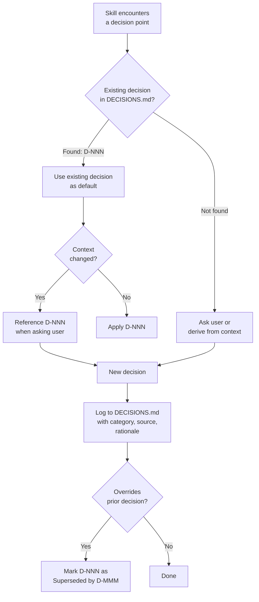

### "Read Before Asking" Protocol

Before asking any question that maps to a category, skills must:

1. Check DECISIONS.md for existing decisions in that category
2. If found, use the existing decision as the default
3. Only ask the user if the context has genuinely changed
4. When overriding, reference the existing decision

### 22 Category Tags

| Category | Scope | Consumed By |
|----------|-------|-------------|
| `auth` | Authentication strategy | spec-gen, implementer |
| `authorization` | Authorization model | spec-gen, implementer |
| `errors` | Error handling, display, format | designer (behavioral), spec-gen, implementer |
| `testing` | Framework, boundaries, coverage | spec-gen (TEST_SPEC.md), implementer |
| `api-style` | Conventions, pagination, naming | spec-gen, implementer |
| `accessibility` | WCAG level, interaction mode | designer, implementer |
| `security` | Depth, compliance, dependency policy | spec-gen (SECURITY_SPEC.md), implementer |
| `content` | Tone, empty states | designer (behavioral walkthrough) |
| `resilience` | Offline, loading, retry | designer |
| `type-sharing` | Cross-boundary types | spec-gen, implementer |
| `dependencies` | Policy, governance | implementer (supply chain) |
| `responsive` | Viewports, breakpoints | designer |
| `design-direction` | Aesthetic, colors, typography | designer (all modes) |
| `spec-format` | Spec output format | spec-gen |
| `checkpoint-level` | Autopilot oversight | implementer |
| `deployment` | Deployment targets, environment | spec-gen (CONFIG_SPEC.md), implementer |
| `config` | Configuration approach, secrets | spec-gen (CONFIG_SPEC.md), implementer |
| `observability` | Logging, metrics, health checks | spec-gen, implementer |
| `data-lifecycle` | Deletion, retention, archival | spec-gen (data modeling), implementer |
| `data-modeling` | Temporal requirements, cascade | spec-gen, implementer |
| `code-conventions` | File naming, directory structure | spec-gen, implementer |
| `performance` | Response time, bundle size | spec-gen, implementer, verify |

Categories are convention, not schema. Multi-category decisions use comma-separated values.

### Entry Lifecycle

Two formats:

| Format | When | Content |
|--------|------|---------|
| **Full** | Complex decisions with options analysis | Category, date, source, options table, decision, rationale, implications |
| **Compact** | Source document has full context | Category, date, source, decision, rationale (one sentence) |

### Source Tracking and Precedence

When multiple sources produce conflicting values:

| Priority | Source | Example |
|----------|--------|---------|
| 1 (highest) | Existing DECISIONS.md entries | Prior human decisions always win |
| 2 | Auto-detected from code | `package.json` contains Vitest |
| 3 | Research-generated | Web search found library convention |
| 4 (lowest) | Preset defaults | "Web Application" template default |

Conflicts are surfaced during the defaults sheet review, not silently resolved.

---

## 12. Spec Generation Pipeline

Spec generation transforms verified system docs into implementation-ready specifications. It is deliberately a **waterfall gate** — all system docs must be stable before specs are generated.

### Waterfall Gate (4 Checks)

| Check | Source | Warning If |
|-------|--------|-----------|
| Active research | RESEARCH_LEDGER.md | Any `draft` or `in-discussion` entries |
| In-flight proposals | PROPOSAL_TRACKER.md | Any `draft`, `in-review`, or `merging` entries |
| Unverified merges | PROPOSAL_TRACKER.md | Any `approved` but not `verified` entries |
| Context freshness | `.context-manifest.md` | Version mismatch in library context |

The user can override warnings. The gate exists to prevent spec generation from incomplete/unstable docs.

### Spec Categories

```mermaid
flowchart TD
    SYS["Verified System Docs"] --> GEN["Spec Generation"]

    GEN --> IMPL["Implementation Specs<br/>(per module/feature)"]
    GEN --> CROSS["Cross-Cutting Specs"]
    GEN --> OPS["Operational Specs"]
    GEN --> TEST["TEST_SPEC.md"]

    subgraph CrossCutting["Cross-Cutting"]
        SEC["SECURITY_SPEC.md<br/>Per-endpoint auth, system security,<br/>dependency governance"]
        ERR["Error Taxonomy<br/>Standard format, code system,<br/>propagation chain"]
        APIC["API Conventions<br/>Pagination, naming, error format,<br/>rate limiting"]
        SHARED["Shared Types<br/>Cross-boundary type inventory,<br/>serialization contracts"]
        EDGES["Edge Cases<br/>Per component type:<br/>text, numeric, list, file, date, API, auth"]
        A11Y["Accessibility<br/>ARIA, keyboard, focus,<br/>screen reader"]
    end

    subgraph Operational["Operational"]
        CONFIG["CONFIG_SPEC.md<br/>Env vars, secrets, feature flags,<br/>deployment targets"]
        MIG["Migrations<br/>Schema changes, data transforms"]
        OBS["Observability<br/>Health endpoint, logging,<br/>correlation IDs"]
        INTEG["Integration Contracts<br/>Per-service specs"]
        BACKEND["Backend Policies<br/>Idempotency, transactions,<br/>caching, validation authority"]
        DATAM["Data Modeling<br/>Deletion strategy, cascade,<br/>temporal, volume"]
        CODEC["Code Conventions<br/>Naming, directory structure,<br/>import patterns"]
        PERFC["Performance<br/>Response time, bundle size,<br/>query budgets"]
    end

    CROSS --> SEC & ERR & APIC & SHARED & EDGES & A11Y
    OPS --> CONFIG & MIG & OBS & INTEG & BACKEND & DATAM & CODEC & PERFC
```

### TEST_SPEC.md Structure

| Section | Content |
|---------|---------|
| Test Architecture | Mock boundaries per layer, test data factories, environment requirements |
| Per-Module Test Cases | Function → input → expected output → edge cases (table format) |
| Cross-Spec Integration Contracts | Full request lifecycle flows, error propagation chains |
| Contract Tests | Producer/consumer response shape verification |

### Spec Consistency Check (6 Dimensions)

After generation, `/cl-implementer spec-review` checks cross-spec consistency:

| Dimension | What It Catches |
|-----------|----------------|
| Type Consistency | Same entity with different types across specs |
| Naming Consistency | Same concept with different names (`userId` vs `user_id`) |
| Contract Consistency | Request/response shape mismatches between producer and consumer |
| Completeness | System doc sections with no spec coverage |
| Traceability | Specs without source references, stale references |
| API Convention Adherence | Pagination/naming/error format inconsistencies |

---

## 13. Implementation Tracking

### Task Queue Structure (TASKS.md)

Tasks are organized by **implementation area** (Data Layer, API Layer, UI Layer), not by phase. A cross-area Mermaid dependency graph represents cross-cutting dependencies that phase-based ordering can't.

Task fields:

| Field | Description |
|-------|-------------|
| ID | `T-001`, `T-002`, ... |
| Name | Imperative form |
| Area | Data Layer, API Layer, UI Layer, etc. |
| Source | Which spec file |
| Dependencies | Task IDs that must complete first |
| Acceptance Criteria | Concrete, verifiable conditions |
| Spec Hash | Content hash for staleness detection |
| Status | `pending`, `in-progress`, `done`, `blocked`, `skipped`, `superseded`, `needs-re-verification`, `externally-managed`, `satisfied-externally`, `done (external)` |

### Fix Task System

When runtime errors or regressions occur, fix tasks (F-NNN) are created:

| Classification | Meaning | Routing |
|---------------|---------|---------|
| `runtime-error` | Code bug, spec is correct | Fix implementation |
| `regression` | Fix broke something else | Fix + cascade re-verify |
| `integration-failure` | Modules don't integrate correctly | Fix seam |
| `context-gap` | Stale library knowledge | → `/cl-researcher context` |
| `design-gap` | Missing component/state in design | → `/cl-designer` |
| `spec-gap` | Missing information in spec | Triage: L0/L1/L2 |

Fix tasks take **priority** over new tasks. After fixing, cascade re-verification checks all transitively dependent tasks.

### Spec Gap Triage

| Level | Action | Queue Impact |
|-------|--------|-------------|
| **L0 — Trivial** | Patch spec inline, continue | None |
| **L1 — Contained** | Log assumption, state it, ask user | Continue (assumption tracked) |
| **L2 — Significant** | Pause task, suggest research cycle | Task paused, rest of queue continues |

L1 assumptions are tracked in TASKS.md (Session Log section). Periodic scans (configurable via `implementer.l1ScanFrequency`) check for assumption accumulation — if the same category keeps generating L1 assumptions, it indicates a systemic gap in the system docs.

### Reconciliation (Git-Based)

Every `run` invocation starts with reconciliation:

1. `git diff` (or timestamp fallback) detects externally modified files
2. Changed files are mapped to tracked tasks
3. Reconciliation summary presented to user
4. User chooses: re-verify affected tasks, skip, or mark as externally-managed

This handles everything from quick bug fixes to multi-day off-script implementation sessions.

---

## 14. Verification and Audit Systems

Three verification entry points serve different purposes and feed findings back into the pipeline.

### Three Entry Points

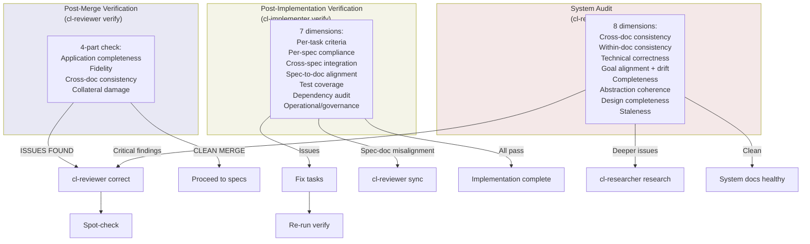

### Code-Doc Sync

`/cl-reviewer sync` extracts verifiable claims from system docs and checks them against the actual codebase:

| Claim Type | Example | How Verified |
|-----------|---------|-------------|
| File structure | "src/gateway/ contains handlers" | Check directory exists |
| Dependencies | "Uses pgvector" | Check package.json |
| API shape | "POST /api/events" | Search for route handler |
| Configuration | "Default port 8080" | Search config files |
| Module structure | "memory/ exports EpisodicStore" | Check exports |

Findings are categorized as **in sync**, **potentially stale**, **confirmed drift**, or **unverifiable**. Sync includes a DECISIONS.md reconciliation pass — checking active decisions against codebase state.

---

## 15. Feedback Loops and Error Recovery

The pipeline has 9 named feedback loops. Each has a specific trigger, source, target, and resolution mechanism.

### Feedback Loop Table

| # | Loop | Trigger | Source | Target | Resolution |
|---|------|---------|--------|--------|-----------|
| 1 | **Review → Fix** | NEEDS REWORK verdict | cl-reviewer review | Proposal file | Fix mode edits proposal, re-review auto-triggers |
| 2 | **Verify → Correct** | ISSUES FOUND after merge | cl-reviewer verify | System docs | Correction mode applies targeted fixes |
| 3 | **Audit → Research** | Critical findings needing design decisions | cl-reviewer audit | cl-researcher | Full research cycle for deeper issues |
| 4 | **Audit → Correct** | Clear diagnosis, obvious fix | cl-reviewer audit | System docs | Correction mode with audit as source finding |
| 5 | **Spec-gap → Research** | L2 gap during implementation | cl-implementer run | cl-researcher | Paused task, research cycle, regenerate specs |
| 6 | **Context-gap → Context** | Stale library knowledge | cl-implementer run | cl-researcher context | Refresh context files, resume task |
| 7 | **Design-gap → Designer** | Missing component/state | cl-implementer run | cl-designer | Add missing design elements, resume task |
| 8 | **Sync → Correct/Research** | Code-doc drift detected | cl-reviewer sync | System docs or cl-researcher | Correction for obvious fixes, research for unclear |
| 9 | **Fix cascade → Re-verify** | Fix task applied | cl-implementer run | Dependent tasks | All transitively dependent completed tasks re-checked |

### Complete Feedback Loop Map

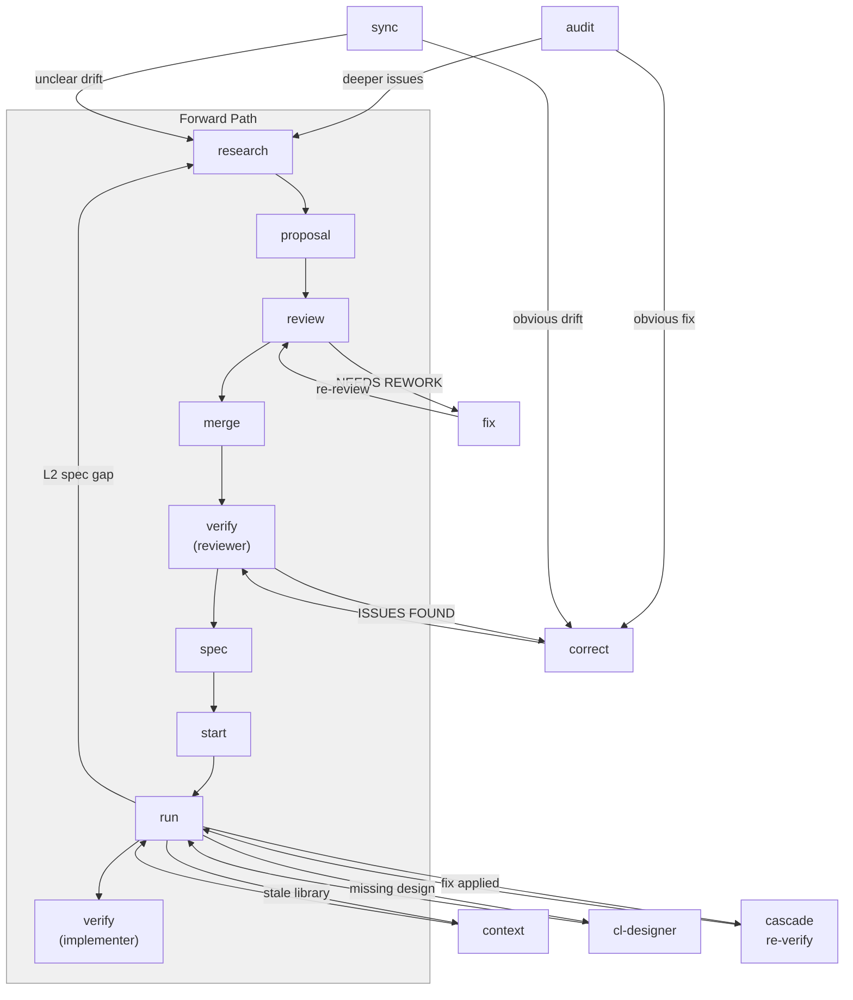

### Emergent Bug Handling

Bugs that couldn't have been predicted (race conditions, state interactions, library conflicts) are handled entirely within the implementer — no pipeline loop required:

- Most are fix tasks or L0/L1 spec gaps
- The full pipeline loop only triggers when a bug proves the **system documentation itself** is wrong
- Behavioral decisions forced by emergent bugs (debounce vs. throttle, retry strategy) are logged to DECISIONS.md

---

## 16. Warmth Gradient

The pipeline's interaction style shifts from exploratory to deterministic as the user moves from discovery to implementation:

| Pipeline Stage | Warmth Level | Interaction Style |
|---------------|-------------|-------------------|
| Bootstrap, Research | **Warm** | Open-ended questions, exploration, summarize understanding. The user is discovering what they want. Don't rush. |
| Design Setup | **Warm-Medium** | Conversational discovery with generate-confirm for preferences when prior input is sufficient. |
| Tokens, Mockups | **Medium** | Batch review, generate-confirm, focused feedback. Tables over conversation. |
| Spec Generation | **Medium-Cool** | Generate-confirm for format, batch gate checks. Minimal conversation. |
| Implementation | **Cool** | Task-by-task or autopilot, tiered checkpoints, no exploratory conversation. |
| Verification, Review | **Cool** | Report output, pass/fail, decision-only interaction. |

This is a guideline, not a constraint. If a user wants detailed discussion during implementation, the skills accommodate.

---

## 17. Complete File Inventory

### Plugin Configuration (2 files)

| File | Purpose |
|------|---------|
| `.claude-plugin/plugin.json` | Plugin manifest — name, version, skills path, metadata |
| `.claude-plugin/marketplace.json` | Marketplace catalog entry |

### Skills (4 SKILL.md + 35 references)

#### cl-researcher (SKILL.md + 6 references)

| File | Tier | Purpose |
|------|------|---------|
| `skills/cl-researcher/SKILL.md` | — | Skill definition — 7 modes, session start, mode detection |
| `skills/cl-researcher/references/bootstrap-guide.md` | Guided | Greenfield/brownfield paths, discovery conversation, profile system, defaults sheet |
| `skills/cl-researcher/references/operational-bootstrap.md` | Guided | Operational bootstrap: security, config, observability, data lifecycle decisions |
| `skills/cl-researcher/references/research-template.md` | Guided | Research doc template (R-NNN format) |
| `skills/cl-researcher/references/proposal-template.md` | Guided | Proposal template with Change Manifest format |
| `skills/cl-researcher/references/document-plan-template.md` | Guided | Structure planning template |
| `skills/cl-researcher/references/context-mode.md` | Structured | Three-layer context system, staleness model, loading protocol |

#### cl-reviewer (SKILL.md + 9 references)

| File | Tier | Purpose |
|------|------|---------|
| `skills/cl-reviewer/SKILL.md` | — | Skill definition — 9 modes, session start, mode detection |
| `skills/cl-reviewer/references/review-mode.md` | Structured | 6-dimension review process, cross-proposal conflict detection |
| `skills/cl-reviewer/references/re-review-mode.md` | Structured | Cumulative issue ledger, regression detection |
| `skills/cl-reviewer/references/fix-mode.md` | Structured | Walk through blocking issues, apply edits, auto-trigger re-review |
| `skills/cl-reviewer/references/merge-mode.md` | Structured | Authorization marker lifecycle, Change Manifest execution |
| `skills/cl-reviewer/references/verify-mode.md` | Structured | 4-part post-merge verification, design nudge |
| `skills/cl-reviewer/references/audit-mode.md` | Guided | 8-dimension analysis, drift analysis, technical verification via web search |
| `skills/cl-reviewer/references/correction-mode.md` | Guided | Corrections manifest, spot-check, lightweight pipeline bypass |
| `skills/cl-reviewer/references/sync-mode.md` | Structured | Claim extraction, code verification, DECISIONS.md reconciliation |
| `skills/cl-reviewer/references/design-review-mode.md` | Structured | 3-dimension design validation, Pencil MCP integration |

#### cl-designer (SKILL.md + 10 references)

| File | Tier | Purpose |
|------|------|---------|
| `skills/cl-designer/SKILL.md` | — | Skill definition — 4 modes, two paths (Pencil/markdown), canvas rules |
| `skills/cl-designer/references/setup-mode.md` | Guided | MCP detection, visual references, design discovery, style guide |
| `skills/cl-designer/references/tokens-mode.md` | Guided | Token derivation, .pen file setup, component generation, behavioral states |
| `skills/cl-designer/references/mockups-mode.md` | Guided | Screen inventory, ref nodes, behavioral walkthrough, responsive states |
| `skills/cl-designer/references/behavioral-walkthrough.md` | Guided | Screen states, interaction flows, navigation context, content decisions |
| `skills/cl-designer/references/build-plan-mode.md` | Structured | 5-phase task breakdown, dependency graph, acceptance criteria |
| `skills/cl-designer/references/design-checklist.md` | Guided | Tokens checklist (14 items), mockups checklist (11 items), tier system |
| `skills/cl-designer/references/visual-quality-rules.md` | Guided | Gestalt principles, WCAG constraints, visual quality gates |
| `skills/cl-designer/references/component-identification-process.md` | Guided | Atomic design methodology, component hierarchy identification |
| `skills/cl-designer/references/pencil-schema-quick-ref.md` | Guided | Pencil MCP node types, frame properties, common patterns |
| `skills/cl-designer/references/pencil-templates.md` | Guided | Copy-paste Pencil code blocks for common UI components |

#### cl-implementer (SKILL.md + 10 references)

| File | Tier | Purpose |
|------|------|---------|
| `skills/cl-implementer/SKILL.md` | — | Skill definition — 8 modes, waterfall gate, queue discipline |
| `skills/cl-implementer/references/spec-mode.md` | Structured | Waterfall gate checks, spec format selection, parallel generation |
| `skills/cl-implementer/references/cross-cutting-specs.md` | Guided | SECURITY_SPEC, error taxonomy, API conventions, shared types, edge cases, accessibility |
| `skills/cl-implementer/references/operational-specs.md` | Guided | CONFIG_SPEC, migrations, observability, integration contracts, backend policies, data modeling, code conventions, performance |
| `skills/cl-implementer/references/governance-checks.md` | Guided | 10 sub-checks for verify mode dimension 7 |
| `skills/cl-implementer/references/spec-consistency-check.md` | Structured | 6-dimension cross-spec consistency check |
| `skills/cl-implementer/references/start-mode.md` | Structured | 13 task generation rules, dependency graph, test tasks, operational tasks |
| `skills/cl-implementer/references/run-mode.md` | Guided | Reconciliation, queue processing, fix tasks, spec gap triage |
| `skills/cl-implementer/references/autopilot-mode.md` | Guided | Self-testing, checkpoint tiers, integration gates, parallel execution |
| `skills/cl-implementer/references/verify-mode.md` | Structured | 7 dimensions, 10 governance sub-checks, dependency audit |
| `skills/cl-implementer/references/sync-mode.md` | Structured | Spec hash comparison, queue adjustment, cascade handling |

### Hooks (4 files)

| File | Purpose |
|------|---------|
| `hooks/hooks.json` | Hook registration — PreToolUse and PostToolUse matchers |
| `hooks/config.js` | Shared config loader — reads `.clarity-loop.json`, resolves doc paths |
| `hooks/protect-system-docs.js` | PreToolUse: blocks unauthorized writes to system docs, checks `.pipeline-authorized` |
| `hooks/generate-manifest.js` | PostToolUse: regenerates `.manifest.md` after system doc changes, content hashing |

### Scripts (2 files)

| File | Purpose |
|------|---------|
| `scripts/init.js` | Directory scaffolding, collision detection, tracking file templates, gitignore setup |
| `scripts/init.sh` | Bash wrapper for cross-platform init |

### Templates (4 files)

| File | Purpose |
|------|---------|
| `templates/decisions.md` | DECISIONS.md template — Project Context + Decision Log |
| `templates/research-ledger.md` | RESEARCH_LEDGER.md template — Active, Completed, Abandoned sections |
| `templates/proposal-tracker.md` | PROPOSAL_TRACKER.md template — In-Flight, Merged, Rejected sections |
| `templates/status.md` | STATUS.md template — minimal stub (pipeline dashboard replaced by PARKING.md) |

### Documentation (7 files + 2 assets)

| File | Purpose |
|------|---------|
| `docs/cl-researcher.md` | User-facing docs for all 7 researcher modes |
| `docs/cl-reviewer.md` | User-facing docs for all 9 reviewer modes |
| `docs/cl-designer.md` | User-facing docs for all 4 designer modes |
| `docs/cl-implementer.md` | User-facing docs for all 8 implementer modes |
| `docs/pipeline-concepts.md` | Pipeline depth, protection, manifest, tracking files, context, config, warmth gradient |
| `docs/hooks.md` | Hook system docs — protection, manifest generation, init script |
| `docs/SYSTEM_DESIGN.md` | This document — comprehensive architecture reference |
| `docs/clarity_loop.png` | Hero image (static) |
| `docs/clarity_loop.gif` | Hero image (animated) |

---

## Related Documentation

| Document | What It Covers |
|----------|---------------|
| [README](../README.md) | What Clarity Loop does and why — installation, usage examples, design principles |
| [cl-researcher](cl-researcher.md) | Per-mode usage for research, bootstrap, triage, proposals, context |
| [cl-reviewer](cl-reviewer.md) | Per-mode usage for review, merge, verify, audit, correct, sync, design-review |
| [cl-designer](cl-designer.md) | Per-mode usage for setup, tokens, mockups, build-plan |
| [cl-implementer](cl-implementer.md) | Per-mode usage for spec, start, run, autopilot, verify, status, sync |
| [Pipeline Concepts](pipeline-concepts.md) | Pipeline depth, protection model, manifest, tracking files, context, configuration |
| [Hooks](hooks.md) | PreToolUse protection, PostToolUse manifest generation, init script |
