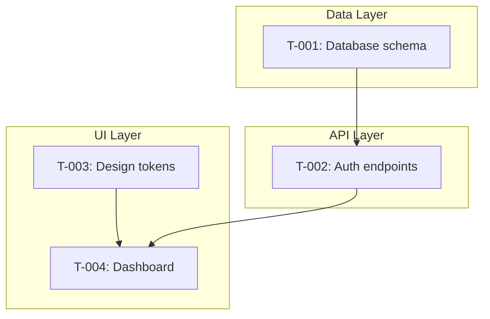

# cl-implementer

The implementation orchestration skill. Owns the full build pipeline — from spec generation through to working code. Generates specs from verified system docs, checks cross-spec consistency, creates structured task queues, tracks implementation progress, handles runtime failures, and feeds gaps back into the pipeline.

**Command**: `/cl-implementer [mode]`

---

## Modes

| Mode | Trigger | Purpose |
|------|---------|---------|
| `spec` | "generate specs", "create specs from docs" | Generate implementation specs from verified system docs (waterfall gate) |
| `spec-review` | "review specs", "check spec consistency" | Cross-spec consistency check |
| `start` | "start implementation", "generate tasks" | Generate unified TASKS.md from all specs, set up progress tracking |
| `run` | "run", "implement", "continue", "next task" | Process the task queue — reconcile, implement, verify, handle failures |
| `autopilot` | "autopilot", "run on autopilot", "autonomous" | Autonomous implementation with self-testing and configurable checkpoints |
| `verify` | "verify implementation", "are we done" | Post-implementation holistic check across seven dimensions |
| `status` | "status", "what's left", "progress" | Progress report from TASKS.md and progress file |
| `sync` | "sync", "specs changed" | Adjust task queue when specs change mid-implementation |

---

## Spec

Generates implementation-ready specs from verified system documentation. Transforms human-approved docs into structured, concrete specifications that developers can build from.

### The Waterfall Gate

Spec generation enforces a strict gate: all system docs should be complete and verified before generating specs.

**Why Waterfall?**

- Partial specs from incomplete docs lead to spec merging later
- Spec merging is messy and error-prone
- The doc pipeline gets docs stable FIRST
- Specs are a one-shot derivation from stable docs
- If docs change later, regenerate specs from scratch (cheap compared to merge conflicts)

**Gate Checks:**

| Check | Source | Warning If |
|-------|--------|------------|
| Active research | [RESEARCH_LEDGER.md](pipeline-concepts.md#tracking-files) | Any `draft` or `in-discussion` entries |
| In-flight proposals | [PROPOSAL_TRACKER.md](pipeline-concepts.md#tracking-files) | Any `draft`, `in-review`, or `merging` entries |
| Unverified merges | PROPOSAL_TRACKER | Any `approved` but not `verified` entries |
| Context freshness | `.context-manifest.md` | Stale library context (version mismatch) |

You can override warnings if you understand the implications.

### Step 1: Read All System Docs

Reads every system doc in full (using parallel subagents for efficiency). Each doc is analyzed for:
- Defined types and entities
- Interfaces and contracts
- Behavioral rules and constraints
- Cross-references to other docs

### Step 2: Choose Spec Format

The skill analyzes content and recommends the appropriate format:

| Content Type | Recommended Format |
|-------------|-------------------|
| API endpoints | OpenAPI YAML |
| Data models | JSON Schema or SQL DDL |
| UI components | Component specs (props, state, variants) |
| Events / messages | AsyncAPI or event schemas |
| Workflows | State machine definitions |
| General | Structured Markdown |

You confirm or override the recommendation.

### Step 3: Generate Specs

For each significant concept, a spec file is created in `{docsRoot}/specs/`. Every spec includes:

| Requirement | Example |
|------------|---------|
| **Source reference** | "From ARCHITECTURE.md, section 'Event Processing', lines 45-78" |
| **Concrete types** | UUID v4, not "a string"; ISO 8601, not "a date" |
| **Edge cases** | Enumerated — what happens when X is null, empty, exceeds limits |
| **Dependencies** | Which other specs are referenced |
| **Implementability** | Can be implemented in isolation with bounded context |

### Step 4: Generate Spec Manifest

Creates `{docsRoot}/specs/.spec-manifest.md`:
- Generated date and source docs
- Format chosen
- Waterfall gate status
- Specs inventory table (file, source docs, source sections, description)
- Cross-spec dependencies table

### Step 5: Generate Test Spec

Generates `{docsRoot}/specs/TEST_SPEC.md` alongside implementation specs. The test spec
defines test architecture decisions (mock boundaries, test data strategy, environment
requirements), per-module unit test cases (function/input/output/edge cases), cross-spec
integration contracts, and contract tests.

TEST_SPEC.md consumes testing decisions from DECISIONS.md (captured during bootstrap) and
is consumed by start mode (test task generation) and autopilot (test case specification).

| Section | Content |
|---------|---------|
| **Test Architecture** | Mock boundaries per layer, test data factories, environment requirements |
| **Per-Module Test Cases** | Function → input → expected output → edge cases (table format) |
| **Cross-Spec Integration Contracts** | Full request lifecycle flows, error propagation chains |
| **Contract Tests** | Producer/consumer response shape verification |

### Design Artifact Integration

If [DESIGN_SYSTEM.md](cl-designer.md) and [UI_SCREENS.md](cl-designer.md) exist, the spec generator references them. Tech specs can point to specific design components for implementation guidance.

### Cross-Cutting Specifications

Alongside implementation specs, the spec generator produces:

| Artifact | Content | Source |
|----------|---------|--------|
| **SECURITY_SPEC.md** | Per-endpoint auth/authz, input validation, system security policy (CORS, CSP, rate limiting, session management, secrets), secure UX patterns, dependency governance | Architecture, DECISIONS.md, PRD |
| **Error taxonomy** | Standard error response format, error code system with category prefixes, error propagation chain, per-endpoint error catalog | Architecture, DECISIONS.md |
| **API conventions** | Pagination style, naming convention, error format, filtering syntax, rate limiting headers, response envelope — inherited by all endpoint specs | Architecture, DECISIONS.md |
| **Shared types** | Cross-boundary type inventory, serialization contracts, type sharing strategy | All endpoint specs, Architecture |
| **Edge cases** | Standard edge case section per spec based on component types (text input, numeric, list, file, date, API endpoint, auth) | Spec content analysis |
| **Accessibility** | ARIA attributes, keyboard interaction, focus management, screen reader requirements per UI spec | Design system, bootstrap accessibility level |
| **CONFIG_SPEC.md** | Environment variables, secrets, feature flags, deployment targets, config validation | Architecture, DECISIONS.md |
| **Operational specs** | Migration notes, observability, integration contracts, backend policies (idempotency, transactions, caching, validation authority), data modeling (deletion, cascade, temporal, volume), code conventions, performance criteria | Architecture, DECISIONS.md, per-module specs |

These are generated from the same system doc read as implementation specs — marginal additional cost.

---

## Spec Review

Cross-spec consistency check. Catches issues that are invisible within a single spec but emerge when specs are compared.

### Six Consistency Dimensions

| Dimension | What It Catches |
|-----------|----------------|
| **Type Consistency** | Same entity with different types across specs. Enum value disagreements. Optional vs. required mismatches. |
| **Naming Consistency** | Same concept with different names (`userId` vs. `user_id`). Casing violations. Names not matching system doc terms. |
| **Contract Consistency** | Request/response shape mismatches between producer and consumer specs. Missing error types. Auth assumption differences. |
| **Completeness** | System doc sections with no spec coverage. Specs referencing undefined entities. Missing error handling. |
| **Traceability** | Specs without source references. Stale source references. Orphaned specs. |
| **API Convention Adherence** | Pagination style inconsistencies. Naming convention violations. Error format deviations. Missing API conventions reference. |

### Output

An inline consistency report (no separate file) with:
- Overall spec health and issue patterns
- Verdict: **CONSISTENT** or **ISSUES FOUND**
- Per-dimension findings with specific spec references
- Recommendations grouped by severity (must fix, should fix, nice to have)

Issues found by spec review can feed into [cl-reviewer correct](cl-reviewer.md#correct) for targeted fixes to the source system docs, or you can regenerate specs after fixing the docs.

---

## Start

Generates a unified `TASKS.md` from ALL spec artifacts — tech specs from spec mode and DESIGN_TASKS.md from cl-designer's build-plan mode.

### Pre-Checks

Before generating tasks, start mode verifies:

1. **Specs exist** — `.spec-manifest.md` must be present
2. **Spec review** — warns if `/cl-implementer spec-review` was never run
3. **Git repository** — checks if git is initialized. If not, offers to run `git init` with an initial commit. Git enables change detection for reconciliation on resume. Without it, the skill falls back to file modification timestamps (less reliable).
4. **Spec coverage** — cross-references system doc topics against spec coverage and warns on gaps. Special attention to testing: if system docs mention test requirements but no testing spec exists, offers three paths (manual tasks, research cycle, skip).

### Unified TASKS.md

Tasks are organized by **implementation area** (Data Layer, API Layer, UI Layer, etc.), not by phase. The key insight: real implementation has cross-cutting dependencies — a dashboard screen depends on both a Button component (UI) and a CRUD endpoint (API). Phase-based ordering can't represent this. Area grouping with a cross-area Mermaid dependency graph can.

If DESIGN_TASKS.md exists, its tasks are merged into the appropriate area (usually UI Layer). DESIGN_TASKS.md remains as a design artifact; TASKS.md is the working implementation copy.

### Test Tasks

If TEST_SPEC.md exists, start mode generates four types of test tasks:

| Task Type | Naming | Dependencies | When |
|-----------|--------|-------------|------|
| **Test infrastructure** | T-00X | None (parallel with early impl) | Always first |
| **Unit test** | T-NNNT (suffix of impl task) | Impl task + test infrastructure | After each module |
| **Integration test** | T-0XX | All spanned impl tasks + infrastructure | After area/boundary completion |
| **Contract test** | T-0XX | Producer + consumer impl tasks + infrastructure | After both sides implemented |

Test tasks are first-class in TASKS.md — acceptance criteria, spec references, dependencies,
status tracking. They appear in the dependency graph and are processed by run/autopilot modes.

### Operational Tasks

If operational specs exist (CONFIG_SPEC.md, observability sections, code conventions),
start mode generates infrastructure tasks: project scaffolding (directory structure),
config and environment setup, observability setup, and migration setup. These are early
tasks with no dependencies — they can run in parallel with test infrastructure and
initial implementation.

### User Control

After generation, the user can reorder, split, merge, skip, or add tasks. The dependency graph enforces hard constraints only — within those constraints, the order is the user's choice.

### Claude Code Integration

TASKS.md tasks are dual-written to Claude Code's native task system via `TaskCreate`. Every state change updates both TASKS.md (persistent truth, survives sessions) and Claude Code tasks (active session view, progress spinners).

---

## Run

The core implementation loop. Designed for repeated invocation — each call starts with reconciliation and then processes tasks.

### Reconciliation on Resume

Every `run` invocation begins by detecting what changed since the last session:

1. **Git diff** (or timestamp fallback) identifies externally modified files
2. Changed files are mapped to tracked tasks
3. A reconciliation summary is presented to the user
4. The user decides: re-verify affected tasks, skip, or mark as externally-managed

This handles the full spectrum of external changes — from a one-line bug fix to a two-day off-script implementation session. The skill is **stateless about HOW code was written** and only cares about **WHETHER acceptance criteria are met**.

### Queue Processing

Tasks are processed front-to-back with a validity check before each:

1. **Select next unblocked task** — respects dependency graph and user ordering
2. **Validity check** — does the task's spec hash match current specs? If not, suggest sync
3. **Implement** — Claude Code writes the code to meet acceptance criteria
4. **Verify** — check every acceptance criterion
5. **Post-task spot-check** (optional) — quick-verify completed tasks whose files overlap with just-modified files. Catches regressions early.
6. **Update tracking** — dual-write to TASKS.md and Claude Code tasks

### Fix Tasks (F-NNN)

When runtime errors or regressions are detected:

- Fix tasks are **distinct from spec gaps** — "the spec is right, the code is wrong"
- Fix tasks take **priority** over new tasks
- After a fix, the source task is re-verified
- **Cascade re-verification**: all tasks that transitively depend on the fixed task are checked
- Multiple fix task cascades are **deduplicated** before re-verification

Issue types: `runtime-error`, `regression`, `integration-failure`, `context-gap`, `design-gap`.

- **Context gaps** route to `/cl-researcher context` — stale library knowledge
- **Design gaps** route to `/cl-designer` — detected automatically (spec references a component or state that doesn't exist in the design system) or triggered by user visual feedback ("this doesn't look right"). On user feedback, the implementer first verifies the code matches the design spec — if it doesn't, that's a code fix, not a design gap. Only if the code faithfully matches the spec and the user still isn't satisfied does it classify as a design gap.

### Spec Gap Triage

When implementation reveals spec gaps (missing information, not visual/design issues):

| Level | Action |
|-------|--------|
| **L0 — Trivial** | Patch spec inline, continue |
| **L1 — Contained** | Log gap, state assumption, ask user |
| **L2 — Significant** | Pause task, suggest research cycle |

L2 gaps pause the affected task but NOT the whole queue — other unblocked tasks continue. If the gap is visual/UI (how it looks, not what it does), classify as `design-gap` and route to `/cl-designer` instead.

### Emergent Bugs

Bugs that couldn't have been predicted during research or spec generation (race conditions, state interactions, library conflicts) are handled entirely within the implementer — no pipeline loop required. Most are fix tasks or L0/L1 spec gaps. The full pipeline loop only triggers when a bug proves the *system documentation itself* is wrong. Behavioral decisions forced by emergent bugs (debounce vs. throttle, retry strategy) are logged to DECISIONS.md.

### Parallel Execution

Independent task groups (no shared dependencies or files) can run in parallel via Claude Code's fork capability. User approval required. Post-merge file conflict check in main context. Sequential fallback if conflicts arise.

---

## Autopilot

Run mode with three additions: **self-testing**, **per-milestone integration testing**, and **autonomous progression**. The implementer writes tests from acceptance criteria (and TEST_SPEC.md when available), runs them to verify its own work, commits per task, and only stops at user-configured checkpoints or when it hits a genuine blocker.

### Checkpoint Levels

| Setting | Behavior |
|---|---|
| `checkpoint: none` | Full autopilot — only stops on genuine blockers |
| `checkpoint: phase` | Stops after each implementation area (data layer, API, UI, etc.) |
| `checkpoint: N` | Stops every N tasks for a progress review |
| `checkpoint: every` | Task-by-task approval (same as run mode, but with self-testing) |

Stored in `.clarity-loop.json` under `implementer.checkpoint`. The checkpoint decision is logged to DECISIONS.md — it's a trust decision that evolves over the project. Users start with frequent checkpoints and reduce oversight as confidence builds.

### Self-Testing

After implementing each task, the implementer translates acceptance criteria into test cases (behavioral -> integration test, structural -> unit test, edge case -> unit test, UI -> component test). Tests run automatically. On failure: three attempts (fix implementation -> re-examine test -> check for context/design gap), then stop and ask the user.

### Integration Testing

At milestone boundaries, autopilot runs integration tests:

| Trigger | What Runs |
|---------|----------|
| Last task in an area completes | Integration test tasks depending on that area |
| Integration boundary tasks all complete | Cross-boundary integration tests |
| All tasks complete (final gate) | Full test suite — unit + integration + contract |

Integration test failures create fix tasks targeting the specific seam. The full-suite gate
catches regressions before declaring implementation complete.

### UI Validation

For UI tasks, the implementer starts the dev server, navigates to the relevant page, takes a screenshot, and compares against the design spec. Structural correctness (right components, right tokens) is checked automatically. Visual/aesthetic judgment is always deferred to the user at the next checkpoint.

### Parallel Execution

When the dependency graph allows, independent task groups run in parallel via subagents (max 3). Each subagent runs the full autonomous loop independently. Main context collects results and checks for file conflicts.

### Hard Stops

Autopilot always stops for L2 spec gaps, repeated failures, cascade regressions, and user interrupts. It never stops for L0/L1 gaps, minor self-resolving test failures, or external changes (handled by reconciliation).

---

## Verify

Post-implementation holistic check. Seven dimensions:

| Dimension | What It Checks | Catches |
|-----------|---------------|---------|
| **Per-task** | Re-check all acceptance criteria | Regressions, drift from criteria |
| **Per-spec** | Full spec contract compliance | Type mismatches, missing constraints |
| **Cross-spec** | Integration between modules | Shape mismatches, protocol disagreements |
| **Spec-to-doc** | Code alignment with system docs (via cl-reviewer sync) | Architectural drift |
| **Test coverage** | Test spec compliance (P2) | Untested behavior, missing test cases |
| **Dependency audit** | Vulnerability scan, license compliance, unused deps, lockfile integrity | CVEs, copyleft surprises, bloat |
| **Operational/governance** | Config, observability, code org, performance, L1 assumptions, backend policies, data model, architecture alignment, DECISIONS.md reconciliation | Infrastructure gaps, invisible drift, policy violations |

Run verify after all tasks are complete, or after a significant batch.

---

## Status

Progress report generated from TASKS.md (including Session Log):

- Task counts by status (done, pending, blocked, skipped)
- Progress by area
- Open spec gaps and fix tasks
- Spec version and staleness check
- Last session date

---

## Sync

Handles spec changes mid-implementation via queue adjustment:

1. **Compare** task spec hashes against current spec hashes
2. **Categorize**: unchanged, modified, superseded, new
3. **Adjust queue**: update criteria, re-queue for re-verification, generate new tasks
4. **Cascade**: check transitive dependencies, flag affected completed tasks
5. **Present** changes to user for approval before applying

Queue semantics: process front-to-back, validity-check before each task, pop/replace if superseded. Not efficient (occasionally implements something that gets superseded) but **consistent** — the same process handles additive, modificatory, and superseding spec changes.

---

## Tracking Files

| File | Location | Purpose |
|------|----------|---------|
| `TASKS.md` | `{docsRoot}/specs/` | Unified task list — the single source of truth for what needs to be built. Includes a Session Log section for session persistence (task status, spec gaps, fix tasks, external changes, sync history). |
| `.spec-manifest.md` | `{docsRoot}/specs/` | Read-only input — spec index with content hashes (generated by spec mode) |
| `DESIGN_TASKS.md` | `{docsRoot}/specs/` | Read-only input — design tasks (generated by cl-designer build-plan) |

### Task Statuses

| Status | Meaning |
|--------|---------|
| `pending` | Not yet started |
| `in-progress` | Currently being implemented |
| `done` | Implemented and acceptance criteria verified |
| `done (external)` | Criteria met by code written outside the implementer |
| `blocked` | Waiting on dependencies or fix tasks |
| `skipped` | User chose to skip (with reason) |
| `satisfied-externally` | Requirement met outside the queue (e.g., database already exists) |
| `superseded` | Spec changed, task replaced by a new version |
| `needs-re-verification` | Spec changed or fix applied — needs re-check |
| `externally-managed` | User took ownership, excluded from verification |

---

## Related

- [cl-designer](cl-designer.md) — Generates DESIGN_TASKS.md consumed by start mode; design gaps route here during implementation
- [cl-reviewer](cl-reviewer.md) — Sync mode used during verify for spec-to-doc alignment
- [cl-researcher](cl-researcher.md) — L2 spec gaps may trigger research cycles; context gaps route here
- [Pipeline Concepts](pipeline-concepts.md) — Pipeline depth (L0-L2) used for gap triage
