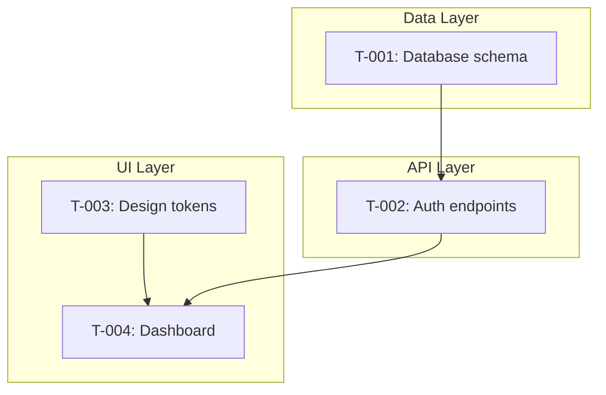

# implementer

The implementation orchestration skill. Bridges the gap between generated specs and working code through structured task tracking, queue-based execution, and feedback loops back into the pipeline.

**Command**: `/implementer [mode]`

---

## Modes

| Mode | Trigger | Purpose |
|------|---------|---------|
| `start` | "start implementation", "generate tasks" | Generate unified TASKS.md from all specs, set up progress tracking |
| `run` | "run", "implement", "continue", "next task" | Process the task queue — reconcile, implement, verify, handle failures |
| `verify` | "verify implementation", "are we done" | Post-implementation holistic check across four dimensions |
| `status` | "status", "what's left", "progress" | Progress report from TASKS.md and progress file |
| `sync` | "sync", "specs changed" | Adjust task queue when specs change mid-implementation |

---

## Start

Generates a unified `TASKS.md` from ALL spec artifacts — tech specs from doc-spec-gen and DESIGN_TASKS.md from ui-designer's build-plan mode.

### Pre-Checks

Before generating tasks, start mode verifies:

1. **Specs exist** — `.spec-manifest.md` must be present
2. **Spec review** — warns if `/doc-spec-gen review` was never run
3. **Git repository** — checks if git is initialized. If not, offers to run `git init` with an initial commit. Git enables change detection for reconciliation on resume. Without it, the skill falls back to file modification timestamps (less reliable).
4. **Spec coverage** — cross-references system doc topics against spec coverage and warns on gaps. Special attention to testing: if system docs mention test requirements but no testing spec exists, offers three paths (manual tasks, research cycle, skip).

### Unified TASKS.md

Tasks are organized by **implementation area** (Data Layer, API Layer, UI Layer, etc.), not by phase. The key insight: real implementation has cross-cutting dependencies — a dashboard screen depends on both a Button component (UI) and a CRUD endpoint (API). Phase-based ordering can't represent this. Area grouping with a cross-area Mermaid dependency graph can.

```
## Dependency Graph


```

If DESIGN_TASKS.md exists, its tasks are merged into the appropriate area (usually UI Layer). DESIGN_TASKS.md remains as a design artifact; TASKS.md is the working implementation copy.

### User Control

After generation, the user can reorder, split, merge, skip, or add tasks. The dependency graph enforces hard constraints only — within those constraints, the order is the user's choice.

### Claude Code Integration

TASKS.md tasks are dual-written to Claude Code's native task system via `TaskCreate`. Every state change updates both TASKS.md (persistent truth, survives sessions) and Claude Code tasks (active session view, progress spinners).

---

## Run

The core implementation loop. Designed for repeated invocation — each call starts with reconciliation and then processes tasks.

### Reconciliation on Resume

Every `run` invocation begins by detecting what changed since the last session:

1. **Git diff** (or timestamp fallback) identifies externally modified files
2. Changed files are mapped to tracked tasks
3. A reconciliation summary is presented to the user
4. The user decides: re-verify affected tasks, skip, or mark as externally-managed

This handles the full spectrum of external changes — from a one-line bug fix to a two-day off-script implementation session. The skill is **stateless about HOW code was written** and only cares about **WHETHER acceptance criteria are met**.

### Queue Processing

Tasks are processed front-to-back with a validity check before each:

1. **Select next unblocked task** — respects dependency graph and user ordering
2. **Validity check** — does the task's spec hash match current specs? If not, suggest sync
3. **Implement** — Claude Code writes the code to meet acceptance criteria
4. **Verify** — check every acceptance criterion
5. **Post-task spot-check** (optional) — quick-verify completed tasks whose files overlap with just-modified files. Catches regressions early.
6. **Update tracking** — dual-write to TASKS.md and Claude Code tasks

### Fix Tasks (F-NNN)

When runtime errors or regressions are detected:

- Fix tasks are **distinct from spec gaps** — "the spec is right, the code is wrong"
- Fix tasks take **priority** over new tasks
- After a fix, the source task is re-verified
- **Cascade re-verification**: all tasks that transitively depend on the fixed task are checked
- Multiple fix task cascades are **deduplicated** before re-verification

### Spec Gap Triage

When implementation reveals spec gaps:

| Level | Action |
|-------|--------|
| **L0 — Trivial** | Patch spec inline, continue |
| **L1 — Contained** | Log gap, state assumption, ask user |
| **L2 — Significant** | Pause task, suggest research cycle |

L2 gaps pause the affected task but NOT the whole queue — other unblocked tasks continue.

### Parallel Execution

Independent task groups (no shared dependencies or files) can run in parallel via Claude Code's fork capability. User approval required. Post-merge file conflict check in main context. Sequential fallback if conflicts arise.

---

## Verify

Post-implementation holistic check. Four dimensions:

| Dimension | What It Checks | Catches |
|-----------|---------------|---------|
| **Per-task** | Re-check all acceptance criteria | Regressions, drift from criteria |
| **Per-spec** | Full spec contract compliance | Type mismatches, missing constraints |
| **Cross-spec** | Integration between modules | Shape mismatches, protocol disagreements |
| **Spec-to-doc** | Code alignment with system docs (via doc-reviewer sync) | Architectural drift |

Run verify after all tasks are complete, or after a significant batch.

---

## Status

Progress report generated from TASKS.md and IMPLEMENTATION_PROGRESS.md:

- Task counts by status (done, pending, blocked, skipped)
- Progress by area
- Open spec gaps and fix tasks
- Spec version and staleness check
- Last session date

---

## Sync

Handles spec changes mid-implementation via queue adjustment:

1. **Compare** task spec hashes against current spec hashes
2. **Categorize**: unchanged, modified, superseded, new
3. **Adjust queue**: update criteria, re-queue for re-verification, generate new tasks
4. **Cascade**: check transitive dependencies, flag affected completed tasks
5. **Present** changes to user for approval before applying

Queue semantics: process front-to-back, validity-check before each task, pop/replace if superseded. Not efficient (occasionally implements something that gets superseded) but **consistent** — the same process handles additive, modificatory, and superseding spec changes.

---

## Tracking Files

| File | Location | Purpose |
|------|----------|---------|
| `TASKS.md` | `{docsRoot}/specs/` | Unified task list — the single source of truth for what needs to be built |
| `IMPLEMENTATION_PROGRESS.md` | `{docsRoot}/specs/` | Session persistence — task status, spec gaps, fix tasks, external changes, sync history |
| `.spec-manifest.md` | `{docsRoot}/specs/` | Read-only input — spec index with content hashes (generated by doc-spec-gen) |
| `DESIGN_TASKS.md` | `{docsRoot}/specs/` | Read-only input — design tasks (generated by ui-designer build-plan) |

### Task Statuses

| Status | Meaning |
|--------|---------|
| `pending` | Not yet started |
| `in-progress` | Currently being implemented |
| `done` | Implemented and acceptance criteria verified |
| `done (external)` | Criteria met by code written outside the implementer |
| `blocked` | Waiting on dependencies or fix tasks |
| `skipped` | User chose to skip (with reason) |
| `satisfied-externally` | Requirement met outside the queue (e.g., database already exists) |
| `superseded` | Spec changed, task replaced by a new version |
| `needs-re-verification` | Spec changed or fix applied — needs re-check |
| `externally-managed` | User took ownership, excluded from verification |

---

## Related

- [doc-spec-gen](doc-spec-gen.md) — Generates the specs that the implementer consumes
- [ui-designer](ui-designer.md) — Generates DESIGN_TASKS.md consumed by start mode
- [doc-reviewer](doc-reviewer.md) — Sync mode used during verify for spec-to-doc alignment
- [doc-researcher](doc-researcher.md) — L2 spec gaps may trigger research cycles
- [Pipeline Concepts](pipeline-concepts.md) — Pipeline depth (L0-L2) used for gap triage
