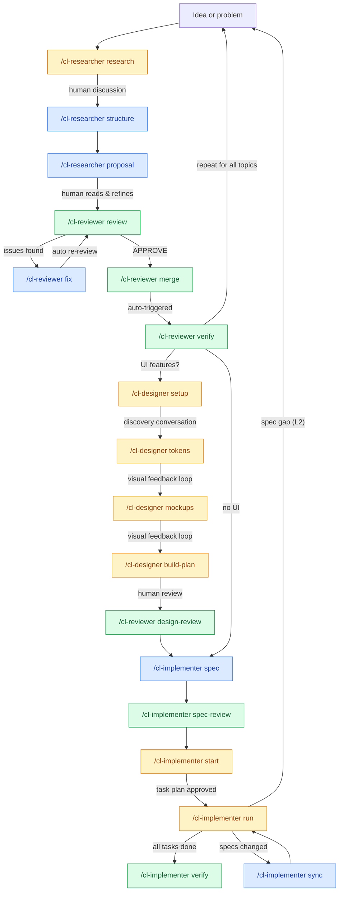

# Proposal: Implementer Skill — Post-Spec Implementation Tracking

**Created**: 2026-02-09
**Status**: Draft
**Research**: docs/research/POST_SPEC_IMPLEMENTATION_TRACKING.md
**Author**: User + AI researcher

## Summary

This proposal adds a fifth skill to Clarity Loop: the `cl-implementer`. It bridges the gap between spec generation and working code — the pipeline currently drops users off a cliff after `/cl-implementer spec-review`. Everything before that point is structured (research, review, merge, verify, design, specs). Everything after is "just start coding."

The cl-implementer skill generates a unified `TASKS.md` from all spec artifacts, tracks implementation progress across sessions, handles runtime failures and regressions with fix tasks, reconciles external code changes on resume, and feeds spec gaps back into the pipeline. It treats the task list as a queue — process front-to-back, validity-check before each task, pop/replace if upstream spec changes supersede work. The design philosophy: **the queue is the plan, not the process** — the skill is stateless about how code was written, only caring whether acceptance criteria are met.

The expected impact is completing the pipeline's value proposition: structured process from idea to working code. This also changes the plugin's positioning from "idea to spec" to "idea to implementation."

## Research Lineage

This proposal is based on the following research:

| Research Doc | Key Findings Used | Recommendation Adopted |
|-------------|-------------------|----------------------|
| docs/research/POST_SPEC_IMPLEMENTATION_TRACKING.md | Finding 1 (Two Tracking Dimensions), Finding 2 (Queue Semantics), Finding 3 (Spec Gap Triage), Finding 4 (Session Persistence), Finding 5 (Unified TASKS.md), Finding 6 (Verification Mode), Finding 7 (Testing/CI-CD Spec-Driven), Finding 8 (Parallel Execution), Finding 9 (User Task Ordering), Finding 10 (Fix Tasks), Finding 11 (Reconciliation on Resume), Finding 12 (Tangent Tolerance) | Option 3: Hybrid — new `cl-implementer` skill with pipeline integration |

## System Context

### Research Type: Net New (with modifications to existing)

The cl-implementer skill is an entirely new capability. No implementation tracking exists in the current pipeline. However, adding it requires modifications to three existing plugin artifacts to establish handoff points and update the plugin's self-description.

### Current State

| Plugin Artifact | Current State Summary | Sections Referenced |
|----------------|----------------------|-------------------|
| `skills/cl-implementer/SKILL.md` | Declares itself as the pipeline's terminal stage. Line 247: "Specs end the pipeline. After specs are generated and reviewed, the documentation pipeline's job is done. Implementation is a separate concern." | Guidelines section (last bullet) |
| `skills/cl-designer/references/build-plan-mode.md` | Generates `DESIGN_TASKS.md` with phased tasks (1-5), dependency graph, acceptance criteria. Currently the closest thing to implementation tracking but only covers UI. Last line suggests starting implementation or running design review — no mention of a downstream skill. | Step 4: User Review, Update Tracking |
| `README.md` | Skills table lists 4 skills. Lifecycle diagram ends at `/cl-implementer spec-review`. "What It Does" section says "four skills." | Skills table (line 28-34), Lifecycle diagram (lines 79-104), What It Does (line 27), Project Structure (lines 340-396) |
| `docs/research/DOC_PIPELINE_PLUGIN.md` | 11 design decisions. Decision 2 lists "Four skills." Decision 5 says "Waterfall. All system docs must be complete and verified before specs are generated." No mention of post-spec workflow. | Design Decisions section, Decision 2, Decision 5 |
| `scripts/init.js` | Creates 8 directories including `specs/`. No implementation-specific directories needed since TASKS.md and IMPLEMENTATION_PROGRESS.md live in `specs/`. | dirs array (lines 200-209) |

### Proposed State

After this proposal is applied:

1. **New `cl-implementer` skill** with 5 modes: `start`, `run`, `verify`, `status`, `sync`
2. **cl-implementer** hands off to the cl-implementer instead of declaring the pipeline done
3. **cl-designer build-plan** notes that DESIGN_TASKS.md is consumed by the cl-implementer
4. **README** reflects 5 skills, lifecycle extends through implementation, directory structure shows TASKS.md and IMPLEMENTATION_PROGRESS.md
5. **DOC_PIPELINE_PLUGIN** gains Design Decision #12 explaining the implementation tracking approach
6. **New docs/cl-implementer.md** provides detailed skill documentation

The lifecycle becomes:

```
Idea → Research → Proposal → Review → Merge → Verify → Design (optional) → Specs → Implementation → Working Code
```

## Change Manifest

> This is the contract between the proposal and the plugin files. The cl-reviewer will
> use this table to verify every change was applied correctly during the verify step.

| # | Change Description | Target Doc | Target Section | Type | Research Ref |
|---|-------------------|-----------|----------------|------|-------------|
| 1 | Create cl-implementer skill definition with 5 modes, session start protocol, mode detection, guidelines | `skills/cl-implementer/SKILL.md` | (new doc) | Add Doc | Findings 1-12, Recommendation |
| 2 | Create start mode reference: unified TASKS.md generation, pre-checks, Claude Code task population, parallelizable group identification, user reordering | `skills/cl-implementer/references/start-mode.md` | (new doc) | Add Doc | Findings 5, 7, 8, 9 |
| 3 | Create run mode reference: reconciliation on resume, queue processing, implementation loop, fix tasks, post-task regression spot-check, gap triage, dual tracking | `skills/cl-implementer/references/run-mode.md` | (new doc) | Add Doc | Findings 2, 3, 10, 11, 12 |
| 4 | Create verify mode reference: per-task, per-spec, cross-spec, spec-to-doc verification dimensions, cl-reviewer sync integration | `skills/cl-implementer/references/verify-mode.md` | (new doc) | Add Doc | Finding 6 |
| 5 | Create sync mode reference: spec hash comparison, task queue adjustment, re-verification of completed tasks, merge mechanics | `skills/cl-implementer/references/sync-mode.md` | (new doc) | Add Doc | Finding 2 |
| 6 | Create detailed skill documentation | `docs/cl-implementer.md` | (new doc) | Add Doc | All findings |
| 7 | Replace "Specs end the pipeline" terminal statement with handoff to cl-implementer | `skills/cl-implementer/SKILL.md` | Guidelines (last bullet, line 247) | Modify | Finding 1, Recommendation |
| 8 | Add note that DESIGN_TASKS.md is consumed by cl-implementer's start mode and merged into unified TASKS.md | `skills/cl-designer/references/build-plan-mode.md` | Update Tracking (end of file) | Add | Finding 5 |
| 9 | Add cl-implementer to skills table, update "What It Does" count to five, extend lifecycle diagram through implementation | `README.md` | Skills table, What It Does, Lifecycle diagram | Modify | Recommendation |
| 10 | Add cl-implementer to project structure tree | `README.md` | Project Structure | Add | Recommendation |
| 11 | Add documentation table entry for cl-implementer | `README.md` | Documentation table | Add | Recommendation |
| 12 | Add Design Decision #12: Implementation Tracking with Queue Semantics | `docs/research/DOC_PIPELINE_PLUGIN.md` | Design Decisions (after #11) | Add Section | Findings 2, 5, 10, 11, 12 |

**Scope boundary**: This proposal ONLY modifies the files listed above. It does not modify hooks, init.js (no new directories needed — TASKS.md and IMPLEMENTATION_PROGRESS.md live in `specs/`), pipeline-concepts.md, or any other plugin artifact not listed.

## Detailed Design

### Change Area 1: New Implementer Skill (Changes 1-5)

**What**: A complete new skill with SKILL.md and four reference files defining five modes.

**Why**: Research Finding 1 identified that spec generation leaves a gap — no progress tracking, no verification, no gap feedback, no loop awareness. The research recommendation (Option 3) is a new skill with tight pipeline integration. Five discussion rounds and two dry runs (20 scenarios) validated the design.

#### SKILL.md (Change 1)

The skill definition follows the established pattern (cl-researcher, cl-reviewer, etc.):

**Frontmatter:**
```yaml
---
name: cl-implementer
description: >
  Implementation orchestration skill for the Clarity Loop documentation pipeline.
  Generates a unified TASKS.md from all spec artifacts, tracks implementation progress
  across sessions, handles runtime failures with fix tasks, reconciles external code
  changes, and feeds spec gaps back into the pipeline. Trigger on "implement",
  "start implementation", "run tasks", "implementation status", "sync specs",
  "verify implementation", "what's left to build", "continue implementing",
  "resume implementation", or any request to track or execute implementation work
  from specs.
argument-hint: "[start|run|verify|status|sync]"
---
```

No `context: fork` — the interactive nature (implement → verify → feedback → continue) requires main context. This is a key differentiator from cl-implementer which runs as fork.

**Body structure:**
1. Role definition: "You are an implementation orchestration agent. You bridge the gap between specs and working code."
2. Pipeline position diagram showing cl-implementer after spec-gen
3. Session start: configuration, pipeline state check, implementation state check (read IMPLEMENTATION_PROGRESS.md if exists, resume from last state)
4. Mode detection with gates (start requires specs, run requires TASKS.md, verify requires completed tasks, sync requires TASKS.md + spec changes)
5. Each mode section says "Read `references/[mode].md` and follow its process"
6. Guidelines section covering queue philosophy, tracking discipline, gap triage rules

#### start-mode.md (Change 2)

The entry point. Generates the unified TASKS.md from all spec artifacts.

**Process:**
1. **Pre-checks**: Verify specs exist (`.spec-manifest.md`). Warn if `/cl-implementer spec-review` was never run. Check for git repository — if not initialized, offer: "This project isn't a git repository. Git enables implementation tracking (change detection, reconciliation on resume, regression identification). Initialize now? [Y/n]" If yes, run `git init` and optionally create an initial commit. If no, warn about reduced reconciliation accuracy and fall back to timestamp-based tracking. Cross-reference system doc areas vs spec coverage — warn on gaps (e.g., "PRD mentions testing but no testing spec exists").
2. **Read all specs**: Parse `.spec-manifest.md`, read each spec file, read DESIGN_TASKS.md if it exists.
3. **Generate unified TASKS.md** in `{docsRoot}/specs/TASKS.md`:
   - Header with generation date, spec version hash, source specs list
   - Cross-area Mermaid dependency graph
   - Tasks organized by implementation area (Data Layer, API Layer, UI Layer, etc.)
   - Each task: ID (T-NNN), name, spec reference, dependencies, status, acceptance criteria, complexity, spec hash
   - DESIGN_TASKS.md tasks merged into the UI area (renumbered, original references preserved)
4. **Identify parallelizable groups**: Tasks with no dependency relationship AND different file paths
5. **Present to user**: Dependency graph, suggested order, parallelizable groups. "Here's the implementation plan. You can reorder, split, merge, skip, or add tasks. Any changes?"
6. **Create IMPLEMENTATION_PROGRESS.md** in `{docsRoot}/specs/`
7. **Populate Claude Code tasks**: `TaskCreate` for each task in TASKS.md. Dual-write: TASKS.md is persistent truth, Claude Code tasks are session view.
8. **Testing/CI-CD nudge**: If system docs mention testing requirements but no testing spec exists, offer three paths: add manual tasks, run research cycle, skip.

#### run-mode.md (Change 3)

The core implementation loop. Most complex reference file.

**Process:**
1. **Reconciliation on resume** (every invocation):
   - Read IMPLEMENTATION_PROGRESS.md for last session date and task states
   - Check for git repo. If not initialized (greenfield project), offer to `git init` (same as start-mode pre-check). Git diff since last session, or fall back to file modification timestamps if user declines git.
   - Map changed files to completed tasks
   - Categorize: no-task-impact, minor-change, major-change, in-progress-affected
   - Present reconciliation summary to user
   - User decides: re-verify, skip, or mark `externally-managed`
2. **Spec hash check**: Compare current `.spec-manifest.md` hash against TASKS.md recorded hash. If mismatch, suggest sync.
3. **Queue processing**:
   - Pick next unblocked task (respects dependency graph + user ordering)
   - Validity check: does task's spec hash match current specs?
   - If valid: implement, verify acceptance criteria, update TASKS.md + Claude Code tasks + IMPLEMENTATION_PROGRESS.md
   - If invalid: suggest sync mode
4. **Fix tasks**: When runtime errors or regressions detected:
   - Create fix task (F-NNN) with source task, discovery context, type
   - Implement fix
   - Re-verify source task
   - Cascade re-verification of transitive dependents
   - Batch and deduplicate cascade sets when multiple fixes resolve
5. **Post-task regression spot-check** (optional, configurable):
   - After each task, quick-check completed tasks whose files overlap
   - Creates fix tasks if regressions detected
6. **Gap triage**: L0 patch inline, L1 log + user decision, L2 pause task + suggest research
7. **Parallel execution**: For user-approved independent groups, fork subagents per group. Post-merge file conflict check in main context.

#### verify-mode.md (Change 4)

Post-implementation verification. Four dimensions:

1. **Per-task**: Does each completed task meet its acceptance criteria? (Quick re-check)
2. **Per-spec**: Does the full implementation honor spec contracts? (Types, interfaces, constraints)
3. **Cross-spec**: Do implemented modules work together as specs described? (Integration check)
4. **Spec-to-doc**: Does implemented code align with system docs? (Invokes cl-reviewer sync)

Output: verification summary in IMPLEMENTATION_PROGRESS.md.

#### sync-mode.md (Change 5)

Handles spec changes mid-implementation. Queue adjustment logic:

1. Read current `.spec-manifest.md` hash, compare against TASKS.md recorded hash
2. For each task: compare task's spec hash against current spec section hash
3. **Unchanged tasks**: No action
4. **Modified tasks (pending)**: Update acceptance criteria from new specs
5. **Modified tasks (completed)**: Mark `needs-re-verification`, run acceptance criteria check
6. **Superseded tasks**: Mark `superseded`, generate replacement tasks from new specs
7. **New spec sections**: Generate new tasks, insert at dependency-appropriate positions
8. Preserve user-added tasks (`source: user-added`) — excluded from sync
9. Present changes to user for confirmation before applying
10. Regenerate dependency graph

**Dependencies**: None — all changes in this area are new files.

### Change Area 2: Spec-Gen Handoff (Change 7)

**What**: Replace the terminal statement in cl-implementer's guidelines with a handoff to the cl-implementer.

**Why**: Research Finding 1 identified this as the cliff. The pipeline shouldn't declare itself "done" at specs — specs are the bridge to implementation, not the destination.

**Current** (from `skills/cl-implementer/SKILL.md`, Guidelines section, last bullet):
> - **Specs end the pipeline.** After specs are generated and reviewed, the documentation
>   pipeline's job is done. Implementation is a separate concern.

**Proposed**:
> - **Specs bridge to implementation.** After specs are generated and reviewed, the
>   `cl-implementer` skill takes over — generating a unified task list, tracking progress,
>   and feeding gaps back into the pipeline. Run `/cl-implementer start` to begin.

**Dependencies**: Change 1 must exist first (the skill being referenced).

### Change Area 3: Build-Plan Handoff (Change 8)

**What**: Add a note to cl-designer's build-plan mode explaining that DESIGN_TASKS.md is consumed by the cl-implementer.

**Why**: Research Finding 5 established that TASKS.md is the single task authority. DESIGN_TASKS.md remains as a design artifact, but the cl-implementer merges its tasks into the unified TASKS.md. Users should know this relationship.

**Current** (from `skills/cl-designer/references/build-plan-mode.md`, Update Tracking section, last paragraph):
> Tell the user: "Build plan complete. DESIGN_TASKS.md generated at
> `{docsRoot}/specs/DESIGN_TASKS.md` with [N] tasks across [M] phases. You can start
> implementation from Phase 1 (tokens), or run `/cl-reviewer design-review` first to
> validate the designs against the PRD."

**Proposed**:
> Tell the user: "Build plan complete. DESIGN_TASKS.md generated at
> `{docsRoot}/specs/DESIGN_TASKS.md` with [N] tasks across [M] phases. Run
> `/cl-reviewer design-review` to validate designs against the PRD, then
> `/cl-implementer start` to generate a unified implementation plan that merges these
> design tasks with tasks from tech specs."
>
> **Note**: DESIGN_TASKS.md is a design artifact — the output of this build-plan mode.
> The `cl-implementer` skill's `start` mode reads it as one of its inputs and merges the
> tasks into a unified `TASKS.md` alongside tasks derived from tech specs. DESIGN_TASKS.md
> remains as the build-plan source reference; TASKS.md becomes the working implementation
> copy.

**Dependencies**: Change 1 must exist first.

### Change Area 4: README Updates (Changes 9, 10, 11)

**What**: Update README to reflect the fifth skill across three sections.

**Why**: The README is the plugin's public-facing documentation. It must accurately reflect the skill set, lifecycle, and project structure.

#### Skills Table (Change 9, part 1)

**Current** (line 27):
> Clarity Loop manages the lifecycle of system documentation through four skills:

**Proposed**:
> Clarity Loop manages the lifecycle of system documentation and implementation through five skills:

**Current** (skills table, lines 29-34):
> | **[cl-researcher](docs/cl-researcher.md)** | `/cl-researcher` | Bootstrap initial docs, triage complexity, research topics, plan document structure, generate proposals |
> | **[cl-reviewer](docs/cl-reviewer.md)** | `/cl-reviewer` | Review proposals, fix issues, re-review, merge to system docs, verify merges, audit doc sets, apply corrections, check code-doc sync, review designs |
> | **[cl-implementer](docs/cl-implementer.md)** | `/cl-implementer` | Generate structured specs from verified system docs, cross-spec consistency checks |
> | **[cl-designer](docs/cl-designer.md)** | `/cl-designer` | Design discovery conversation, design token generation, reusable component library, screen mockups with visual feedback loops, implementation task breakdown |

**Proposed** (add row after cl-designer):
> | **[cl-implementer](docs/cl-implementer.md)** | `/cl-implementer` | Generate unified task list from specs, track implementation progress, handle runtime failures, reconcile external changes, feed spec gaps back into the pipeline |

#### Lifecycle Diagram (Change 9, part 2)

**Current** (lines 79-104): Diagram ends at `/cl-implementer spec-review`.

**Proposed**: Extend the diagram to include implementation:



#### Project Structure (Change 10)

**Current** (lines 340-396): No cl-implementer skill in the tree.

**Proposed**: Add to the skills section of the tree:
```
    cl-implementer/
      SKILL.md
      references/
        start-mode.md
        run-mode.md
        verify-mode.md
        sync-mode.md
```

And add to the docs section:
```
    cl-implementer.md                  cl-implementer skill documentation
```

#### Documentation Table (Change 11)

**Current** (lines 318-325): Four documentation entries.

**Proposed**: Add row:
> | [cl-implementer](docs/cl-implementer.md) | Start, run, verify, status, sync modes, unified TASKS.md, queue semantics, fix tasks, reconciliation |

**Dependencies**: Change 6 must exist first (the docs file being linked).

### Change Area 5: Design Decision #12 (Change 12)

**What**: Add a new design decision documenting the implementation tracking approach.

**Why**: Every major design choice in the plugin is recorded in `docs/research/DOC_PIPELINE_PLUGIN.md`. The cl-implementer skill introduces significant new concepts (queue semantics, fix tasks, reconciliation, tangent tolerance) that need to be documented with rationale.

**Current** (from `docs/research/DOC_PIPELINE_PLUGIN.md`): 11 design decisions, ending with Decision 11 (Visual Design as Separate Skill).

**Proposed** (add after Decision 11):

```markdown
### 12. Post-Spec Implementation Tracking with Queue Semantics

**Question**: What happens after specs are generated? Should the pipeline end at specs, or extend through implementation?

**Decision**: A new `cl-implementer` skill that extends the pipeline from specs to working code. The skill generates a unified `TASKS.md` from ALL spec artifacts (tech specs + DESIGN_TASKS.md), organized by implementation area with a cross-area Mermaid dependency graph. It tracks progress via `IMPLEMENTATION_PROGRESS.md`, handles spec changes mid-implementation via queue semantics (process front-to-back, validity-check before each task, pop/replace if superseded), and feeds gaps back into the pipeline through the existing triage mechanism (L0-L2).

Three mechanisms handle real-world development messiness:
- **Fix tasks (F-NNN)**: Runtime failures and regressions are distinct from spec gaps ("spec is right, code is wrong"). Fix tasks are created, prioritized, and trigger cascading re-verification of transitive dependents.
- **Reconciliation on resume**: Git-diff-based detection of external changes (user edits, other tools, manual work). The skill maps changed files to tracked tasks and presents a reconciliation summary. User decides: re-verify, skip, or mark as `externally-managed`.
- **Tangent tolerance**: The queue is the plan, not the process. The skill is stateless about HOW code was written, only cares WHETHER acceptance criteria are met. Supports off-script work, manual edits, and multi-day absences through full reconciliation.

The skill uses dual-write tracking: TASKS.md is the persistent source of truth (survives sessions), Claude Code's `TaskCreate`/`TaskUpdate` is the active session view.

**Rationale**:
- The pipeline's value proposition was incomplete — structured process from idea to spec, then unstructured implementation
- Implementation is a distinct activity requiring main context (interactive), not fork (heavy subagent)
- Queue semantics are simpler than impact analysis — same process handles all spec change scenarios (additive, modificatory, superseding)
- Reuses existing pipeline concepts: pipeline depth for gap triage, emerged concepts for discoveries, sync mode for code-doc alignment
- Fix tasks distinguish "spec is wrong" (gap triage) from "code is wrong" (fix task) — different resolution paths
- Reconciliation respects the user's autonomy — external changes are legitimate, the skill adapts rather than gates
- Two dry runs (20 scenarios, 14 edge cases found and resolved) validated the design

**Principles**: Structured iteration (implement → verify → feedback → continue loop) + The system remembers (TASKS.md + IMPLEMENTATION_PROGRESS.md persist across sessions) + Judgment is the bottleneck (user approves task order, parallel groups, reconciliation decisions) + React, don't originate (AI generates task plan, user reacts and adjusts).
```

**Dependencies**: None — this is an additive section.

## Cross-Cutting Concerns

### Terminology

| Term | Definition | Where Used |
|------|-----------|-----------|
| **TASKS.md** | Unified implementation task file generated from all specs. Organized by area with cross-area dependency graph. Single source of truth for what needs to be built. | cl-implementer SKILL.md, start-mode.md, run-mode.md, sync-mode.md, README |
| **IMPLEMENTATION_PROGRESS.md** | Session persistence file tracking task status, spec gaps, fix tasks, external changes, and spec sync history. | cl-implementer SKILL.md, run-mode.md, verify-mode.md |
| **Fix task (F-NNN)** | A task created in response to runtime errors or regressions, distinct from spec gaps. Tracked separately from implementation tasks (T-NNN). | run-mode.md, IMPLEMENTATION_PROGRESS.md |
| **Queue semantics** | The model for handling TASKS.md: process front-to-back, validity-check before each task, pop/replace if superseded. | run-mode.md, sync-mode.md, SKILL.md |
| **Reconciliation** | Git-diff-based detection and handling of code changes made outside the cl-implementer. | run-mode.md |
| **Spec hash** | Content hash from `.spec-manifest.md` recorded per task. Used for validity checking and staleness detection. | start-mode.md, run-mode.md, sync-mode.md |
| **Tangent tolerance** | The design principle that the skill accommodates off-script development. The queue is the plan, not the process. | run-mode.md, SKILL.md guidelines |
| **Dual-write** | Pattern where task state is written to both TASKS.md (persistent) and Claude Code tasks (session view). | start-mode.md, run-mode.md |

### Migration

No migration needed. This is entirely additive — new skill, new files, minor modifications to existing files. No breaking changes to existing workflows. Users who don't use the cl-implementer skill are unaffected.

The one behavioral change: cl-implementer's last guideline changes from "pipeline done" to "hand off to cl-implementer." This doesn't change spec-gen's behavior — it changes the messaging to users about what comes next.

### Integration Points

| Integration | How | Direction |
|------------|-----|-----------|
| cl-implementer (spec) → cl-implementer (start) | Spec mode's updated guideline points users to `/cl-implementer start` | Handoff |
| cl-designer → cl-implementer | Build-plan note explains DESIGN_TASKS.md consumption | Handoff |
| cl-implementer → cl-reviewer sync | Verify mode invokes sync to check code-doc alignment | Invocation |
| cl-implementer → cl-researcher | L2 spec gaps may trigger research cycles | Feedback |
| cl-implementer → STATUS.md | Emerged concepts during implementation captured via existing mechanism | Tracking |
| cl-implementer ← .spec-manifest.md | Reads spec hash for version tracking and validity checks | Input |
| cl-implementer ← DESIGN_TASKS.md | Reads and merges design tasks into unified TASKS.md | Input |

## Design Decisions

| Decision | Alternatives Considered | Rationale |
|----------|------------------------|-----------|
| New skill vs. extend spec-gen | Spec-gen modes, monolith skill | Implementation needs main context (interactive), spec-gen uses fork. Different activities deserve different skills. |
| Queue semantics vs. impact analysis | Full re-verify, diff-based analysis, hybrid | Queue is simpler and handles all spec change scenarios uniformly. Occasionally redundant but predictable. |
| Unified TASKS.md vs. per-area files | DESIGN_TASKS.md only, separate files per area, flat list | Cross-area dependencies require a single file. Data task depending on API task is invisible in separate files. |
| Areas vs. phases | Linear phases (1-5), areas (domain-grouped), flat | Real implementation has cross-cutting deps. A screen needs both a component (UI) and an API endpoint (backend). |
| Dual-write tracking | TASKS.md only, Claude Code tasks only | Markdown survives sessions/crashes. Claude Code tasks give in-session UX. Both needed. |
| Fix tasks vs. inline fixes | Stop-all, log-and-continue, fix tasks with cascade | Fix tasks distinguish "code is wrong" from "spec is wrong." Cascade re-verification catches transitive breakage. |
| Reconciliation vs. gating | Block external changes, ignore them, reconcile on resume | The skill doesn't own the codebase. External changes are legitimate. Reconcile with reality. |
| Tangent tolerance | Strict enforcement, abandon queue, plan-not-process | Stateless about HOW, cares about WHETHER. Accommodates real development patterns. |

## Risks

| Risk | Likelihood | Impact | Mitigation |
|------|-----------|--------|------------|
| Scope creep — skill becomes project management | Medium | High | Keep focused: tracks spec implementation, not project planning. Guidelines explicitly state boundaries. |
| Over-instrumentation — progress file bloats | Medium | Low | Minimal tracking: status, files, gaps, hash, brief notes. No full implementation logs. |
| Parallel execution file conflicts | Low | Medium | Conservative parallelization, user approval, post-merge conflict check, sequential fallback. |
| Queue model wastes work on superseded tasks | Low | Low | Intentional tradeoff. Queue processes faster than upstream changes arrive. Occasional redundancy is acceptable for consistency. |
| Reconciliation misidentifies external changes | Low | Medium | User always confirms reconciliation. Three options (re-verify, skip, externally-managed) cover all cases. |
| Fix task cascade causes unnecessary re-verification | Low | Low | Deduplication across cascade sets. Most re-verifications pass quickly. |

## Open Items

None. The research doc resolved all open questions through five discussion rounds and two dry runs.

## Appendix: Research Summary

The research identified six gaps in the current pipeline after spec generation: no progress tracking, no implementation verification, no spec gap feedback, no loop awareness, no failure handling, and no external change tolerance. Through five discussion rounds (including user-identified critical gaps around runtime failures and off-script development) and two comprehensive dry runs (20 scenarios, 14 edge cases found and resolved), the research converged on a new `cl-implementer` skill with queue-based loop awareness, fix tasks for runtime issues, git-based reconciliation for external changes, and a core design principle that "the queue is the plan, not the process."

Key findings:
1. Two tracking dimensions needed: task progress AND contract compliance
2. Queue semantics handle all spec change scenarios uniformly
3. Spec gap triage reuses existing pipeline depth concept (L0-L2)
4. Session persistence via IMPLEMENTATION_PROGRESS.md (same pattern as DESIGN_PROGRESS.md)
5. Unified TASKS.md with cross-area dependency graphs (areas, not phases)
6. Verification is a first-class mode with four dimensions
7. Testing/CI-CD are spec-driven — implement if specced, nudge if gap
8. Parallel execution via fork for independent task groups
9. User controls task ordering within dependency constraints
10. Fix tasks (F-NNN) for runtime failures with cascade re-verification
11. Reconciliation on resume detects and handles external changes
12. Tangent tolerance — stateless about HOW, cares about WHETHER

See `docs/research/POST_SPEC_IMPLEMENTATION_TRACKING.md` for full analysis, options comparison, decision log, and dry run gap resolution.
