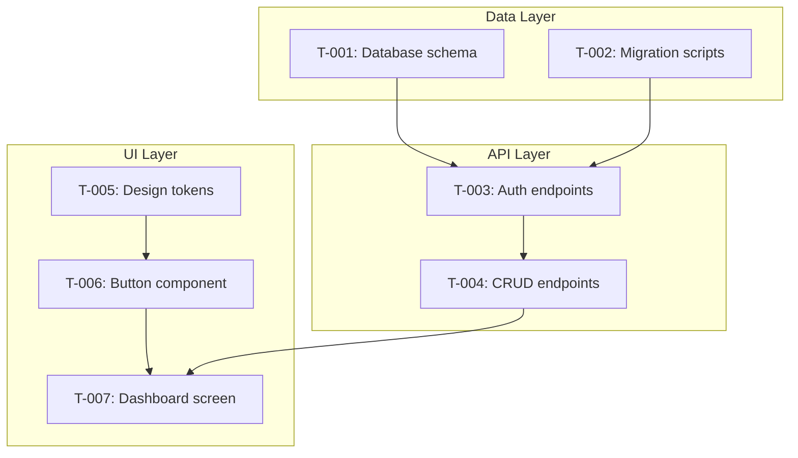

# Post-Spec Implementation Tracking

**Type**: Net new
**Status**: Draft
**Complexity**: L2 (Complex) — cross-cutting, affects pipeline philosophy, new skill + modifications to existing
**Open Questions**: 0
**Discussion Rounds**: 5

---

## System Context

This research relates to the following system docs and plugin artifacts:

| Document | Relevance |
|----------|-----------|
| `skills/cl-implementer/SKILL.md` | Currently declares "Specs end the pipeline. Implementation is a separate concern." This research challenges that boundary. |
| `skills/cl-implementer/references/build-plan-mode.md` (via cl-designer) | Already generates DESIGN_TASKS.md with phased tasks, dependency graphs, and acceptance criteria. The closest existing artifact to implementation tracking. |
| `skills/cl-reviewer/references/sync-mode.md` | Compares doc claims against code. Advisory and reactive — only runs after code exists. Could inform the verification dimension. |
| `docs/pipeline-concepts.md` | Pipeline depth (L0-L3), emerged concepts, tracking files. The triage and feedback patterns apply directly to implementation gap handling. |
| `README.md` | Philosophy section — "AI does the work. Humans make the calls. Files hold the truth." and "Structured iteration beats one-shot generation." Both apply to implementation. |
| `docs/research/DOC_PIPELINE_PLUGIN.md` | Design lineage. States the goal: "specs that a junior dev (or AI) can implement without hand-holding." The implementation skill is the mechanism that delivers on this. |

---

## Current State

### What Exists

The pipeline currently produces two categories of implementation-ready artifacts:

**Task-oriented** (from cl-designer build-plan):
- `DESIGN_TASKS.md` — phased task list with dependency graph, acceptance criteria, design references
- Tasks are numbered (T-001, T-002...), organized into 5 phases, each with concrete acceptance criteria

**Contract-oriented** (from cl-implementer):
- Spec files in `docs/specs/` — OpenAPI, JSON Schema, SQL DDL, structured markdown
- `.spec-manifest.md` — index with source doc mappings, cross-spec dependencies
- Each spec traces to system doc sections

### What's Missing

After specs are generated, the pipeline ends. The cl-implementer SKILL.md explicitly says: "Specs end the pipeline. After specs are generated and reviewed, the documentation pipeline's job is done. Implementation is a separate concern."

This creates six gaps:

1. **No progress tracking** — No persistent record of which tasks are done, in progress, or blocked. Each Claude Code session starts blind.
2. **No implementation verification** — No structured check that code matches what specs described. Sync mode exists but is reactive and doc-focused (checks doc claims against code), not spec-focused (checks spec contracts against code).
3. **No spec gap feedback** — When implementation reveals a spec gap (missing edge case, impossible constraint, ambiguous contract), there's no structured way to record it, triage it, or feed it back upstream.
4. **No loop awareness** — If a new research cycle changes system docs mid-implementation, specs become stale. There's no mechanism to assess impact on already-implemented tasks or adjust the remaining queue.
5. **No failure handling** — When implemented code throws errors, regresses previously-working features, or fails integration, there's no mechanism to diagnose, create fix tasks, or re-verify affected work. The pipeline assumes clean implementation.
6. **No external change tolerance** — The user (or Claude Code outside the skill) can modify code orthogonally — direct bug fixes, refactors, manual edits. The pipeline has no awareness of or reconciliation with changes made outside its tracking.

### The Cliff

The user experience goes from highly structured (every change reviewed, tracked, verified) to completely unstructured (just start coding). This is jarring and undermines the plugin's value proposition — the whole point is that structured process produces better output.

---

## Scope

### In Scope

- A new skill for tracking and orchestrating implementation from specs
- Progress persistence across sessions
- Implementation verification against spec contracts
- Spec gap discovery, triage, and upstream feedback
- Loop awareness: handling spec changes mid-implementation (impact analysis, re-verification)
- Integration with existing pipeline (emerged concepts, sync mode, pipeline depth)

### Out of Scope

- Code generation techniques (how Claude Code writes code is not this skill's concern — it orchestrates, tracks, and verifies)
- IDE integration or dashboard UI for progress visualization
- Deciding WHAT to test or WHAT CI/CD to use (that's a research/spec concern — if it's in the specs, the cl-implementer implements it)

### Explicitly In Scope (Clarified in Round 3)

- **Testing and CI/CD implementation**: If the specs include testing strategy, test specs, or CI/CD configuration, the cl-implementer includes those as tasks in TASKS.md and implements them. If specs DON'T include testing but system docs mention test requirements, the skill nudges the user (see Finding 7).
- **Parallel task execution**: Claude Code supports fork/subagents. Independent tasks with no shared file dependencies can be parallelized (see Finding 8).
- **User reordering of tasks**: The auto-generated task order is a suggestion. Users can reorder, reprioritize, split, merge, or skip tasks (see Finding 9).
- **Runtime failure and regression handling**: When implemented code throws errors or breaks previously-working features, the skill supports diagnosis, fix tasks, and cascading re-verification (see Finding 10).
- **External change reconciliation**: The user or other tools can modify code outside the cl-implementer. On resume, the skill detects external changes via git diff and reconciles with tracked state (see Finding 11).
- **Tangent tolerance**: Real development has interruptions — debugging, exploration, refactoring. The skill accommodates tangents without losing queue state (see Finding 12).

### Constraints

- Must follow existing plugin patterns (SKILL.md format, reference files, progress tracking via markdown)
- Must work with Claude Code as the cl-implementer (AI-driven, can be instrumented)
- Must survive session boundaries (context compression, crashes, multi-day implementation)
- Must not break the waterfall principle — specs are still generated from stable docs. The implementation skill handles what happens when stability is disrupted by new cycles.
- Must follow the plugin philosophy: AI does the work, humans make the calls, files hold the truth.

---

## Research Findings

### Finding 1: Two Tracking Dimensions

Implementation tracking requires two complementary dimensions that serve different purposes:

**Task progress** (from DESIGN_TASKS.md and spec-derived task lists):
- "What's been done" — a worklist with status
- Sequential, dependency-aware ordering
- Each task has acceptance criteria that can be verified
- Progress is linear: pending → in progress → done

**Contract compliance** (from spec files):
- "Does what's done match what was specced" — a verification matrix
- Not sequential — any spec can be checked against code at any time
- Catches drift between what was specced and what was built
- Contract compliance can degrade over time as code evolves

Both dimensions are needed. Task progress alone doesn't catch "we implemented it but it doesn't match the spec." Contract compliance alone doesn't tell you "what's left to build."

**Traceability chain:**
```
System doc section → Spec file/section → Task → Implemented code (files/functions)
```

This chain is the foundation for everything — progress tracking, verification, impact analysis, and gap feedback all follow it.

### Finding 2: Queue Semantics for Loop Awareness

The pipeline is cyclical. Implementation is not the terminal step — it feeds back into research via discoveries, and upstream changes (new research, audit findings, emerged concepts) can change specs while implementation is in progress.

The original design proposed complex impact analysis (diff spec manifests, trace affected tasks, categorize changes). Discussion Round 3 revealed a simpler mental model: **treat TASKS.md as a queue.**

**Queue rules:**

1. **Process front-to-back** — pick the next unblocked task
2. **Validity check before each task** — before implementing, check: does this task's spec reference still match current specs? If yes, implement. If specs changed:
   - **Task superseded** (spec section removed or fundamentally changed) → pop the task, replace with new version derived from updated specs
   - **Task still valid** (spec section unchanged or trivially updated) → implement as-is
3. **Already-implemented tasks affected by spec changes** — re-verify against new specs. If still valid, keep. If not, re-queue for re-implementation.
4. **New tasks from spec changes** — insert into queue at the appropriate position based on dependencies

**Why queue over impact analysis:**

The queue model is simpler and more consistent. Impact analysis tries to predict which tasks are affected before processing them — this requires spec diffing, traceability traversal, and categorization. The queue model defers that judgment to the point of execution: when you're about to work on a task, you check if it's still valid. This is "not efficient" (you might implement something that gets superseded next cycle) but it's **consistent** — the same process handles all cases:

| Scenario | Queue Behavior |
|----------|---------------|
| **Additive** (new specs) | New tasks inserted into queue at dependency-appropriate positions |
| **Modificatory** (specs changed) | Affected pending tasks are updated in-place. Affected completed tasks are re-queued for verification. |
| **Superseding** (approach replaced) | Affected tasks popped and replaced. Completed work re-queued for verification or cleanup. |
| **No change** | Queue processes normally |

**The cost is intentional**: occasionally implementing something that a later cycle supersedes. But the alternative — complex impact analysis that tries to avoid wasted work — adds significant complexity for a case that's relatively rare. Most of the time, the queue processes faster than upstream changes arrive.

**Spec version checkpoint**: Each task in TASKS.md records which spec hash it was generated from. The `sync` mode compares the current spec hash against each task's recorded hash. Mismatches trigger the queue update rules above.

### Finding 3: Spec Gap Triage

Implementation will reveal spec gaps. The existing pipeline depth concept (L0-L3) maps cleanly to gap severity:

| Gap Level | Example | Action |
|-----------|---------|--------|
| **L0 — Trivial** | Typo in spec, obvious default value missing | Patch spec inline, note in progress file, continue |
| **L1 — Contained** | Edge case not covered, minor contract ambiguity | Log gap, flag to user for decision, continue with stated assumption |
| **L2 — Significant** | Design-level gap, conflicting constraints, impossible requirement | Pause task, flag to user. User decides: research cycle or make a call now |

L0 gaps are patched without breaking flow. L1 gaps are logged and the user makes a call (often async — the implementation continues with a stated assumption). L2 gaps pause the affected task but not the whole implementation — other unblocked tasks can continue.

**Feedback path**: When gaps are resolved (either inline or via a research cycle that changes system docs), the resolution flows through: system docs → spec regeneration → impact analysis → task adjustment. The loop closes.

### Finding 4: Session Persistence Pattern

The design pipeline already solved this with `DESIGN_PROGRESS.md`. The implementation skill needs an equivalent: `IMPLEMENTATION_PROGRESS.md`.

**What it tracks:**

```markdown
# Implementation Progress

**Spec version**: [content hash from .spec-manifest.md]
**Started**: [date]
**Last session**: [date]
**Status**: In Progress | Paused (spec change) | Complete

## Task Status

| Task | Status | Completed | Files Modified | Notes |
|------|--------|-----------|----------------|-------|
| T-001 | done | 2026-02-10 | src/theme/tokens.css | — |
| T-002 | done | 2026-02-10 | src/components/Button.tsx | Discovered: needs loading variant (gap G-001) |
| T-003 | in-progress | — | src/components/Input.tsx | — |
| T-004 | pending | — | — | Blocked by T-003 |

## Spec Gaps

| ID | Task | Gap | Level | Status | Resolution |
|----|------|-----|-------|--------|------------|
| G-001 | T-002 | Button spec has no loading state variant | L1 | resolved | Added loading prop, user confirmed |
| G-002 | T-003 | Input validation rules not specified | L2 | open | Awaiting user decision |

## Fix Tasks

| ID | Type | Source Task | Discovered During | Status | Files Modified |
|----|------|-----------|-------------------|--------|----------------|
| F-001 | regression | T-003 | T-007 | resolved | src/auth/middleware.ts |

## External Changes

| Date | Files Changed | Task Impact | Action Taken |
|------|--------------|-------------|--------------|
| 2026-02-11 | src/utils/date.ts | None (new file) | Noted as external |
| 2026-02-11 | src/auth/middleware.ts | T-003 | Re-verified, still passes |

## Spec Sync History

| Date | Old Hash | New Hash | Impact | Action Taken |
|------|----------|----------|--------|--------------|
| 2026-02-12 | abc123 | def456 | T-005 acceptance criteria changed | Re-queued T-005 |
```

This file is the single source of truth for implementation state. On session start, the skill reads it, orients, and resumes.

### Finding 5: Unified TASKS.md — Single Task Authority

The current pipeline produces task breakdowns in one place (DESIGN_TASKS.md from cl-designer's build-plan mode) and spec contracts in another (spec files from cl-implementer). But there's no task breakdown for non-UI work — API endpoints, data models, services, infrastructure. A developer implementing from tech specs has contracts but no worklist.

**The solution: a single unified `TASKS.md`** generated by the cl-implementer's `start` mode from ALL spec artifacts.

**What goes into TASKS.md:**

The cl-implementer reads every spec file and DESIGN_TASKS.md (if it exists), then produces a single task file organized by implementation area:

```markdown
# Implementation Tasks

**Generated**: [date]
**Spec version**: [hash]
**Source specs**: [list]

## Dependency Graph



## Area: Data Layer
### T-001: Create database schema
- **Spec reference**: data-model-spec.md, Section 2
- **Dependencies**: None
- **Status**: pending
- **Acceptance criteria**:
  - [ ] All tables from spec created
  - [ ] Indexes match spec
  - [ ] Constraints enforced
- **Complexity**: Medium

## Area: API Layer
### T-003: Implement auth endpoints
- **Spec reference**: api-spec.yaml, paths./auth/*
- **Dependencies**: T-001
- **Status**: pending
- **Acceptance criteria**:
  - [ ] POST /auth/login returns JWT
  - [ ] Token validation middleware works
- **Complexity**: Medium

## Area: UI Layer
### T-005: Configure design tokens
- **Spec reference**: DESIGN_SYSTEM.md, Token Catalog
- **Dependencies**: None
- **Status**: pending
- **Acceptance criteria**:
  - [ ] CSS custom properties match token values
  - [ ] Theme switching works (if applicable)
- **Complexity**: Simple
```

**Key design decisions:**

1. **Areas, not phases**: DESIGN_TASKS.md uses phases (1-5) which assumes a linear build order. Real implementation has cross-cutting dependencies — a screen task depends on both a component task (UI) and an API task (backend). Areas group by domain, the dependency graph handles ordering.

2. **Cross-area dependencies**: The Mermaid graph shows dependencies across areas. T-007 (Dashboard screen) depends on both T-006 (Button component, UI area) and T-004 (CRUD endpoints, API area). This is impossible to represent in phase-based ordering.

3. **Absorbs DESIGN_TASKS.md**: If DESIGN_TASKS.md exists from cl-designer, its tasks are merged into the UI area of TASKS.md. DESIGN_TASKS.md remains as a source artifact (build-plan output) but TASKS.md is the working copy. This avoids two task lists that can drift.

4. **Feeds Claude Code's task system**: On session start, the cl-implementer reads TASKS.md and creates Claude Code tasks via `TaskCreate`. As tasks complete, it updates both the Claude Code task system (`TaskUpdate`) and TASKS.md (the persistent file). The markdown is the source of truth; the Claude Code task system is the active session view.

5. **Spec traceability per task**: Every task links to a spec file and section. When specs change (loop scenario), impact analysis traces from changed spec → affected tasks → required action.

**What happens to DESIGN_TASKS.md?** It stays as build-plan output — the cl-designer generates it during the design phase. The cl-implementer's `start` mode reads it as one of its inputs and merges those tasks into TASKS.md alongside tasks derived from tech specs. DESIGN_TASKS.md is a design artifact; TASKS.md is an implementation artifact.

### Finding 6: Verification as a First-Class Mode

Post-implementation verification is distinct from task-by-task acceptance criteria checking. It's a holistic check:

- **Per-task**: Does each implemented task meet its acceptance criteria? (Checked during `run` mode)
- **Per-spec**: Does the full implementation honor the spec contracts? (Types match, interfaces align, constraints respected)
- **Cross-spec**: Do implemented modules work together the way the specs said they should? (Integration check)
- **Spec-to-doc**: Does the implemented code still align with the system docs? (This is where `sync` mode gets invoked)

This maps to a dedicated `verify` mode that runs after all tasks are complete (or after a significant batch). It's the implementation equivalent of `cl-reviewer verify` after a merge.

### Finding 7: Testing and CI/CD Are Spec-Driven

The original research excluded testing and CI/CD from scope. This was wrong — if testing strategy went through the pipeline (research → proposal → spec), the resulting test specs are implementation tasks like any other.

**Three scenarios:**

| Scenario | What Happens |
|----------|-------------|
| **Testing is in the specs** | TASKS.md includes testing tasks: write unit tests, set up test infrastructure, configure CI pipeline. These are regular tasks with acceptance criteria. |
| **Testing is NOT in specs, but system docs mention it** | Nudge during `start` mode: "Your PRD mentions test coverage requirements but no testing spec exists. Consider running `/cl-researcher research 'testing strategy'` before or during implementation." |
| **Testing is not mentioned anywhere** | No nudge. The cl-implementer implements what's specced, nothing more. |

The cl-implementer doesn't decide what to test or which framework to use — that's a research/spec concern. But it absolutely implements testing tasks if they're in the specs. Similarly for CI/CD: if there's a spec for deployment configuration, the cl-implementer creates those tasks.

**The nudge is important**: Many projects specify testing requirements in the PRD ("90% coverage", "E2E tests for critical flows") but never research a testing strategy. The nudge surfaces this gap before the user gets deep into implementation and realizes tests were never planned.

### Finding 8: Parallel Task Execution via Subagents

Claude Code supports `context: fork` for subagent isolation. Tasks with no shared file dependencies can be parallelized.

**Parallelization rules:**

1. **Identify independent task groups**: Tasks that have no dependency relationship AND modify different files/directories can run in parallel
2. **Fork per task group**: Each parallel group gets a subagent via fork
3. **Shared interface boundary**: If two tasks share an interface (e.g., API task defines endpoints, UI task calls them), they must either run sequentially or the interface contract must be locked before parallelizing
4. **Merge point**: After parallel tasks complete, the main context verifies no conflicts (file-level merge check)

**Typical parallel opportunities:**

| Group A | Group B | Why Parallel |
|---------|---------|-------------|
| Data layer tasks (schema, migrations) | UI token/component tasks | Different directories, no shared files |
| Backend service A | Backend service B | Independent modules with no shared code |
| Unit test tasks for module X | Unit test tasks for module Y | Independent test files |

**What can't parallelize:**
- Tasks that modify the same file
- Tasks where one produces an interface the other consumes (unless the interface is defined upfront)
- Tasks with explicit dependency relationships in TASKS.md

**User control**: The skill suggests parallelizable groups during `start` mode. The user can approve, adjust, or disable parallel execution. Some users will prefer sequential for easier debugging and review.

**Session model**: Parallel tasks use fork (subagent with fresh context). Each subagent:
- Gets its task description, spec references, and acceptance criteria
- Implements independently
- Reports back: files modified, acceptance criteria status, gaps found
- Main context updates TASKS.md and IMPLEMENTATION_PROGRESS.md

### Finding 9: User Control Over Task Ordering

The auto-generated task list in TASKS.md is a **suggestion**, not a mandate. This aligns with the plugin's core philosophy: "AI does the work. Humans make the calls."

**What the user can change:**

| Action | How | When |
|--------|-----|------|
| **Reorder within area** | Move tasks up/down in an area section | Different implementation preference |
| **Reorder across areas** | Move a task from one area's priority to another | Strategic choice (e.g., "build API first, UI later") |
| **Split a task** | Break one task into multiple smaller tasks | Task too large or has separable concerns |
| **Merge tasks** | Combine related tasks | Tasks are trivially small or tightly coupled |
| **Skip a task** | Mark as `skipped` with reason | Deferred to later, or handled differently |
| **Add a task** | Insert a new task not in the specs | Implementation discovery, infrastructure need |
| **Change dependencies** | Modify the dependency graph | User knows something the auto-generation doesn't |

**Mechanism**: During `start` mode, after generating TASKS.md, the skill presents:
1. The dependency graph (Mermaid visualization)
2. The suggested implementation order (topological sort of the dependency graph)
3. Any parallelizable groups identified
4. Ask: "Here's the implementation plan. You can reorder, split, merge, skip, or add tasks. Any changes?"

The user edits TASKS.md directly or gives verbal instructions. The skill regenerates the dependency graph and re-validates (no circular deps, no orphaned dependencies).

**Between sessions**: The user can also edit TASKS.md manually between sessions. On the next `run`, the skill re-reads the file, detects changes, and adapts. Added tasks are incorporated. Removed tasks are acknowledged. Reordered tasks are followed.

**Key principle**: The dependency graph enforces hard constraints (can't implement a component before its tokens exist). But within those constraints, the order is the user's choice.

**Additional controls from dry run (Round 4):**

- **Skipping with dependents**: When a task is skipped, the skill checks transitive dependents. If the requirement is satisfied externally (e.g., database already exists), the task gets status `satisfied-externally` and dependents are unblocked. If not, dependents are also flagged.
- **User-added tasks**: Tasks added by the user that aren't derived from specs get `source: user-added`. They're tracked for progress but excluded from spec-based verification and sync (no spec to verify against).
- **Task ID renumbering**: When DESIGN_TASKS.md tasks are merged with tech spec tasks, TASKS.md renumbers everything sequentially based on dependency-aware ordering. Original DESIGN_TASKS.md references are preserved within task descriptions.

### Finding 10: Fix Tasks — Runtime Failures and Regressions

The queue model (Finding 2) assumes clean implementation — write code, check acceptance criteria, move on. Real development breaks this assumption. Code throws errors. Previously-working features regress when later tasks are implemented. Integration between modules fails in ways individual task verification doesn't catch.

**The problem**: A spec gap means "the spec is wrong." A runtime failure means "the spec is right, the code is wrong." These require different handling:

| Issue Type | Meaning | Upstream Impact | Resolution Path |
|-----------|---------|----------------|----------------|
| **Spec gap** | Spec is incomplete/wrong | May trigger research cycle | Gap triage (L0-L2) → spec update → queue adjustment |
| **Runtime failure** | Code doesn't work correctly | None — spec is fine | Fix task → re-verify affected tasks → continue |
| **Regression** | Later task breaks earlier work | None — spec is fine | Diagnose → fix task → cascade re-verify → continue |

**Fix tasks (F-NNN)**:

When a runtime failure or regression is detected:

1. **Pause the current task** (if the failure is blocking it)
2. **Create a fix task**: `F-001: Fix auth middleware token parsing (regression from T-007 integration)`
   - **Source task**: Which task's implementation has the bug
   - **Discovered during**: Which task was being implemented when the bug surfaced
   - **Files affected**: The files that need fixing
   - **Type**: `runtime-error` | `regression` | `integration-failure`
3. **Implement the fix**
4. **Re-verify the source task**: Does the fixed code still meet its original acceptance criteria?
5. **Cascade re-verification**: All tasks that transitively depend on the source task should be re-verified. Most will pass quickly (the fix was targeted). Some may surface additional issues.
6. **Resume the paused task**

Fix tasks are tracked in IMPLEMENTATION_PROGRESS.md alongside spec gaps:

```markdown
## Fix Tasks

| ID | Type | Source Task | Discovered During | Status | Files Modified |
|----|------|-----------|-------------------|--------|----------------|
| F-001 | regression | T-003 | T-007 | resolved | src/auth/middleware.ts |
| F-002 | integration-failure | T-004, T-006 | T-007 | in-progress | — |
```

**Cascade re-verification rule**: When a fix modifies files associated with a completed task, ALL completed tasks whose files overlap OR that transitively depend on the modified task are flagged `needs-re-verification`. The skill processes these before continuing with new tasks.

**When to create fix tasks vs. absorb inline**: Small issues discovered while implementing the current task (missing import, wrong variable name) are fixed inline — no separate fix task. Fix tasks are for issues that affect OTHER tasks' code or that require significant debugging.

**Post-task regression spot-check** (from dry run gap #13): After implementing each task, `run` mode does a lightweight regression check — quick-verify acceptance criteria for completed tasks whose files overlap with the files just modified. This catches regressions early (at the task that caused them) rather than deferring to `verify` mode. The check is optional and user-configurable — some users will prefer speed over safety and can disable it.

**Cascade deduplication** (from dry run gap #14): When multiple fix tasks resolve in a batch, their cascade re-verification sets may overlap (e.g., T-005 depends on both T-002 and T-003, and both had fixes). The skill collects the union of all `needs-re-verification` tasks after all fixes in the batch are resolved, deduplicates, then re-verifies each task exactly once. This is naturally handled by the status model — a task marked `needs-re-verification` is simply re-verified regardless of which fix triggered the flag — but the run-mode reference doc should explicitly call out the batching behavior.

### Finding 11: Reconciliation on Resume — External Change Tolerance

The cl-implementer is not the only thing that modifies code. The user can:
- Open a regular Claude Code session and fix bugs, add features, refactor
- Manually edit files in their IDE
- Run other tools that generate or modify code
- Pull changes from a collaborator

The cl-implementer must tolerate this. It doesn't gate or prevent external changes — it reconciles with them.

**Reconciliation protocol (runs at the start of every `run` invocation):**

1. **Read IMPLEMENTATION_PROGRESS.md** — get last session date and task states
2. **Git check**: Is this a git repository? If not, offer to initialize:
   - "This project isn't a git repository. Git enables implementation tracking — change detection, reconciliation on resume, regression identification. Initialize now? [Y/n]"
   - If yes: `git init`, optionally create an initial commit with the current state
   - If no: fall back to file modification timestamps (less reliable — no commit history, no diff granularity, no rename detection). Warn: "Without git, reconciliation accuracy is reduced. External changes may be missed or misattributed."
3. **Git diff since last session**: `git diff --name-only [last-session-date]...HEAD`
4. **Map changed files to completed tasks**: Cross-reference changed files against the "Files Modified" column in the progress file
5. **Categorize each external change**:

| External Change | Task Impact | Action |
|----------------|-------------|--------|
| File NOT associated with any task | No task impact | Note in progress file as `external change`, continue |
| File associated with a completed task, minor change (few lines) | May still be valid | Flag: "T-003's files were externally modified. Re-verify?" |
| File associated with a completed task, major change (rewrite) | Likely invalidated | Flag: "T-003's auth.ts was substantially rewritten externally. Task may no longer match its recorded state. Re-verify or mark as externally-managed?" |
| File associated with an in-progress task | Current work affected | Flag: "Files for your current task T-007 were modified externally. Review before continuing." |

6. **Present reconciliation summary to user**:
   ```
   Since your last session (2026-02-10):
   - 3 files changed outside the cl-implementer
   - T-003 (auth endpoints): auth.ts modified — needs re-verification
   - 2 new files not associated with any task (src/utils/date.ts, src/config/env.ts)
   Re-verify affected tasks before continuing? [Y/n]
   ```

7. **User decides**: re-verify (recommended), skip (trust external changes), or mark tasks as `externally-managed` (remove from queue verification scope)

**New task status: `externally-managed`**: For tasks where the user says "I rewrote this myself, don't track it anymore." The task stays in TASKS.md for completeness but the cl-implementer doesn't verify or re-implement it.

**Key principle**: The cl-implementer doesn't fight the user's workflow. External changes are legitimate. The skill's job is to keep TASKS.md and IMPLEMENTATION_PROGRESS.md accurate — reflecting reality, not enforcing a process.

### Finding 12: Tangent Tolerance — The Queue Is the Plan, Not the Process

Real development has tangents. Debugging sessions, exploratory refactors, "let me try a different approach," infrastructure yak-shaving. The queue model needs to accommodate these without breaking.

**Tangent classification:**

| Size | Example | Queue Impact | Handling |
|------|---------|-------------|----------|
| **Small** | Fix an import, adjust config, add a missing type | None | Absorbed into current task. No separate tracking needed. |
| **Medium** | Debug a runtime error, fix a regression, refactor a function | Current task paused | Fix task (F-NNN) created, resolved, current task resumes. See Finding 10. |
| **Large** | User refactors entire module, adds unplanned feature, rewrites component approach | Multiple tasks potentially affected | Detected via reconciliation on next resume. See Finding 11. |
| **Off-script** | User abandons the queue entirely, does a bunch of manual work, comes back days later | Queue may be significantly stale | Full reconciliation: git diff all changes, re-verify all completed tasks, update queue to reflect reality. |

**The "off-script" scenario in detail:**

The user gets frustrated with the queue, opens Claude Code directly, implements several features manually over two days, then comes back to the cl-implementer. This is fine. On resume:

1. Git diff reveals extensive changes across many files
2. Reconciliation maps changes to tasks — some tasks are now effectively done (code exists and meets criteria), some are partially done, some are untouched
3. The skill presents: "Significant external changes detected. I'll re-assess the task queue against current code state."
4. For each task: check if acceptance criteria are met by the existing code (regardless of who wrote it)
5. Tasks whose criteria are met → mark `done (external)`. Tasks partially met → mark `in-progress` with notes. Tasks unaffected → remain `pending`.
6. Updated TASKS.md reflects reality. The user can continue from wherever the queue actually stands.

**The key design principle**: **The queue is the plan, not the process.** The plan says what needs to be built and what "done" looks like (acceptance criteria). The process of how it gets built — through the queue, through manual work, through a mix — is the user's choice. The cl-implementer's job is to keep the plan accurate against reality, not to enforce a rigid workflow.

This means the cl-implementer must be **stateless about HOW code was written** and only care about **WHETHER acceptance criteria are met**. If T-003's acceptance criteria are satisfied by code the user wrote manually, T-003 is done. The cl-implementer doesn't care that it didn't implement it.

---

## Dry Run Gaps (Rounds 4-5)

Comprehensive scenario testing across two dry runs revealed 15 edge cases. All are addressed in the findings above. Summary:

| # | Gap | Resolution | Finding |
|---|-----|------------|---------|
| 1 | No spec review check in `start` | `start` warns if `/cl-implementer spec-review` was never run | Start mode pre-checks |
| 2 | No resume protocol for partial tasks | Reconciliation detects in-progress tasks, asks user to continue or restart | Finding 11 |
| 3 | Pausing a task doesn't cascade to dependents | Pausing cascades `blocked` to transitive dependents automatically | Finding 10 |
| 4 | No auto-detect of spec changes in `run` | `run` checks spec hash every invocation, suggests sync on mismatch | Finding 2 + 11 |
| 5 | Superseded task doesn't cascade re-verification | Completed dependents transitively re-queued as `needs-re-verification` | Finding 2 + 10 |
| 6 | Parallel execution misses generated shared files | "No shared file" rule; main context handles barrel exports post-merge | Finding 8 |
| 7 | Skipping task with dependents unresolved | `satisfied-externally` status unblocks dependents when requirement exists outside queue | Finding 9 |
| 8 | User-added tasks need source marker | `source: user-added`, excluded from spec verification and sync | Finding 9 |
| 9 | Testing nudge when user wants tests without specs | No spec = no auto-task. Three paths offered: manual tasks, quick research, skip | Finding 7 |
| 10 | No spec coverage check against system docs | `start` compares system doc areas vs. spec coverage, warns on gaps | Start mode pre-checks |
| 11 | `sync` merge mechanics unclear | Regenerate from specs, diff against existing TASKS.md, preserve statuses + user tasks | Finding 2 |
| 12 | Task ID renumbering during merge | Renumber sequentially by dependency order; preserve design refs in descriptions | Finding 5 + 9 |
| 13 | No post-task regression spot-check | After each task, quick-check completed tasks whose files overlap with just-modified files. Optional, user-configurable. | Finding 10 |
| 14 | Fix task cascade re-verification not deduplicated | When multiple fixes resolve, collect union of `needs-re-verification` tasks, deduplicate, re-verify each once | Finding 10 |
| 15 | No git repo for greenfield projects | Reconciliation checks for git on first run, offers to initialize. Timestamp fallback if user declines. | Finding 11 |

---

## Options Analysis

### Option 1: New `cl-implementer` Skill

Create a standalone skill (`cl-implementer` or `spec-runner`) with its own SKILL.md and reference files.

**Modes:**

| Mode | Purpose |
|------|---------|
| `start` | Read ALL specs + DESIGN_TASKS.md, generate unified TASKS.md with cross-area dependency graph, identify parallelizable groups, present for user reordering, create IMPLEMENTATION_PROGRESS.md, populate Claude Code tasks. Nudge if testing/CI-CD gaps detected. |
| `run` | Reconcile external changes (git diff since last session), pick next unblocked task (queue order), validity-check against current specs, implement (fork subagents for parallel groups), verify acceptance criteria, handle runtime failures (fix tasks), update TASKS.md + Claude Code tasks, triage gaps |
| `verify` | Post-implementation: check all specs against code, contract compliance, invoke cl-reviewer sync |
| `status` | Progress report: done, remaining, gaps, spec staleness, queue state |
| `sync` | Specs changed — check task spec hashes against current specs, pop/replace superseded tasks, re-queue affected completed tasks for verification |

**Pros:**
- Clean separation — implementation has its own skill, own tracking, own modes
- Follows the pattern of other skills (cl-researcher, cl-reviewer, cl-designer, cl-implementer)
- Can evolve independently
- Queue semantics keep the loop-awareness model simple

**Cons:**
- Another skill to maintain
- Overlap with `cl-reviewer sync` (code-vs-doc verification)
- The skill boundary between spec-gen and implementer is "specs end here, implementation starts here" — but sync mode blurs that

### Option 2: Extend `cl-implementer` with Implementation Modes

Add `implement`, `verify-impl`, and `sync-impl` modes to the existing spec-gen skill.

**Pros:**
- Spec generation and implementation tracking live together
- Spec version tracking is natural (spec-gen owns the manifest)
- Fewer skills to discover

**Cons:**
- cl-implementer currently runs as `context: fork` (heavy subagent). Implementation needs main context (interactive feedback).
- Spec generation and implementation are fundamentally different activities — one derives artifacts, the other produces code
- The skill gets large and dual-purpose

### Option 3: Hybrid — New Skill, but Integrate with Existing Pipeline

New `cl-implementer` skill, but with explicit integration points:

- Generates a unified `TASKS.md` from ALL spec artifacts + DESIGN_TASKS.md, organized by implementation area with a cross-area dependency graph
- Populates Claude Code's native task system (`TaskCreate`) on session start, syncs back to TASKS.md on completion (`TaskUpdate`)
- Reads spec manifest (from cl-implementer) for version tracking
- Invokes `cl-reviewer sync` as part of its verify mode
- Feeds gaps back via emerged concepts (existing STATUS.md mechanism)
- Uses pipeline depth triage for gap handling (existing concept)
- Triggers spec-gen staleness checks when relevant

**Pros:**
- Clean separation (own skill) with tight integration (shared mechanisms)
- Reuses existing pipeline concepts rather than reinventing
- Implementation-specific concerns don't pollute other skills
- The loop closes through existing channels

**Cons:**
- Coordination between skills adds complexity
- Need to define clear handoff points

---

## Recommendation

**Option 3: Hybrid — New `cl-implementer` skill with pipeline integration.**

Rationale:
1. Implementation is a distinct activity that deserves its own skill, not a mode tacked onto spec-gen
2. The interactive nature (implement → verify → feedback → continue) requires main context, not fork
3. The loop-awareness (spec sync, gap triage, upstream feedback) is best handled by a skill that understands both specs and code
4. Reusing existing mechanisms (pipeline depth for gap triage, emerged concepts for discoveries, sync mode for code-doc alignment) means less new invention and more consistency
5. It completes the pipeline's value proposition — structured process from idea to working code

### Naming

`cl-implementer` — short, clear, describes what it does. Follows the pattern of skills named for their role (researcher, reviewer, designer).

### Risk: Scope Creep

The biggest risk is this skill trying to become a full project management system. Mitigate by keeping it focused:
- It tracks implementation of specs. Not project planning.
- It implements what's specced (including tests and CI/CD if they're in the specs). Not deciding what to test.
- It surfaces gaps. Not fixing upstream docs autonomously.

### Risk: Over-Instrumentation

If every task produces verbose tracking, the progress file bloats and becomes noise. Mitigate by keeping tracking minimal:
- Task status (pending/in-progress/done/skipped/superseded)
- Files modified (for traceability)
- Gaps found (only when they exist)
- Spec hash per task (for queue validity checks)
- Brief notes (not full implementation logs)

### Risk: Parallel Execution Conflicts

Subagent parallel execution can produce file conflicts if independence analysis is wrong. Mitigate by:
- Conservative parallelization — only suggest when file paths clearly don't overlap
- User approval before parallel execution
- Post-merge file conflict check in main context
- Easy fallback: any failed parallel group re-runs sequentially

---

## Doc Impact Preview

| Document | Change Type | Description |
|----------|-------------|-------------|
| `skills/cl-implementer/SKILL.md` | Add Doc | New skill definition with five modes |
| `skills/cl-implementer/references/start-mode.md` | Add Doc | Unified TASKS.md generation from all specs, Claude Code task population, progress file creation |
| `skills/cl-implementer/references/run-mode.md` | Add Doc | Core implementation loop with verification, gap triage, dual tracking (TASKS.md + Claude Code tasks) |
| `skills/cl-implementer/references/verify-mode.md` | Add Doc | Post-implementation contract compliance check |
| `skills/cl-implementer/references/sync-mode.md` | Add Doc | Spec change impact analysis, TASKS.md adjustment, re-verification of completed work |
| `skills/cl-implementer/SKILL.md` | Modify | Remove "implementation is a separate concern" line, add handoff to implementer |
| `skills/cl-designer/references/build-plan-mode.md` | Modify | Note that DESIGN_TASKS.md is consumed by the cl-implementer's start mode and merged into the unified TASKS.md |
| `README.md` | Modify | Add implementer to skills table, update lifecycle diagram, extend pipeline to include implementation |
| `docs/research/DOC_PIPELINE_PLUGIN.md` | Modify | Add Design Decision #12 about implementation tracking and unified task authority |
| `docs/` | Add Doc | `implementer.md` — detailed documentation for the skill |
| `scripts/init.js` | Modify | No new directories needed — TASKS.md and IMPLEMENTATION_PROGRESS.md go in `specs/` |

---

## Decision Log

| Decision | What Was Considered | Outcome | Rationale |
|----------|-------------------|---------|-----------|
| New skill vs. extend spec-gen | Options 1, 2, 3 | New skill with integration (Option 3) | Separation of concerns + interactive context needs + reuse of existing mechanisms |
| Gap triage model | Stop-and-fix, log-and-continue, triage-inline | Triage inline (L0-L2) | Matches existing pipeline depth philosophy, balances flow preservation with quality |
| Progress persistence | Database, JSON, Markdown | Markdown (IMPLEMENTATION_PROGRESS.md + TASKS.md) | Consistent with DESIGN_PROGRESS.md pattern, git-friendly, human-readable |
| Spec version tracking | Git tags, file hashes, manual versioning | Content hash from .spec-manifest.md | Already generated by spec-gen, no new mechanism needed |
| Impact analysis approach | Full re-verify, diff-based, task-level tracing | Task-level tracing via spec manifest diff | Proportional effort — only re-verify what's affected |
| Unified vs. separate task files | DESIGN_TASKS.md only, separate per-area files, unified TASKS.md | Unified TASKS.md | Cross-area dependencies are invisible in separate files; a single file enables proper dependency ordering and single-source tracking |
| Task organization | Phases (linear 1-5), areas (domain-grouped), flat list | Areas with cross-area dependency graph | Real implementation has cross-cutting deps (screen needs both component + API); phases assume linearity that doesn't exist |
| Claude Code task integration | Ignore Claude Code tasks, replace TASKS.md with Claude Code tasks, dual-write | Dual-write: TASKS.md is persistent truth, Claude Code tasks are active session view | Markdown survives sessions/crashes; Claude Code tasks provide in-session UX (progress spinner, status) |
| DESIGN_TASKS.md relationship | Replace, ignore, merge | Merge into TASKS.md | DESIGN_TASKS.md remains as build-plan output (design artifact); implementer consumes it and merges into unified TASKS.md (implementation artifact) |
| Testing/CI-CD | Exclude from scope, always include, include if specced | Include if specced + nudge if gap detected | Implementer implements specs — ALL specs. If testing is specced, it's a task. If not specced but PRD mentions it, nudge the user. |
| Parallel execution | V2 concern, always parallel, user-controlled parallel | User-controlled parallel via fork | Claude Code supports fork. Independent tasks can parallelize. User approves groups. Conservative by default. |
| Task ordering control | Fixed auto-generated order, fully manual, suggested + user override | Suggested + user override | Dependency graph enforces hard constraints; within constraints, user chooses order. Aligns with "humans make the calls." |
| Loop handling model | Complex impact analysis, simple queue, hybrid | Queue semantics | Process front-to-back, validity-check before each task, pop/replace if superseded. Simpler, consistent, occasionally redundant but predictable. |
| Runtime failure model | Stop all, log and continue, fix tasks | Fix tasks (F-NNN) with cascade re-verification | Distinct from spec gaps (spec is right, code is wrong). Fix tasks are prioritized, targeted, and trigger transitive re-verification of dependents. Small issues absorbed inline. |
| External change handling | Block external changes, ignore them, reconcile | Reconcile on resume via git diff | Implementer is not the gatekeeper of code changes. It reconciles with reality. `externally-managed` status for user-owned tasks. |
| Tangent tolerance model | Strict queue enforcement, abandon queue, plan-not-process | Plan-not-process: queue is the plan, acceptance criteria are the measure | The cl-implementer is stateless about HOW code was written. Only cares WHETHER acceptance criteria are met. Supports off-script work, manual edits, and multi-day absences. |

---

## Resolved Questions

1. **~~Should the cl-implementer generate task lists from tech specs?~~** Yes — resolved in Discussion Round 2. The cl-implementer's `start` mode generates a unified `TASKS.md` from ALL spec artifacts (tech specs + DESIGN_TASKS.md if it exists). Tasks are organized by implementation area with a cross-area Mermaid dependency graph. See Finding 5.

2. **~~Should testing and CI/CD be in scope?~~** Yes, if they're in the specs — resolved in Discussion Round 3. The cl-implementer implements ALL specs, including testing and CI/CD. If testing isn't specced but system docs mention it, the skill nudges the user. See Finding 7.

3. **~~Should parallel execution be V2?~~** No — resolved in Discussion Round 3. Claude Code already supports fork. Independent tasks with no shared file dependencies can be parallelized with user approval. See Finding 8.

4. **~~How should task ordering work?~~** Suggested + user override — resolved in Discussion Round 3. Auto-generated order is a suggestion. Users can reorder, split, merge, skip, or add tasks. Dependency graph enforces hard constraints only. See Finding 9.

5. **~~How should the cl-implementer handle partial implementation when specs change?~~** Queue semantics — resolved in Discussion Round 3. TASKS.md is a queue processed front-to-back. Before each task, validity-check against current specs. Superseded tasks are popped and replaced. Completed tasks affected by spec changes are re-queued for verification. Simple, consistent, occasionally redundant but predictable. See Finding 2.

6. **~~How should the cl-implementer handle runtime failures and regressions?~~** Fix tasks (F-NNN) — resolved in Discussion Round 4. Runtime failures are distinct from spec gaps (spec is right, code is wrong). Fix tasks are created, prioritized over new tasks, and trigger cascading re-verification of transitive dependents. Small issues absorbed inline. See Finding 10.

7. **~~How should the cl-implementer handle external changes (user edits, other tools, manual work)?~~** Reconciliation on resume — resolved in Discussion Round 4. Git diff since last session maps changed files to tracked tasks. User decides: re-verify, skip, or mark as `externally-managed`. The cl-implementer doesn't fight the user's workflow. See Finding 11.

8. **~~How should the cl-implementer handle tangents and off-script development?~~** Plan-not-process — resolved in Discussion Round 4. The queue is the plan, not the process. The cl-implementer is stateless about HOW code was written, only cares WHETHER acceptance criteria are met. Full reconciliation handles even multi-day off-script absences. See Finding 12.

## Open Questions

None — all questions resolved through discussion.
