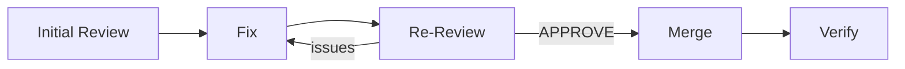
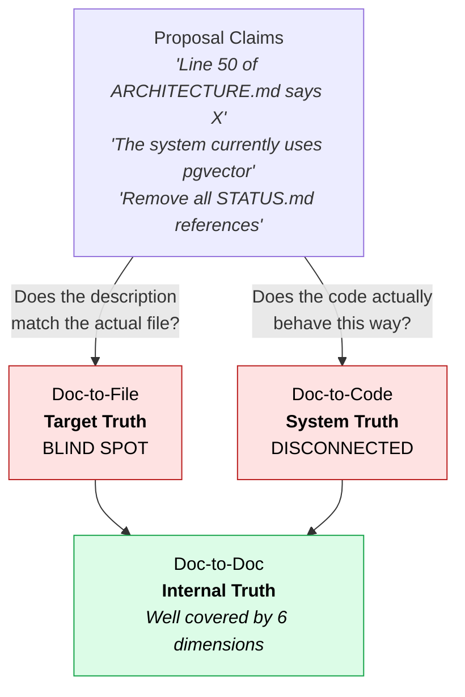
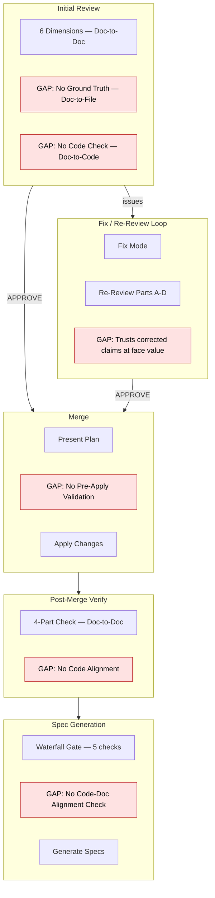
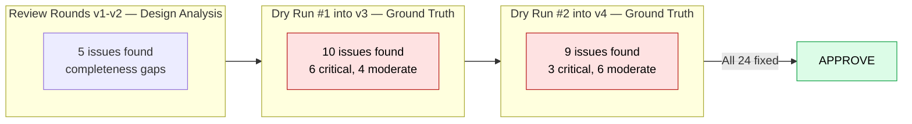
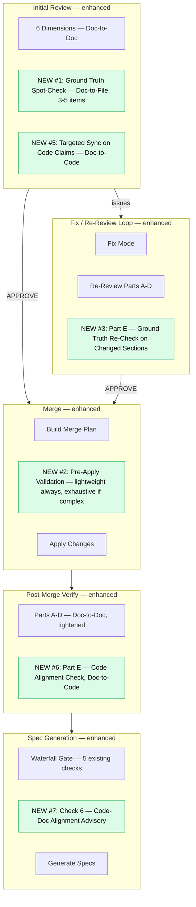
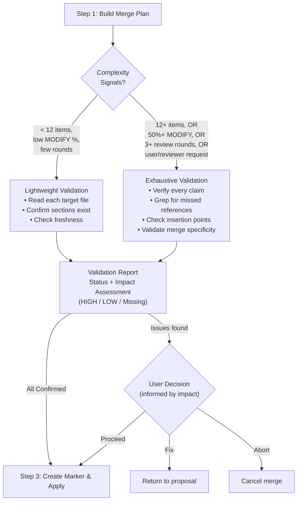
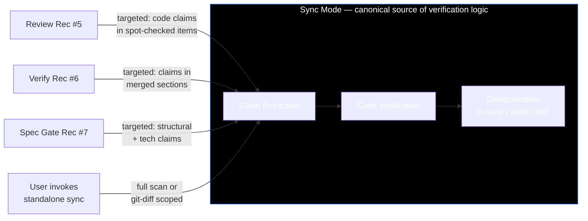
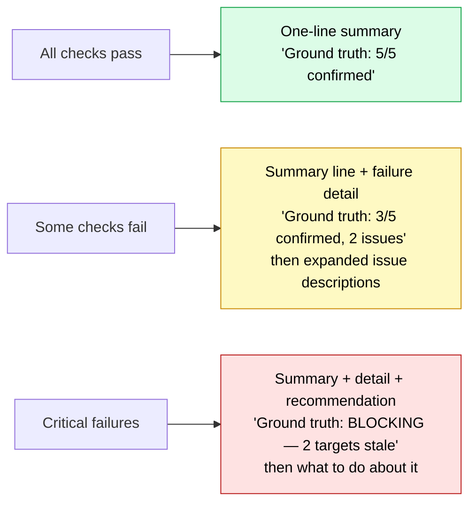

# Research: Verification Gap Analysis and Ground Truth Validation

**ID**: R-001
**Created**: 2026-02-12
**Status**: Approved
**Author**: user + AI researcher

## Status

- **Research Type**: Evolutionary
- **Status**: approved
- **Open Questions**: 0 remaining (all resolved — Decision Log 11-14)
- **Discussion Rounds**: 6
- **Complexity**: L2-complex

## System Context

### Research Type: Evolutionary

This research improves the pipeline's verification coverage across both the documentation
lifecycle (cl-reviewer) and the implementation lifecycle (cl-implementer). It doesn't add
new modes — it strengthens existing ones and connects disconnected verification capabilities.

### Related System Docs

| System Doc | Relevant Sections | Relationship |
|------------|-------------------|-------------|
| cl-reviewer/SKILL.md | Mode Detection, all mode summaries | The pipeline hub — all verification flows through here |
| cl-reviewer/references/review-mode.md | Step 2 (6 dimensions), full process | Initial review has no ground truth checking |
| cl-reviewer/references/re-review-mode.md | Part A-D, all steps | Re-review trusts fix claims at face value |
| cl-reviewer/references/merge-mode.md | Step 3 (Apply Changes), Error Handling | Merge has no pre-apply validation |
| cl-reviewer/references/verify-mode.md | Step 2 (Four-Part Verification) | Post-merge — catches problems after they're in system docs |
| cl-reviewer/references/fix-mode.md | Step 3 (Apply Fixes) | Fixes can introduce new ground truth errors |
| cl-reviewer/references/correction-mode.md | Step 4 (Spot-Check) | Has a lightweight post-apply check |
| cl-reviewer/references/sync-mode.md | Full process (Steps 1-5) | Doc-to-code verification exists but is standalone — disconnected from proposal lifecycle |
| cl-implementer/SKILL.md | Verify Mode summary, Spec Mode waterfall gate | Post-implementation verification invokes sync; waterfall gate doesn't check code alignment |
| cl-implementer/references/verify-mode.md | Dimension 4 (Spec-to-Doc), Dimension 7i (Architecture alignment) | Code verification exists but only runs post-implementation |
| cl-implementer/references/spec-mode.md | Step 1 (Waterfall Gate Check) | Checks pipeline state but not code-doc alignment before generating specs |

### Current State

The cl-reviewer pipeline has 9 modes. Five participate in the proposal lifecycle:



Each mode validates different things:

| Mode | What It Validates | What It Trusts (Doesn't Verify) |
|------|-------------------|-------------------------------|
| **Review** | Design quality across 6 dimensions (value, coherence, external consistency, technical soundness, completeness, spec-readiness) | Proposal's claims about current file state. Change Manifest accuracy. Merge instruction specificity. |
| **Re-Review** | Fix quality, regressions, convergence | Corrected claims about current state. New merge targets added during fix rounds. |
| **Fix** | Whether edits address blocking issues | Whether suggested edits introduce new ground truth errors |
| **Merge** | Prerequisites (APPROVE exists). Presents plan for user approval. | Whether targets still match proposal's assumptions. Whether instructions can be executed mechanically. |
| **Verify** | Application completeness, fidelity, cross-doc consistency, collateral damage | N/A — reads everything fresh. But catches problems AFTER they're in system docs. |

The "What It Trusts" column is the gap map. Every entry in that column is a category of
error that can pass through the pipeline undetected until merge time (where it causes a
reactive failure) or post-merge (where the fix cost is higher).

### Three Axes of Verification

The pipeline needs to validate along three distinct axes:



| Axis | What It Checks | Current Coverage | Gap |
|------|---------------|-----------------|-----|
| **Doc-to-Doc** | Proposal ↔ system docs consistency | Review dimensions 1-6 | None — well covered |
| **Doc-to-File** | Proposal claims ↔ actual target file content | Nothing in the lifecycle | **Complete blind spot** — Findings 1-7 below |
| **Doc-to-Code** | System doc claims ↔ actual codebase | Sync mode (standalone), cl-implementer verify Dim 4 + 7i | **Disconnected** — exists but orphaned from lifecycle. Findings 8-10 below |

The first version of this research identified Doc-to-File gaps (Findings 1-7). Discussion
with the user surfaced the equally important Doc-to-Code gap: the pipeline changes system
docs without verifying those docs still reflect what the code actually does.

### Where the Gaps Live



### Why This Research

The Guided Autonomy Execution Model proposal (23 Change Manifest items, 25+ target files)
went through 4 review rounds. The design was stable from v1. But two ad-hoc "dry runs" —
where every target file was read and every claim verified against actual content — found
19 additional issues (9 critical, 10 moderate) that pure design analysis missed entirely.
These included:

- A proposal claiming a target section was "a one-liner" when it was actually ~80 lines
- Silent file drops where a table rewrite accidentally omitted existing entries
- Phantom targets referencing files/structure that didn't exist
- Uncovered write instructions that would have left stale references surviving the merge
- Ambiguous insertion points where the proposal didn't specify enough for mechanical execution
- Pre-check descriptions that were wrong for 4 out of 5 checks

All 19 were accuracy and executability issues — invisible to the 6-dimension design analysis
but guaranteed to cause merge errors.



This experience prompted the question: where does the pipeline's verification have blind
spots, and how do we close them systematically?

## Scope

### In Scope
- Map all verification touchpoints across both doc and implementation lifecycles
- Identify gaps along three axes: doc-to-doc, doc-to-file, doc-to-code
- Define "ground truth validation" as a reusable concept
- Research how other engineering systems handle pre-apply validation
- Propose enhancements to existing modes (review, re-review, merge, verify)
- Integrate sync mode into the proposal lifecycle (currently standalone)
- Define complexity signals that should trigger deeper validation
- Clarify boundaries between modes to reduce overlap and drift
- Add code-doc alignment check to cl-implementer's waterfall gate

### Out of Scope
- New mode files or CLI invocations (the user explicitly wants to enhance, not add)
- Changes to audit, correction, or design-review modes
- Restructuring sync mode itself (it works; it just needs to be invoked)
- Changes to the cl-researcher or cl-designer skills
- Proposal template changes (the proposal format is working well)

### Constraints
- Must enhance existing modes, not create new ones
- Must not increase the baseline cost of reviewing simple proposals
- Deeper validation must be triggered by complexity, not applied uniformly
- Code verification in lifecycle steps must be targeted (not full sync scans)
- Sync logic stays in sync mode — lifecycle steps invoke the pattern, don't duplicate it
- The pipeline already has 9 reviewer modes — any changes must simplify or hold steady

## Research Findings

### Finding 1: The Pipeline Has No Ground Truth Dimension

**Context**: The initial review evaluates proposals across 6 dimensions. All 6 analyze the
proposal as a *document* — is the reasoning sound, are the ideas consistent, do they fit
the system? None of them read the actual target files to verify the proposal's factual
claims about current state.

**Analysis**: This is equivalent to reviewing a Terraform configuration without running
`terraform plan`. You're checking if the HCL syntax and design look good, but not whether
it matches actual infrastructure. The proposal says "line 50 of file X currently reads A" —
the review has no mechanism to verify that line 50 actually reads A.

The Guided Autonomy experience showed this isn't theoretical:
- 6 of 19 issues were **factual accuracy** errors (wrong line counts, oversimplified
  descriptions of existing content, incorrect pre-check descriptions)
- 3 of 19 were **target completeness** errors (references the proposal didn't account for)
- 4 of 19 were **insertion point** errors (not enough detail about what already exists at
  the proposed location)

**Tradeoffs**: Adding ground truth checking to every review adds file reads. For a 5-item
Change Manifest, sampling 3 items adds 3 reads — trivial. For a 23-item manifest, exhaustive
checking adds 23+ reads — significant but still much cheaper than finding the errors at
merge time.

**Source**: Pipeline analysis + Guided Autonomy case study (REVIEW_GUIDED_AUTONOMY_EXECUTION_MODEL_v1 through v4).

### Finding 2: The Merge Step Has No Pre-Apply Validation

**Context**: After a proposal receives APPROVE, merge mode presents a plan and starts
applying changes. There is no step between "plan presented" and "changes applied" that
validates the plan is *executable*.

**Analysis**: Every mature apply system has a validation step before execution:
- **Terraform**: `plan` reads actual infrastructure, computes diff, shows what will change
- **Kubernetes**: `--dry-run=server` runs admission controllers without persisting
- **git**: `apply --check` verifies patch context lines match current file
- **Flyway**: `validate` checks migration checksums against stored versions
- **etcd**: compare-and-swap rejects writes if current value doesn't match expected

The cl-reviewer merge mode skips this entirely. It goes from "here's the plan" to "applying
change #1." Problems are discovered reactively — the error handling section describes what
to do when "a system doc section referenced by the proposal doesn't exist or has changed."
This is like running `terraform apply` without `terraform plan`.

The merge mode *does* present a plan table to the user, but this plan is copied from the
proposal's Change Manifest — it hasn't been validated against actual target files. The user
is approving a plan that might not be executable.

**Tradeoffs**: Pre-apply validation adds a read of every target file before the merge starts.
For large proposals this is significant. But the alternative — discovering problems mid-merge
with partial changes applied — is strictly worse.

**Source**: merge-mode.md analysis + external pattern research (Terraform plan, etcd CAS,
git apply --check, Kubernetes dry-run).

### Finding 3: Re-Review Trusts Corrected Claims at Face Value

**Context**: When fix mode corrects a proposal and re-review runs, the re-review checks
whether the fix addresses the review's concern (Part A: Issue Resolution) and whether it
introduced regressions (Part B: Regression Scan). But it doesn't verify that corrected
claims about current state are actually accurate.

**Analysis**: Consider this sequence:
1. Review says: "The proposal claims this is a one-liner, but please verify"
2. Fix mode changes the proposal to say "~80 line comprehensive section"
3. Re-review sees the fix addressed the concern → marks as Fixed

But nobody verified that it's actually ~80 lines. The fix could have said "~40 lines" and
the re-review would still mark it as Fixed, because Part A checks *whether the fix was
attempted*, not *whether the fix is correct*.

The re-review's Part D (Convergence Tracking) is quantitative — it counts issues and
computes severity-weighted sums. It doesn't provide qualitative ground truth re-checking
on corrected sections.

The Guided Autonomy experience showed this clearly: dry run #2 (v4) found 9 additional
issues in sections that were "fixed" during v3 — including new factual errors introduced
by the fix process itself.

**Tradeoffs**: Adding ground truth re-checking to re-review on every changed section adds
cost proportional to the number of fixes. But these are exactly the sections most likely
to contain errors — they were just rewritten.

**Source**: re-review-mode.md analysis + Guided Autonomy v3→v4 experience.

### Finding 4: No Reference Completeness Mechanism

**Context**: When a proposal says "remove all references to X" or "replace X with Y in
files A, B, C," no pipeline step verifies that A, B, C are *all* the files containing X.

**Analysis**: The proposal author typically finds references by reading files. But grep-based
exhaustive search is more reliable — it catches references in files the author didn't think
to check. The Guided Autonomy proposal missed a STATUS.md reference in audit-mode.md because
the proposal's Change 6 only targeted cl-implementer files for IMPLEMENTATION_PROGRESS
removal.

This is a specific form of the ground truth gap (Finding 1), but it deserves separate
attention because:
- It requires a different validation technique (grep sweep, not file reading)
- It's the most common source of "surviving references" after a merge
- It can be automated cheaply — grep for key terms across the target directory

**Tradeoffs**: A grep sweep for each "remove/replace" operation adds seconds, not minutes.
The signal-to-noise ratio is high because the search terms are specific.

**Source**: Guided Autonomy post-merge grep audit (found 1 surviving IMPLEMENTATION_PROGRESS
reference that the proposal's 23 changes missed).

### Finding 5: Target Freshness is Unchecked

**Context**: Between the proposal being written (or last reviewed) and the merge being
executed, target files could change. Another proposal could merge, corrections could be
applied, or manual edits could happen. No step checks whether the target files still match
the proposal's assumptions.

**Analysis**: This is the compare-and-swap problem. etcd solves it by attaching a version
number to every key — writes only succeed if the expected version matches. Git solves it
with context lines in patches — `git apply` fails if surrounding lines don't match.

In the current pipeline, if target files change between APPROVE and merge:
- Merge mode may silently apply changes to the wrong section (content shifted)
- Merge mode may fail mid-apply (section referenced doesn't exist)
- The proposal's "Current" descriptions become wrong, making the change manifest misleading

For projects with a single contributor working sequentially, this risk is low. For projects
with multiple contributors or where audits/corrections happen between review and merge, the
risk is real.

**Tradeoffs**: A freshness check is cheap — compare file modification timestamps or content
hashes against a snapshot taken at review time. The cost is near-zero; the protection is
valuable for the cases where it matters.

**Source**: External pattern research (etcd CAS, git context lines, Flyway checksums).

### Finding 6: Validation Depth is Uniform Regardless of Complexity

**Context**: All proposals receive identical validation depth: 6-dimension review → fix/re-review
loop → merge → verify. A 5-change proposal to 3 files gets the same treatment as a
23-change proposal to 25 files.

**Analysis**: Every mature pipeline uses progressive gating — cheapest checks first, expensive
checks only when risk warrants it. CI/CD runs lint before unit tests before integration
tests before canary analysis. Aviation pre-flight uses "Normal" vs "Extended" checklists
depending on conditions.

The current pipeline lacks complexity signals that would trigger deeper validation. Risk
factors that should scale validation depth:

| Signal | Why It Matters | Measurement |
|--------|---------------|-------------|
| Change Manifest size | More items = more surface for errors | Count of manifest rows |
| MODIFY density | MODIFYs are riskier than ADDs (claims about current state) | % of manifest items that are Modify type |
| Multi-file targets | Same file touched by multiple changes = collision risk | Count of files targeted more than once |
| Review cycle count | 3+ rounds suggests accumulated complexity | Count of REVIEW_v*.md files |
| Cross-file dependencies | Changes that reference each other's outputs | Manual assessment |

**Tradeoffs**: Complexity-scaled validation adds decision logic ("should I do the deep
check?"). But the alternative — uniform shallow checking — means simple proposals waste
no effort while complex proposals get insufficient scrutiny.

**Source**: External pattern research (CI/CD progressive gating, aviation checklist
tiering, NASA IV&V).

### Finding 7: Verify Mode Catches What Should Be Caught Earlier

**Context**: Verify mode runs AFTER merge. It reads all system docs fresh, checks application
completeness, fidelity, cross-doc consistency, and collateral damage. This is comprehensive —
but it catches problems after they're already in the canonical system docs.

**Analysis**: Many of verify's checks could be done pre-merge at lower cost:

| Verify Check | Could Be Pre-Merge? | How |
|-------------|---------------------|-----|
| Application completeness | Partially — validate that every manifest item has a clear target | Pre-apply: read targets, confirm sections exist |
| Fidelity | No — requires seeing what was actually applied | Must remain post-merge |
| Cross-doc consistency | Partially — check for obvious conflicts before merge | Pre-apply: read adjacent sections |
| Collateral damage | No — requires seeing what actually changed | Must remain post-merge |

If pre-apply validation catches "this target doesn't exist" and "this section has changed,"
verify mode can focus on what only it can check: fidelity (was the change applied accurately?)
and collateral damage (were unintended changes made?). This makes verify lighter and more
focused.

**Tradeoffs**: Moving some checks earlier means verify does less. This is a feature — a
tighter verify step is easier to maintain and faster to run. It also means problems are
caught at the cheapest fix point (before merge, when the fix is "update the proposal"
rather than "edit the system docs again").

**Source**: Structural analysis of verify-mode.md + "shift left" principle from DevOps.

### Finding 8: Sync Mode Is Orphaned From the Proposal Lifecycle

**Context**: cl-reviewer's sync mode (`/cl-reviewer sync`) is a well-designed doc-to-code
verification tool. It extracts verifiable claims from system docs, checks them against the
codebase, and produces an advisory report with categories (in sync, potentially stale,
confirmed drift, unverifiable). It even has git-diff scoping for incremental checks.

**Analysis**: Despite being capable, sync is disconnected from every other pipeline step:

| Pipeline Step | Does It Invoke Sync? | Should It? |
|--------------|---------------------|-----------|
| Initial review | No | Yes — if a proposal claims "the code does X," verify it |
| Re-review | No | Possibly — if fixes change code-related claims |
| Merge | No | Yes — before updating system docs, confirm they'll still match code |
| Verify (cl-reviewer) | No | Yes — after merge, check the updated docs still match code |
| Spec generation | No | Yes — the waterfall gate checks pipeline state but not code-doc alignment |
| Verify (cl-implementer) | Yes (Dimension 4) | Already connected — but only post-implementation |

Sync is currently like a fire extinguisher that exists but isn't on any evacuation route.
The user has to remember to invoke it. No pipeline step recommends or triggers it.

The cl-implementer's verify mode (Dimension 4: Spec-to-Doc Alignment) is the *only* place
sync is integrated — and it runs at the very end of the implementation cycle, when drift
has had the maximum time to accumulate.

**Tradeoffs**: Integrating sync checks into review and merge adds cost — sync reads system
docs AND code. But it doesn't need to be a full scan every time. Targeted sync (checking
only the claims related to the proposal's changes) would be lightweight.

**Source**: sync-mode.md analysis + cl-implementer/references/verify-mode.md Dimension 4.

### Finding 9: No Code-Doc Alignment Gate Before Spec Generation

**Context**: The cl-implementer's spec mode has a thorough waterfall gate (Step 1) that
checks 5 conditions before generating specs: active research, in-flight proposals, unverified
merges, context freshness, and transition advisory (PARKING.md + intent). But it doesn't
check whether the system docs — the input to spec generation — still match the code.

**Analysis**: Consider this scenario:
1. System docs are written describing the desired architecture
2. Implementation starts informally (user writes code outside the pipeline)
3. The code drifts from what the docs describe
4. User runs `/cl-implementer spec` to generate formal specs
5. Specs are generated from docs that no longer match the code
6. Implementation tasks are generated from specs that contradict what already exists

The waterfall gate catches pipeline-level staleness (active research, proposals) but not
code-level staleness. A lightweight sync check — "do the system docs' key claims still match
the codebase?" — would catch this before generating specs from stale docs.

This is particularly important because spec generation is a one-shot derivation (the
waterfall principle). If specs are wrong because docs were stale, the fix is expensive:
regenerate specs from scratch.

**Tradeoffs**: Adding a sync check to the waterfall gate is additive (one more check in the
batch table). The cost depends on how many claims need verification — a targeted check of
structural and technology claims (file paths, dependencies, module structure) would be fast.

**Source**: cl-implementer/references/spec-mode.md Step 1 analysis.

### Finding 10: Post-Merge Verify Doesn't Check Code Alignment

**Context**: After a proposal is merged into system docs, cl-reviewer's verify mode runs.
It checks four things: application completeness, fidelity, cross-doc consistency, and
collateral damage. All four are doc-to-doc checks — they verify the merge was accurate
relative to the proposal, not relative to the code.

**Analysis**: When a merge updates system docs to say "the system uses approach Y" (where
it previously said "approach X"), verify confirms the doc was updated correctly. But nobody
checks whether the code actually uses approach Y. This means:

- System docs can be "verified clean" but describe a system that doesn't exist
- The gap between docs and code grows silently with each merge
- The divergence is only caught when someone runs sync manually (or when cl-implementer
  eventually runs its Dimension 4 check)

The fix is lightweight: after verify's existing 4 parts, add a targeted code-alignment check
on the specific claims that changed in the merge. Not a full sync — just check the delta.

**Tradeoffs**: This adds code reads to the verify step, making it more expensive. But verify
is already the most thorough post-merge check. Adding code alignment makes it complete
rather than partial. The alternative is catching doc-code drift much later (during spec
generation or implementation), when the fix cost is higher.

**Source**: verify-mode.md analysis + sync-mode.md integration analysis.

### Finding 11: No UX Design for Verification Outputs

**Context**: Findings 1-10 identify verification gaps and recommendations 1-7 propose
closing them. But every recommendation adds verification output that the user must read,
interpret, or act on. None of the recommendations specify what the user actually sees or
how their workflow changes.

**Analysis**: The pipeline is a tool for humans. Every verification step produces output
that a human reads. Adding 7 new verification touchpoints without designing their output
format risks:

1. **Report bloat on the happy path.** A simple 5-change proposal that passes all checks
   would now produce: 6 dimensions of analysis (existing) + ground truth spot-check results
   + sync findings + a validation report at merge time + code alignment findings in verify.
   If all pass cleanly, the user reads "all clear" five extra times. That's noise, not signal.

2. **New interaction gates.** Pre-apply validation (rec #2) introduces a decision point:
   proceed / fix / abort. This is a new place where the pipeline stops and waits for the
   user. For clean proposals, this gate adds friction with no value.

3. **Inconsistent output density.** The existing review report is structured (dimensions
   with summaries). The proposed additions vary: a spot-check table, sync findings inline,
   a separate validation report, a code alignment section in verify. Without a consistent
   format, the user has to re-orient at each step.

4. **Unclear severity signals.** When a ground truth check finds a discrepancy, is it the
   same severity as a design coherence issue? The user needs to know which findings need
   action vs. which are informational. Currently, the only severity levels are "blocking"
   and "non-blocking" from the existing 6 dimensions. The new checks need to fit this model.

5. **Time perception.** The constraint says "must not increase the baseline cost of
   reviewing simple proposals." But cost to whom? The AI's token cost is one axis. The
   user's time-to-read-and-decide is another. A review that takes 30 seconds longer to
   generate but produces 2 pages more output has increased the user's cost even if the
   AI cost is trivial.

**The core principle**: Verification should be **quiet on success, loud on failure.**
If everything passes, the user should see *less* output, not more. The value of these
checks is in what they catch, not in reporting that nothing was caught.

**Tradeoffs**: Designing UX for verification output adds specification work to the
proposal. But without it, each recommendation will be implemented with ad-hoc output
formats, and the user experience will degrade incrementally — death by a thousand "all
clear" messages.

**Source**: UX analysis of cumulative impact across all 7 recommendations.

## Options Analysis

### Doc-to-File Gaps (Findings 1-7)

| Criterion | Option A: Enhance Existing Steps | Option B: Separate Dry-Run Mode | Option C: Enhance Verify Only |
|-----------|-------------------------------|-------------------------------|-------------------------------|
| New files/modes | 0 new modes, 0 new files | 1 new mode + reference file | 0 new modes |
| Pipeline complexity | Holds steady | Increases — new decision point | Holds steady |
| When errors caught | Review time + pre-merge | After review, before merge | After merge (most expensive) |
| Maintenance burden | Changes to 3 existing files | New file + changes to 2 existing | Changes to 1 file |
| Drift risk | Low | Medium — new mode can drift | Low |

### Doc-to-Code Gaps (Findings 8-10)

| Criterion | Option D: Integrate Sync Into Lifecycle | Option E: Keep Sync Standalone | Option F: Duplicate Sync Logic In Each Mode |
|-----------|---------------------------------------|-------------------------------|------------------------------------------|
| New files/modes | 0 — sync already exists | 0 | 0, but duplicated logic |
| Code touched | sync-mode.md (add hooks), review-mode.md, verify-mode.md, spec-mode.md (add sync invocations) | None | Multiple files get partial sync logic |
| When drift caught | At review, merge, verify, and spec-gen time | Only when user remembers to invoke | At each step, but inconsistently |
| Maintenance | Sync logic stays in one place, invoked by many | No change | Sync-like logic drifts across files |
| User experience | Transparent — pipeline handles it | User must remember `/cl-reviewer sync` | Inconsistent depth per step |

## Recommendations

### Primary Recommendation: Option A + Option D — Enhance Existing Steps + Integrate Sync Into Lifecycle

Enhance existing reference files and connect sync mode into the pipeline. No new modes,
no new files, no duplicated logic.



**1. Add Ground Truth as the 7th review dimension (review-mode.md)**

Insert a new Step 2 "Ground Truth Spot-Check" between gathering context and analyzing
dimensions. This runs on every initial review:

- Select 3-5 Change Manifest items for spot-checking
- Prioritize: MODIFY operations, broad targets, terse "Current" descriptions
- For each: read the actual target file and verify:
  - Factual accuracy of "Current" description
  - Target completeness (grep for key terms to find missed references)
  - Design specificity (is there enough detail for mechanical execution?)
  - Insertion point awareness (what already exists at the proposed location?)
- Report failures as blocking issues under **dimension 7: Ground Truth**

Cost: 3-5 additional file reads per review. Always-on — not complexity-gated, because even
small proposals can have ground truth errors.

**2. Add a Pre-Apply Validation step to merge mode (merge-mode.md)**

Insert a new Step 2.5 between "Build the Merge Plan" and "Create Authorization Marker."
This is the "dry run" concept — but it lives inside merge mode, not as a separate mode:



- **Always (lightweight)**: For every merge, do a target freshness check — read each target
  file and confirm the sections referenced by the Change Manifest still exist and match the
  proposal's "Current" descriptions. Cost: one read per target file.

- **Complexity-triggered (exhaustive)**: When complexity signals exceed thresholds, do the
  full validation — verify every claim, grep for missed references, check insertion points,
  validate merge instruction specificity. Present a validation report before proceeding.

  Complexity triggers (any one activates exhaustive mode):
  - Change Manifest has 12+ items
  - 50%+ of changes are MODIFY type
  - Any file is targeted by 3+ changes
  - Proposal has been through 3+ review/fix rounds
  - User or reviewer explicitly requests it

- **Validation report format**: A table showing each Change Manifest item's validation
  status, what the proposal expects, what's actually there, and an AI-assessed impact on
  the proposed change (HIGH / LOW / Missing). The impact column is what makes the decision
  actionable — the user decides based on what would happen if they proceed, not on a
  category label. If any items have issues, present the report and ask whether to proceed,
  fix, or abort.

**3. Enhance re-review with ground truth re-check (re-review-mode.md)**

Add to the existing Part D (or as Part E) a ground truth re-check on sections that
changed since the last review:

- If a fix corrected a "Current" description → read the actual target file and verify
  the correction is accurate
- If fixes expanded merge targets → verify the new targets exist
- If a new Detailed Design subsection was added → verify it doesn't conflict with what's
  already in the target file

Scale: lighter than the initial review's spot-check. Only check sections that actually
changed — don't re-verify what passed the initial ground truth check and wasn't modified.

**4. Tighten verify mode's scope (verify-mode.md)**

With pre-apply validation catching executability issues, verify can focus on what only it
can check:
- **Fidelity**: Was the change applied accurately? (not just "does the target exist" but
  "does the applied text match the proposal's intent?")
- **Collateral damage**: Were unintended changes made?
- **Cross-doc consistency**: Are the system docs still consistent with each other?

The "Application Completeness" check in verify becomes a confirmation rather than a
discovery — pre-apply already validated the targets exist.

**Sync Integration Model — Single Source, Multiple Invocation Points:**



**5. Integrate targeted sync into review (review-mode.md) — Doc-to-Code axis**

When the ground truth spot-check (recommendation #1) reads target files, also check whether
the proposal's code-related claims are accurate:

- If the proposal says "the codebase currently uses X" → verify X exists in the code
- If the proposal changes a system doc to claim "the system does Y" → verify Y is real
- If the Change Manifest modifies sections about technology, architecture, or code structure
  → do a targeted sync on those specific claims

This is NOT a full sync scan. It piggybacks on the ground truth spot-check — same 3-5 items,
but checking against code as well as target files when the claims are code-related. Cost:
a few greps/file reads on top of what the spot-check already does.

**6. Add code-alignment check to post-merge verify (verify-mode.md) — Doc-to-Code axis**

After verify's existing 4 parts (application completeness, fidelity, cross-doc consistency,
collateral damage), add a **Part E: Code Alignment Check**:

- Extract code-related claims from the sections that were changed by the merge
- Do a targeted sync on those claims only (not a full scan)
- Report findings alongside the existing verify categories

This makes verify complete — it checks the merged docs against both other docs AND code.
Currently it only checks against other docs, leaving code drift invisible until implementation.

**7. Add sync advisory to spec-mode waterfall gate (spec-mode.md) — Doc-to-Code axis**

Add a 6th check to the waterfall gate batch table:

| Check | Status | Details |
|-------|--------|---------|
| Code-doc alignment | Clear / Advisory / Warning | [sync-like check results] |

This checks whether the system docs (the input to spec generation) still match the code.
If code has drifted from docs, specs generated from those docs will produce tasks that
contradict reality.

The check should be:
- **Advisory** (not blocking) if drift is minor — e.g., a file was renamed but the logic
  is the same
- **Warning** (suggest correction before proceeding) if drift is structural — e.g., docs
  describe a module that no longer exists

Implementation: invoke a lightweight, targeted version of sync logic — check structural and
technology claims only (file paths, dependencies, module names). Skip behavioral claims
(too expensive for a gate check).

### UX Design for Verification Output (Finding 11)

The core principle: **quiet on success, loud on failure.** Checks that pass should
compress to a single line. Checks that fail should expand with enough context for the
user to act.

#### Design Principle: Progressive Disclosure



Every new verification output follows this three-tier pattern:
- **Clean pass**: One summary line. No expanded detail. No user action needed.
- **Issues found**: Summary line with count + severity, then itemized findings.
- **Blocking failure**: Summary line flagged as blocking, findings, and a recommended
  next action (fix / abort / override).

#### Per-Recommendation UX Specification

**Rec #1 — Ground Truth Spot-Check (review-mode.md)**

The spot-check results appear as **Dimension 7** in the existing review structure.
The user already reads dimensions 1-6, so the format is familiar.

- **Clean pass**: `**Dimension 7: Ground Truth** — 5 items spot-checked, all confirmed.`
  No table, no expanded detail. One line.
- **Issues found**: Summary line + a table of only the failed items:

  ```
  **Dimension 7: Ground Truth** — 5 items spot-checked, 2 issues found.

  | Change # | Issue | Severity |
  |----------|-------|----------|
  | Change 3 | "Current" says ~10 lines, actual is ~45 lines | Blocking |
  | Change 7 | Target section not found at stated location | Blocking |
  ```

  Failed items get the same blocking/non-blocking treatment as findings in other
  dimensions. No new severity model needed.

**Rec #2 — Pre-Apply Validation (merge-mode.md)**

This is the one recommendation that adds a new interaction gate. The UX must minimize
friction on the happy path:

- **All confirmed (happy path)**: Show the validation summary inline, then proceed
  automatically. No user prompt.

  ```
  Pre-apply validation: 8/8 targets confirmed. Proceeding to apply.
  ```

  The user sees one line, merge continues without stopping. This is critical — clean
  merges should not add a decision point.

- **Failures found**: Stop and present the validation report. The report must give
  the user enough context to judge the risk — not just "this drifted" but "here's what
  would happen if you applied the proposal's instruction to the current state":

  ```
  Pre-apply validation: 6/8 confirmed, 2 issues.

  | # | Target | Status | Proposal Expects | Actual State | Impact on Change |
  |---|--------|--------|-----------------|--------------|-----------------|
  | 3 | ARCHITECTURE.md §Event Flow | Stale | ~10-line section describing webhook flow | ~45 lines, restructured with subheadings for each channel | HIGH — proposal's "replace section" instruction would discard 35 lines of new content |
  | 7 | TDD.md §Sandbox Config | Stale | 3-tier list (bash, OS, Docker) | 3-tier list with added resource limits table | LOW — proposal appends to end of section, existing content unaffected |

  Options: (1) Fix proposal and re-review, (2) Proceed anyway, (3) Abort merge
  ```

  The **Impact on Change** column is what makes the decision actionable. HIGH means
  the proposed change would overwrite, discard, or conflict with current content. LOW
  means the drift exists but the proposed change wouldn't collide with it. Missing means
  the target doesn't exist at all. No automatic blocking — the user decides based on
  assessed impact, not status category.

**Rec #3 — Re-Review Ground Truth Re-Check (re-review-mode.md)**

Appears as **Part E** in the existing re-review structure (after Parts A-D). The user
already reads Part D (Convergence Tracking), so the position is natural.

- **No changed ground-truth claims**: `**Part E: Ground Truth Re-Check** — No ground
  truth claims were modified in this fix round. Skipped.` One line.
- **Changed claims, all verified**: `**Part E: Ground Truth Re-Check** — 3 corrected
  claims verified against target files. All accurate.` One line.
- **Issues found**: Summary + table of only the failures, same format as Dimension 7.

**Rec #4 — Tightened Verify Scope (verify-mode.md)**

No new output — this recommendation changes what verify focuses on, not what it shows.
Verify's existing output format is unchanged. The Application Completeness section
becomes confirmatory ("Pre-apply validation confirmed all targets; post-merge
verification confirms application is complete") rather than discovery-oriented.

**Rec #5 — Targeted Sync in Review (review-mode.md)**

Sync findings appear **within Dimension 7**, not as a separate section. The ground truth
spot-check already reads target files for 3-5 items; sync piggybacks on those same items
when they involve code claims.

- **No code claims in spot-checked items**: No sync output at all. Dimension 7 only
  shows doc-to-file results.
- **Code claims checked, all in sync**: One additional line under Dimension 7:
  `Code claims in spot-checked items: 2 checked, all in sync.`
- **Drift found**: Itemized under Dimension 7 alongside doc-to-file findings:

  ```
  | Change # | Issue | Type | Severity |
  |----------|-------|------|----------|
  | Change 3 | "Current" says ~10 lines, actual is ~45 | Doc-to-File | Blocking |
  | Change 5 | Proposal claims pgvector uses 768-dim, code uses 1536 | Doc-to-Code | Blocking |
  ```

  The `Type` column distinguishes doc-to-file from doc-to-code findings. The user
  doesn't need to know the check was "sync" — they see a ground truth issue with a type.

**Rec #6 — Code Alignment in Verify (verify-mode.md)**

Appears as **Part E** in verify output. Same progressive disclosure:

- **No code-related claims in merged sections**: `**Part E: Code Alignment** — No
  code-related claims in merged sections. Skipped.`
- **All in sync**: `**Part E: Code Alignment** — 4 code claims checked, all in sync.`
- **Drift found**: Summary + table with claim, expected, actual, and advisory/warning
  severity.

**Rec #7 — Sync Advisory in Waterfall Gate (spec-mode.md)**

One row in the existing gate check table. No separate section. The table already has
5 rows; this adds a 6th:

```
| Check | Status | Details |
|-------|--------|---------|
| ... existing 5 checks ... |
| Code-doc alignment | Clear | 12 structural claims checked, all in sync |
```

Or if drift is found:

```
| Code-doc alignment | Advisory | 2 minor drifts detected (see below) |
```

With a small findings table below, only if status is Advisory or Warning.

#### Aggregate Impact: What Changes for the User

| Pipeline Step | Current User Experience | After Enhancement (happy path) | After Enhancement (issues found) |
|--------------|----------------------|-------------------------------|--------------------------------|
| **Review** | Read 6 dimensions | Read 6 dimensions + 1 summary line for Dim 7 | Read 6 dimensions + Dim 7 findings table |
| **Re-Review** | Read Parts A-D | Read Parts A-D + 1 summary line for Part E | Read Parts A-D + Part E findings table |
| **Merge** | Approve plan → merge starts | Approve plan → 1-line validation confirmation → merge starts (no new gate) | Approve plan → validation report table → decide proceed/fix/abort |
| **Verify** | Read Parts A-D | Read Parts A-D + 1 summary line for Part E | Read Parts A-D + Part E drift table |
| **Spec Gate** | Read 5-check table | Read 6-check table (1 new row) | Read 6-check table + small drift findings |

**Happy path cost**: ~5 additional summary lines across the entire lifecycle. No new
decision points. No expanded tables. The user's reading time increases by seconds, not
minutes.

**Issue path value**: When problems exist, the user gets structured, actionable tables
at the point where the problem was detected — not pages later at merge time or after
merge in verify.

### Risks & Mitigations

| Risk | Likelihood | Impact | Mitigation |
|------|-----------|--------|------------|
| Ground truth spot-check adds cost to every review | High (it will) | Low (3-5 reads) | The cost is fixed and small. The ROI from the Guided Autonomy case was 19 errors caught. |
| Complexity triggers are too sensitive → exhaustive validation runs too often | Medium | Medium (slower merges) | Start with conservative thresholds, adjust based on experience. Document thresholds in the reference file so they can be tuned. |
| Complexity triggers are too insensitive → exhaustive validation doesn't run when needed | Medium | High (errors reach merge) | Allow manual trigger ("validate before merge" or reviewer recommendation). The user always has override. |
| Pre-apply validation makes merge mode longer/more complex | High | Low | The validation step is self-contained — it runs, reports, and the user decides. It doesn't change the merge logic itself. |
| Verify mode becomes too thin after scope reduction | Low | Low | Verify still does the most important checks (fidelity, collateral damage, cross-doc). It's better focused, not reduced. |
| Code-related sync checks slow down reviews | Medium | Medium | Targeted sync (only code claims in spot-checked items) is fast — a few greps. Full sync is expensive. Never run full sync inside the lifecycle. |
| Sync advisory in waterfall gate creates false positives | Medium | Low | Advisory, not blocking. The user can always proceed. Structural claims only — skip behavioral checks that require deep code reading. |
| Sync logic diverges from standalone sync mode | Low | High | Don't duplicate sync logic. The lifecycle integrations invoke sync's extraction/verification pattern, not reimplementations. Sync mode remains the canonical source. |
| Verification output becomes noisy on the happy path | Medium | Medium (user fatigue, starts skimming) | Quiet-on-success principle — clean passes compress to one summary line. No expanded tables, no user prompts when everything passes. |
| Pre-apply validation gate adds friction to clean merges | High (without UX design) | Medium (user annoyance, slows momentum) | Auto-proceed when all targets confirmed. The gate only stops the pipeline when failures exist. Clean merges see one line, not a prompt. |
| Inconsistent output formats across new checks | Medium | Low (confusion, slower parsing) | All new checks follow the same three-tier pattern: summary line → issue table → recommendation. Findings use the same table columns regardless of which step produced them. |

### Impact on System Docs

**Doc-to-File enhancements (Findings 1-7):**

| System Doc | Expected Changes |
|------------|-----------------|
| cl-reviewer/references/review-mode.md | Add Step 2 "Ground Truth Spot-Check" with both doc-to-file and doc-to-code checks (~50-60 lines). Renumber subsequent steps. Add dimension 7: Ground Truth. |
| cl-reviewer/references/merge-mode.md | Add Step 2.5 "Pre-Apply Validation" (~60-80 lines). Complexity signal definitions. Validation report format. |
| cl-reviewer/references/re-review-mode.md | Add Part E "Ground Truth Re-Check on Changed Sections" (~30-40 lines). |

**Doc-to-Code enhancements (Findings 8-10):**

| System Doc | Expected Changes |
|------------|-----------------|
| cl-reviewer/references/verify-mode.md | Add Part E "Code Alignment Check" after existing 4 parts (~30-40 lines). Scope clarification in Part A intro (~5-10 lines). |
| cl-implementer/references/spec-mode.md | Add check 6 "Code-doc alignment" to waterfall gate batch table (~15-20 lines). |

**Cross-cutting updates:**

| System Doc | Expected Changes |
|------------|-----------------|
| cl-reviewer/SKILL.md | Update review summary (ground truth dimension), merge summary (pre-apply validation), verify summary (code alignment). (~15 lines modified) |
| cl-implementer/SKILL.md | Update spec mode summary to mention code-doc gate check. (~5 lines modified) |

Total: 7 files modified, ~210-270 lines added, ~25 lines modified. No new files.

## Decision Log

| # | Topic | Considered | Decision | Rationale |
|---|-------|-----------|----------|-----------|
| 1 | New mode vs. enhance existing | Create a "dry-run" mode (Option B) vs. enhance review + merge modes (Option A) | Enhance existing modes | User explicitly wanted no new files/modes. Also reduces drift risk — fewer things to maintain. |
| 2 | Ground truth: always-on vs. complexity-gated | Always spot-check vs. only on complex proposals | Always-on spot-check (3-5 items), complexity-gated exhaustive | Even small proposals can have ground truth errors. The baseline cost (3-5 reads) is too low to skip. |
| 3 | Where does pre-apply validation live | As a merge-mode step vs. as a review-mode step vs. standalone | Merge-mode step | Validation needs to run at merge time when targets are about to be modified — review-time validation could go stale if merge is delayed. |
| 4 | Verify mode changes | Reduce verify scope vs. keep verify unchanged | Tighten scope with note | Pre-apply catches executability issues, so verify's application completeness check becomes confirmatory. But verify should still check all items — the scope note just adjusts expectations, not structure. |
| 5 | Complexity thresholds | Fixed numbers vs. user-configurable | Fixed defaults with documented reasoning | Configurability adds complexity. Start with empirically-derived thresholds (12+ items, 50%+ MODIFY, 3+ rounds) based on the Guided Autonomy case, tune later if needed. |
| 6 | Code verification approach | Duplicate sync logic in each mode vs. invoke sync from lifecycle steps | Invoke — don't duplicate | Sync mode already has well-designed claim extraction and verification. Lifecycle steps should invoke targeted subsets of sync, not reimplement it. One source of truth for how to check code. |
| 7 | Sync depth in lifecycle | Full sync at every step vs. targeted sync on relevant claims | Targeted | Full sync is too expensive for lifecycle integration. Each step only checks claims related to its scope (review: spot-checked items; verify: merged changes; spec gate: structural claims). |
| 8 | Scope expansion to cl-implementer | Keep research to cl-reviewer only vs. include cl-implementer waterfall gate | Include waterfall gate | The spec generation gate is a critical point where doc-code drift causes expensive downstream failures. Adding one check to the gate table is minimal effort, high value. |
| 9 | UX for verification output | Ad-hoc per recommendation vs. consistent design pattern | Consistent three-tier pattern (summary / issue table / recommendation) with quiet-on-success | Without a unified output design, 7 new checks would produce 7 different output styles. The user's cognitive load scales with format variety, not just content volume. |
| 10 | Pre-apply gate behavior on clean pass | Always prompt user vs. auto-proceed on clean | Auto-proceed when all targets confirmed | A mandatory prompt on clean merges violates "must not increase baseline cost." The gate exists to catch problems, not to add ceremony. Clean merges should feel unchanged. |
| 11 | Ground truth spot-check scope in re-reviews | Full 3-5 item spot-check vs. lighter Part E re-check on changed sections | Lighter Part E re-check only | Re-review always has the initial review's Dimension 7 results via the cumulative ledger. Part E verifies fixes are accurate on changed sections. Re-running the full spot-check duplicates work on unchanged items. |
| 12 | Pre-apply validation blocking behavior | Automatic block/warn tiering (stale blocks, ambiguous warns) vs. impact-assessed user decision | Impact-assessed — no automatic blocking | A "Stale" label alone doesn't tell the user whether proceeding is safe. The validation report must show what the proposal expects, what's actually there, and the AI-assessed impact on the specific proposed change (HIGH/LOW/Missing). The user decides based on impact, not category. A stale target with LOW impact is safe to proceed; a stale target with HIGH impact needs fixing. The system informs, the user decides. |
| 13 | Targeted sync claim-type depth | Fuzzy "structural vs. behavioral" boundary vs. concrete claim-type list per integration point | Concrete claim-type list per integration point | Three tiers: Review checks existence claims only (does the thing exist?). Verify checks existence + structural claims (does it exist and is it shaped right?). Spec gate checks existence + structural only (same as verify). Behavioral claims (retry logic, rate limits) excluded at all points — domain of standalone sync and implementation verification. |
| 14 | Quiet-on-success output suppression | Always show summary line vs. suppress entirely on clean pass | Always show one-line summary | Consistent with how existing dimensions 1-6 always appear in reports. Suppressing Dimension 7 while showing 1-6 would be inconsistent. Also builds user trust in the new checks — they see it ran even when nothing was found. Applied uniformly to all new verification outputs. |

## Emerged Concepts

| Concept | Why It Matters | Suggested Action |
|---------|---------------|-----------------|
| Proposal content hashing | If proposals stored a hash of each target file's relevant section at write time, freshness checking could be automated and precise | Defer — useful optimization but not needed for v1 |
| Reviewer-recommended validation | The reviewer could flag "recommend exhaustive validation before merge" in the review verdict, passing a signal to merge mode | Include in proposal — add to review report format |
| Sync mode as a library pattern | If sync's claim-extraction and verification logic were structured as callable steps (not just a standalone mode), lifecycle integration would be cleaner. Currently sync is a monolithic mode. | Defer — the proposal can invoke "sync-like" checks by describing the pattern; formal refactoring of sync into reusable steps can happen later |
| Post-merge code drift tracking | After verify adds code alignment, the pipeline could track cumulative drift score across merges — a leading indicator of when a full sync is needed | Defer to audit mode enhancement |
| Design loop verification gaps | The design loop (cl-designer → cl-reviewer design-review) has analogous ground truth gaps: design review trusts PRD claims without re-reading system docs, PRD freshness is unchecked between design start and review, screenshot sampling is non-exhaustive, Pencil MCP absence degrades review to documentation-only, and the design-to-spec handoff has no artifact freshness check. R-001's patterns (quiet-on-success output, targeted sync, complexity-scaled depth) could be adapted but the design loop's unique mechanics (no merge step, visual verification, MCP dependency) warrant separate research. | Separate research (R-002) — reference R-001 patterns, apply to design loop lifecycle |

## Open Questions

All resolved — see Decision Log entries 11-14.

## References

- Terraform plan documentation — pre-apply validation with real state reading
- Kubernetes server-side dry-run — full pipeline execution without persistence
- etcd compare-and-swap — precondition guards on writes
- Flyway validate — checksum verification before migration execution
- git apply --check — context line verification before patch application
- NASA IV&V (Independent Verification & Validation) — independent verification protocol
- Aviation pre-flight checklists — tiered verification based on conditions
- CI/CD progressive gating — cheapest checks first, expensive checks on high-risk
- Guided Autonomy Execution Model reviews v1-v4 — empirical case study (19 ground truth
  errors across 2 dry runs)
