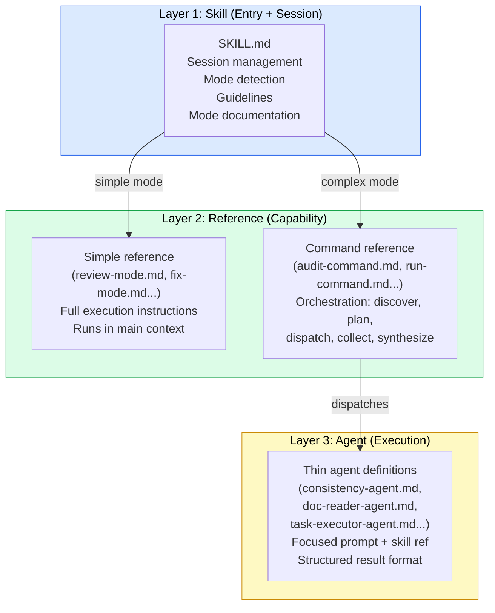

# Research: Guidance/Execution Separation for Complex Modes

**ID**: R-006
**Created**: 2026-02-16
**Status**: Draft
**Author**: User + AI researcher

## Status

- **Research Type**: Evolutionary
- **Status**: draft
- **Open Questions**: 5 remaining
- **Discussion Rounds**: 1
- **Complexity**: L3-exploratory

## System Context

### Research Type: Evolutionary

This research proposes restructuring how Clarity Loop's skills distribute work between
guidance (orchestration, planning, coordination) and execution (focused task completion).
It evolves the existing skill/reference architecture rather than introducing net-new
capabilities. Every mode and reference file is in scope for classification, though only
the most complex modes would actually be separated.

### Related System Docs

| System Doc | Relevant Sections | Relationship |
|------------|-------------------|-------------|
| SYSTEM_DESIGN.md | S1 Architecture Overview | Defines plugin structure (4 skills, 28 modes, 34 references) -- separation restructures how these layers interact |
| SYSTEM_DESIGN.md | S3-6 Per-Skill Architecture | Defines mode dispatch, reference loading, and subagent patterns per skill -- these are the sections most affected by separation |
| SYSTEM_DESIGN.md | S12 Spec Generation Pipeline | Documents subagent dispatch for parallel doc reads -- one of the existing parallelization precedents |
| SYSTEM_DESIGN.md | S14 Verification and Audit Systems | Documents audit-mode parallel dispatch -- the heaviest existing orchestration pattern |
| docs/cl-implementer.md | Spec mode, Run mode, Autopilot mode | References subagent dispatch for parallel doc reads and task execution |
| docs/cl-reviewer.md | Verify mode, Audit mode | References parallel subagent dispatch for cross-document checks |
| docs/cl-designer.md | Mockups mode | References parallelization rules for MCP operations |

### Current State

Clarity Loop is a Claude Code plugin with 4 skills, 28 modes, and 34 reference files.
Every mode follows the same execution model:

```
User invokes skill --> SKILL.md loads --> mode detected --> reference file(s) loaded
                       --> agent performs ALL work in a single context:
                           - Session management (state checks, orientation)
                           - Guidance (planning, work discovery, distribution)
                           - Execution (reading, analyzing, generating)
                           - Error handling
                           - Tracking file updates
                           - Reporting
```

This monolithic single-context model works well for simple modes but strains under complex
ones. The strain manifests in three ways:

1. **Context pressure**: Audit mode reads ALL system docs, performs 9-dimension analysis
   with per-doc-pair consistency checks, runs external research, reads prior audit reports,
   and produces a multi-section report. All in one context window.

2. **Cognitive overload on the model**: A single agent simultaneously plans what to analyze,
   executes the analysis, handles errors, and synthesizes findings. The orchestration logic
   competes with execution logic for attention.

3. **Implicit orchestration**: Where subagent dispatch exists (spec-mode, audit-mode,
   verify-mode), it is described in prose -- "dispatch subagents in parallel, one per doc" --
   without formalized agent definitions, structured result formats, or error handling
   protocols.

R-002 (Bowser Architecture Patterns) found that Bowser separates guidance (command layer)
from execution (agent layer), with the command never executing and the agents never
planning. This research designs how Clarity Loop could adopt a similar separation.

### Why This Research

The single-context model is a scalability ceiling. As Clarity Loop usage grows:

- System doc sets get larger (more docs to read, more pairs to cross-reference)
- Specs get more complex (more cross-cutting concerns, more integration contracts)
- Audit and verification become more expensive (N-squared growth with doc count)

The Guided Autonomy proposal (in-flight) adds intent-driven UX and session management but
does not address how work gets distributed. This research fills that gap by designing the
execution layer that Guided Autonomy assumes but does not specify.

## Scope

### In Scope

- Responsibility mapping for all 4 SKILL.md files and all 28 modes
- Classification of every mode on a complexity spectrum
- Separation design for modes that benefit from it
- Interaction with Claude Code's native primitives (SKILL.md, agents, commands, Task tool)
- Integration with the Guided Autonomy proposal
- Migration path from monolithic to separated
- Identification of modes that should NOT be separated

### Out of Scope

- Browser automation integration (covered by R-002 Phase 1 recommendation)
- File structure convention changes (covered by R-002 Finding 6 -- separate concern)
- Structured agent result protocols (an implementation detail of separation, not the
  architectural design)
- Actual SKILL.md or reference file rewrites (that is a proposal, not research)
- Performance benchmarking of fan-out vs. sequential (requires experimentation, not research)

### Constraints

- Must use Claude Code's native primitives: SKILL.md (skills), `.claude/agents/*.md`
  (agents), `.claude/commands/*.md` (commands), Task tool (subagent dispatch)
- Claude Code agent teams feature is experimental
  (`CLAUDE_CODE_EXPERIMENTAL_AGENT_TEAMS=1`) -- any design must degrade gracefully
- 34 reference files + 4 SKILL.md files exist -- migration must be incremental
- The Guided Autonomy proposal is in-flight -- this research must complement, not conflict
- Modes that are inherently conversational must not be separated (conversation history
  cannot be shared across agents)

## Research Findings

### Finding 1: Current Responsibility Mapping

**Context**: Before designing a separation, we need to understand what each SKILL.md
currently does. This finding catalogs the responsibilities embedded in each skill file
and classifies them as guidance or execution.

**Analysis**: Each SKILL.md currently performs six categories of work:

| Category | What It Does | Classification |
|----------|-------------|---------------|
| **Session management** | Read config, check pipeline state, detect stale markers, read tracking files | Guidance (infrastructure) |
| **Orientation** | Summarize state for user, suggest next steps | Guidance (UX) |
| **Mode detection** | Parse user arguments, match to mode, check gates | Guidance (routing) |
| **Mode documentation** | Describe what each mode does, when to use it | Documentation (neither) |
| **Guidelines** | Cross-mode rules: parking protocol, decision flow, warmth gradient | Guidance (policy) |
| **Mode dispatch** | "Read references/X-mode.md and follow its process" | Guidance (delegation) |

The reference files then contain the actual execution logic. But critically, many
reference files ALSO contain guidance logic:

| Reference Pattern | Guidance Content | Execution Content |
|------------------|-----------------|-------------------|
| audit-mode.md | "Dispatch subagents in parallel, one per doc" (Step 1), "Use subagents for parallel analysis" (Step 2) | 9-dimension analysis instructions, report template |
| spec-mode.md | "Dispatch subagents in parallel, one per system doc" (Step 2), gate check orchestration (Step 1) | Spec format selection, spec generation rules, test spec structure |
| verify-mode.md | "Dispatch subagents to read every doc" (Step 1), "Dispatch subagents to check each pair" (Part C) | 5-part verification instructions, report template |
| run-mode.md | Reconciliation orchestration (Step 1), queue processing loop (Step 3), parallel group management | Per-task implementation instructions, gap triage rules |
| autopilot-mode.md | Checkpoint evaluation logic, trust evolution, parallel group management | Self-testing protocol, integration gate logic, commit protocol |
| mockups-mode.md | Parallelization safety rules, batch vs. serial review orchestration | Per-screen design instructions, behavioral walkthrough |

**Key insight**: The guidance/execution boundary is not SKILL.md vs. reference file. It
cuts through reference files themselves. A reference file like audit-mode.md is 40%
orchestration logic (what to dispatch, how to collect, when to stop) and 60% execution
instructions (what to analyze, what to look for, how to report).

**Per-skill breakdown**:

**cl-researcher** (7 modes): Mostly conversational. SKILL.md handles session management
and routing. Reference files contain execution instructions that are inherently sequential
and interactive (Phase 2 conversation, Phase 3 research). Very little orchestration logic
in references -- bootstrap-guide.md is the heaviest, but its complexity is conversational,
not computational.

**cl-reviewer** (9 modes): Mixed. Simple modes (review, re-review, fix, merge, correct)
are sequential and contained. Complex modes (audit, verify, sync) contain significant
orchestration logic in their reference files. Audit-mode is the heaviest orchestrator in
the entire system.

**cl-designer** (4 modes): Mostly sequential with MCP interaction. Setup and tokens are
inherently serial (MCP operations cannot be parallelized). Mockups mode has parallelization
potential but with strict safety constraints (no concurrent .pen file writes).

**cl-implementer** (8 modes): Most diverse. Spec-mode has heavy parallel reads. Start-mode
is a generator (sequential). Run-mode and autopilot-mode are orchestration-heavy -- they
manage a task queue, dispatch parallel groups, handle errors, and coordinate across
sessions. Verify-mode dispatches parallel checks. Status and sync are lightweight.

**Source**: Direct analysis of all 4 SKILL.md files and all 34 reference files, with
specific attention to orchestration patterns vs. execution instructions.

### Finding 2: Mode Complexity Spectrum

**Context**: Not every mode benefits from separation. This finding ranks all 28 modes by
complexity to identify the threshold where separation adds value.

**Analysis**: Modes are classified on three axes: context pressure (how much data they
process), orchestration complexity (how many parallel concerns they coordinate), and
interaction model (conversational vs. mechanical).

#### Tier 1: Simple (Single-context is optimal)

These modes are contained, sequential, and often conversational. Separation would add
overhead without benefit.

| Mode | Skill | Why Single-Context Works |
|------|-------|------------------------|
| triage | cl-researcher | Short evaluation, minimal reads, conversational |
| research | cl-researcher | Multi-turn conversation -- history cannot be shared |
| structure | cl-researcher | Sequential planning with user, references manifest |
| proposal | cl-researcher | Sequential generation from approved research |
| context | cl-researcher | Focused on one library, sequential web research |
| review | cl-reviewer | Reads 1 proposal + manifest + spot-checks, sequential analysis |
| re-review | cl-reviewer | Reads prior review + proposal diffs, sequential |
| fix | cl-reviewer | Reads review, suggests edits, sequential |
| merge | cl-reviewer | Sequential: plan -> validate -> apply -> clean up |
| correct | cl-reviewer | Sequential: manifest -> approve -> apply -> spot-check |
| setup | cl-designer | Conversational discovery, MCP detection |
| build-plan | cl-designer | Sequential generation from design artifacts |
| start | cl-implementer | Sequential: read specs -> generate TASKS.md |
| status | cl-implementer | Read TASKS.md, format summary |
| sync | cl-implementer | Read spec hashes, compare, adjust |
| spec-review | cl-implementer | Read specs, check 6 dimensions, sequential |

**16 modes** -- the majority of the system -- are well-served by the current model.

#### Tier 2: Moderate (Could benefit from separation, not urgent)

These modes have some parallel work but manage it adequately in a single context.

| Mode | Skill | Separation Benefit |
|------|-------|--------------------|
| tokens | cl-designer | Batch generation of components could be parallelized, but MCP constraint (no concurrent writes) limits the benefit. Planning could separate from generation. |
| mockups | cl-designer | Independent screens could be generated in parallel (with per-file isolation), but requires careful MCP coordination. |
| bootstrap | cl-researcher | Brownfield mode has heavy parallel reads (analyze codebase), but greenfield is purely conversational. Mixed profile. |
| verify (cl-reviewer) | cl-reviewer | Cross-doc consistency (Part C) could dispatch per-pair agents. But the other 4 parts are sequential. Partial benefit. |
| sync (cl-reviewer) | cl-reviewer | Claim extraction + verification could be parallelized per doc. Moderate volume. |
| design-review | cl-reviewer | Three dimensions are independent, could parallelize. But each dimension is lightweight. |

**6 modes** -- moderate benefit from separation. These are candidates for Phase 2.

#### Tier 3: Complex (Clear separation benefit)

These modes have significant orchestration overhead, high context pressure, and
well-defined parallelizable units of work.

| Mode | Skill | Why Separation Helps |
|------|-------|---------------------|
| **audit** | cl-reviewer | Reads ALL system docs. 9-dimension analysis. Per-doc-pair consistency checks (N-squared). External research. Prior audit comparison. Heaviest mode in the system. |
| **spec** | cl-implementer | Parallel reads of all system docs (Step 2). Gate check orchestration (Step 1). Cross-cutting spec generation. Test spec generation. Manifest generation. |
| **run** | cl-implementer | Queue orchestration across sessions. Reconciliation. Parallel group dispatch. Fix task management. Gap triage. L1 scanning. |
| **autopilot** | cl-implementer | Everything in run-mode PLUS self-testing, integration gates, operational verification, checkpoint management, trust evolution. The most complex orchestration in the system. |
| **verify** (cl-implementer) | cl-implementer | 7-dimension verification with per-task acceptance checks, per-spec contract compliance, cross-spec integration, dependency audit. |

**5 modes** -- these would clearly benefit from guidance/execution separation.

**The threshold**: A mode benefits from separation when it has 3+ independent units of
work that could execute in parallel AND when the orchestration logic (planning,
dispatching, collecting, synthesizing) is complex enough to compete with execution logic
for context attention.

**Tradeoffs**:
- *Pro*: Clear classification prevents over-engineering simple modes
- *Pro*: Focused investment on the 5 modes with the biggest payoff
- *Con*: The Tier 2/Tier 3 boundary is judgment-based, not mechanical
- *Con*: Some Tier 2 modes may become Tier 3 as system doc sets grow

**Source**: Analysis of all 34 reference files, focusing on: number of parallel dispatch
points, total data volume processed, and ratio of orchestration to execution instructions.

### Finding 3: Separation Design for Complex Modes

**Context**: For the 5 Tier 3 modes, what does the guidance/execution split look like
architecturally?

**Analysis**: The separation follows Bowser's layered model but adapted to Clarity Loop's
constraint of being a Claude Code plugin (not a standalone CLI tool).

#### Three-Layer Model for Clarity Loop



**Layer 1 -- SKILL.md (unchanged)**: Remains the entry point. Handles session management
(config, pipeline state, tracking file reads), orientation, mode detection, guidelines,
and mode dispatch. SKILL.md's role does NOT change -- it is already purely guidance.

**Layer 2a -- Simple references (unchanged)**: For Tier 1 modes, the reference file runs
in the main context exactly as today. No separation needed. The file contains both guidance
and execution because the mode is simple enough that they do not compete.

**Layer 2b -- Command references (new for Tier 3 modes)**: For complex modes, the reference
file evolves into a command that orchestrates but does not execute. It:
- Discovers work items (reads manifest, enumerates doc pairs, analyzes task queue)
- Plans distribution (decides what to parallelize, what to sequence)
- Dispatches execution agents via the Task tool
- Collects structured results from agents
- Synthesizes results into a unified output (report, manifest, task list)
- Handles failures (timeout, crash, partial results)

**Layer 3 -- Execution agents (new)**: Thin `.md` files in `.claude/agents/` that:
- Declare their purpose (one sentence: "You are a consistency checker")
- Reference the skill or capability they use
- Define the structured result format they produce
- Execute one focused task and report back
- Have no awareness of siblings or the orchestration plan

**Mapping Bowser's 4 layers to Clarity Loop**:

| Bowser Layer | Clarity Loop Equivalent | Location |
|-------------|------------------------|----------|
| Layer 1: Skill (Capability) | Execution agent definitions | `.claude/agents/cl-*.md` |
| Layer 2: Agent (Scale) | Not needed -- Claude Code's Task tool handles agent instantiation | N/A |
| Layer 3: Command (Orchestration) | Command reference files | `skills/cl-*/references/*-command.md` (or `*-mode.md` with orchestration pattern) |
| Layer 4: Just (Reusability) | SKILL.md mode dispatch | `skills/cl-*/SKILL.md` |

Note the layer inversion: Bowser's Layer 1 (skill) maps to Clarity Loop's Layer 3 (agent),
because in Bowser the skill is the reusable capability and the command orchestrates, while
in Clarity Loop the SKILL.md is the entry point and the reference file orchestrates.

#### Concrete Design: Audit Mode Separation

**Before** (current monolithic model):

```
cl-reviewer/SKILL.md
  --> detects "audit" mode
  --> reads references/audit-mode.md
  --> single agent does EVERYTHING:
       Read all system docs (fills context)
       Read prior audit reports
       Read research/proposal history
       Analyze 9 dimensions (in same context)
       Cross-reference every doc pair (N-squared, same context)
       External web research
       Write audit report
       Update tracking files
```

**After** (separated model):

```
cl-reviewer/SKILL.md
  --> detects "audit" mode
  --> reads references/audit-mode.md (now a COMMAND reference)

audit-mode.md (command layer):
  Phase 1: DISCOVER
    - Read manifest for doc list (lightweight)
    - Read prior audit reports (lightweight)
    - Enumerate work: N docs for content extraction,
      N*(N-1)/2 pairs for consistency, 9 dimensions

  Phase 2: EXTRACT (fan-out)
    - Dispatch 1 doc-reader-agent per system doc
    - Each agent reads ONE doc and produces:
      content summary, defined terms, architectural decisions,
      cross-references, technology claims, aspirational vs. decided
    - Structured result format with parseable summary
    - Collect all extractions

  Phase 3: ANALYZE (fan-out)
    - Dispatch consistency-agent for each doc pair
      (receives both doc extractions, not full docs)
    - Dispatch dimension-agent for independent dimensions
      (technical correctness, completeness, staleness, design completeness)
    - Some dimensions are cross-cutting (goal alignment, abstraction coherence)
      and must run in the command context with ALL extractions available
    - Collect all findings

  Phase 4: SYNTHESIZE (command context)
    - Aggregate findings into health score
    - Cross-reference dimension findings for patterns
    - Compare against prior audit for drift analysis
    - Generate the audit report
    - Update tracking files

  Phase 5: CLEANUP
    - Shut down all agents
    - Present report to user
```

**Token efficiency comparison**:

| Aspect | Monolithic | Separated |
|--------|-----------|-----------|
| Main context holds | ALL system docs + ALL analysis + report | Manifest + extractions (summaries) + report |
| Per-agent context | N/A | 1-2 docs (reader) or 2 summaries (consistency checker) |
| Cross-cutting analysis | Full docs available | Summaries only -- may miss nuance |
| Total tokens used | 1 large context | N small contexts + 1 medium context |
| Total token COST | Lower (1 context) | Higher (N+1 contexts) but each is focused |

**Tradeoffs**:
- *Pro*: Main context stays lightweight -- orchestration, not analysis
- *Pro*: Each agent has focused scope -- better analysis quality per unit
- *Pro*: True parallelism -- N agents executing simultaneously
- *Pro*: Failure isolation -- one agent crash does not corrupt the audit
- *Con*: Cross-agent synthesis depends on extraction quality -- if a summary misses a key
  detail, the consistency check between that doc and others may miss a contradiction
- *Con*: Higher total token cost (N+1 contexts vs. 1)
- *Con*: More files to maintain (command + agent definitions)

**Source**: Bowser's ui-review.md orchestration pattern applied to audit-mode.md structure;
comparative analysis of context requirements.

### Finding 4: SKILL.md Role Evolution

**Context**: Does SKILL.md's role change in the separated model?

**Analysis**: SKILL.md's role does NOT fundamentally change. It already performs pure
guidance functions:

| Current SKILL.md Responsibility | Changes? | Notes |
|--------------------------------|----------|-------|
| Session management (config, state, markers) | No | Same regardless of separation |
| Orientation (state summary for user) | No | Same regardless of separation |
| Mode detection (argument parsing, gate checks) | No | Same regardless of separation |
| Mode documentation (what each mode does) | No | Users need to understand modes |
| Guidelines (parking, decision flow, warmth) | No | Cross-cutting, stays in SKILL.md |
| Mode dispatch ("read references/X-mode.md") | No | Same instruction, reference file just has different content |

**What about SKILL.md as documentation?** Currently, SKILL.md serves as both router AND
documentation. Each mode has a description explaining what it does, when to use it, and
what it produces. This documentation role is valuable and should NOT move.

Consider the alternative: if documentation moved to a separate file (e.g., `README.md`
per skill), the SKILL.md would become a pure routing table, and users would need to read
two files to understand a skill. This hurts discoverability. The current model -- SKILL.md
as the "table of contents" with brief descriptions and the reference files as the "chapters"
with full instructions -- is sound.

**What does change**: The reference file naming convention could distinguish between simple
execution files and command orchestration files:

| Pattern | Current | After Separation |
|---------|---------|-----------------|
| Simple mode reference | `review-mode.md` | `review-mode.md` (no change) |
| Complex mode reference | `audit-mode.md` | `audit-mode.md` (content changes to orchestration, but filename stays the same) |

The naming convention does NOT need to change. The SKILL.md dispatch instruction
("read references/audit-mode.md and follow its process") works identically whether the
reference contains execution instructions or orchestration instructions. The distinction
is in the content, not the filename.

**Tradeoffs**:
- *Pro*: SKILL.md remains stable -- no restructuring needed
- *Pro*: Users interact with the system the same way -- same commands, same modes
- *Con*: The distinction between simple and command references is implicit (you have to
  read the file to know which pattern it follows)

**Source**: Analysis of SKILL.md content across all 4 skills; comparison with Bowser's
justfile (Layer 4) which serves a similar entry-point role.

### Finding 5: Guided Autonomy Integration

**Context**: How does guidance/execution separation interact with the in-flight Guided
Autonomy proposal?

**Analysis**: The Guided Autonomy proposal has three pillars: file rationalization,
intent-driven UX, and cross-cutting protocols. This research intersects with specific
elements of each:

| Guided Autonomy Concept | Current Owner | After Separation | Interaction |
|------------------------|---------------|-----------------|-------------|
| **Intent detection** (Ship/Quality/Rigor/Explore) | SKILL.md (bootstrap) | SKILL.md (no change) | None -- intent is detected at session start, before mode dispatch |
| **Session orientation** | SKILL.md (session start) | SKILL.md (no change) | Separation could enrich orientation by parallelizing tracking file reads, but the benefit is marginal |
| **Transition advisory** | spec-mode.md, start-mode.md (pre-execution check) | Command layer (pre-dispatch check) | Advisory moves into the orchestration phase of command references. Before dispatching agents, the command checks PARKING.md for architectural items and calibrates dispatch depth by intent |
| **Parking protocol** | All SKILL.md Guidelines | All SKILL.md Guidelines + agents report parkable findings | In separated model, execution agents may discover parkable items during their focused work. Protocol: agent includes parkable items in its structured result; command layer writes to PARKING.md. Agents never write directly to tracking files. |
| **Loop calibration** | cl-researcher Guidelines | cl-researcher Guidelines (no change) | None -- loop calibration is about pipeline depth, not execution distribution |
| **Convergence tracking** | re-review-mode.md | re-review-mode.md (no change) | Re-review is a Tier 1 mode -- not separated |
| **File rationalization** | Templates, tracking files | No interaction | Separation does not affect which files exist or how they are structured |

**Intent-calibrated fan-out depth** (new interaction): The Guided Autonomy proposal
introduces intent calibration. This research adds fan-out depth as a calibratable
dimension:

| Intent | Audit Fan-Out | Spec Fan-Out | Run/Autopilot Fan-Out |
|--------|--------------|-------------|----------------------|
| **Ship** | Skip full audit; use lightweight sync instead | Parallel doc reads, but skip cross-cutting specs unless explicitly requested | Sequential execution (predictable, lower cost) |
| **Quality** | Full fan-out for all 9 dimensions | Full parallel reads + cross-cutting specs | Parallel for independent groups (default) |
| **Rigor** | Full fan-out + additional per-pair consistency agents + external research agents | Full parallel reads + cross-cutting specs + additional edge-case enumeration | Parallel + post-task regression checks + integration gates at every boundary |
| **Explore** | Not typically invoked during exploration | Not typically invoked during exploration | Not typically invoked during exploration |

**The relationship**: This research EXTENDS the Guided Autonomy proposal. Guided Autonomy
provides the "what guidance looks like" (intent, orientation, transition advisory). This
research provides the "how guidance is implemented" (command layer orchestrates, agent
layer executes). They are complementary, not competing.

**Proposal update needed**: If both are adopted, the Guided Autonomy proposal should
reference this research's command layer as the mechanism through which transition advisory
and intent-calibrated behavior are delivered. Currently, the proposal says "add transition
advisory to spec mode entry" -- with separation, that advisory becomes part of the
command layer's Phase 1 (pre-dispatch planning).

**Tradeoffs**:
- *Pro*: Intent-calibrated fan-out is a natural extension -- Guided Autonomy provides
  the signal, separation provides the mechanism
- *Pro*: Parking protocol works cleanly across layers -- agents report, command writes
- *Con*: Two in-flight proposals modifying similar areas creates merge complexity
- *Con*: Intent calibration adds another dimension to orchestration logic

**Source**: Mapping of every Guided Autonomy concept against the separation model;
analysis of interaction points and potential conflicts.

### Finding 6: Modes That Must NOT Be Separated

**Context**: Some modes are inherently conversational or sequential in ways that
separation would harm. This finding identifies those modes and explains why.

**Analysis**: Three categories of modes should never be separated:

**Category 1: Conversational modes (conversation history is the product)**

| Mode | Why Not Separate |
|------|-----------------|
| research (cl-researcher) | Multi-turn Phase 2 conversation IS the research. The agent needs full conversation history to build on prior exchanges, push back, and surface connections. Dispatching sub-agents for parts of the research would lose conversational context. |
| bootstrap (cl-researcher, greenfield) | Discovery conversation builds a mental model of the user's project. The agent's ability to make connections ("you mentioned X earlier, which relates to Y") depends on full history. |
| setup (cl-designer) | Design discovery conversation establishes aesthetic direction. The agent needs to remember "you said you like minimal designs" when making later design choices. |
| triage (cl-researcher) | Short conversation that depends on back-and-forth with the user. No parallelizable work. |

**Category 2: Sequential modes with MCP constraints**

| Mode | Why Not Separate |
|------|-----------------|
| tokens (cl-designer) | MCP operations cannot be parallelized -- Pencil does not support concurrent writes to the same .pen file. The generate -> screenshot -> feedback -> refine loop is inherently serial. |
| merge (cl-reviewer) | Sequential by necessity -- each change must be applied in order, with the `.pipeline-authorized` marker managing access. Parallel applies would risk file corruption. |
| correct (cl-reviewer) | Same as merge -- sequential application with marker protection. |

**Category 3: Lightweight modes where overhead exceeds benefit**

| Mode | Why Not Separate |
|------|-----------------|
| status (cl-implementer) | Reads one file, formats a summary. Zero orchestration. |
| sync (cl-implementer) | Compares spec hashes, adjusts queue. Lightweight. |
| structure (cl-researcher) | Reads manifest, analyzes research, suggests structure. Low complexity. |
| fix (cl-reviewer) | Reads one review, suggests edits. Sequential and contained. |

**The conversational constraint is the hardest boundary.** In Claude Code, conversation
history belongs to the main session. Subagents dispatched via the Task tool receive a
prompt, execute, and return a result -- they do not have access to the conversation history.
Any mode where the user's prior responses inform the agent's next action CANNOT be
meaningfully separated.

This is why research mode -- despite being complex (multi-phase, deep reads, external
research) -- remains Tier 1. The conversation is the product. Separation would produce
better-organized research but worse research, because each phase-agent would lack the
context of what the user said in prior phases.

**Tradeoffs**:
- *Pro*: Clear exclusion criteria prevent over-engineering
- *Pro*: Preserves the warmth gradient -- early pipeline stages stay conversational
- *Con*: Some modes are borderline (bootstrap brownfield has heavy reads but also
  conversational elements). These require judgment calls.

**Source**: Analysis of each mode's interaction model, with specific attention to
conversation dependency, MCP constraints, and overhead-to-benefit ratio.

### Finding 7: Migration Path

**Context**: How to get from the current monolithic model to the separated model without
breaking the existing system.

**Analysis**: The migration has four stages, designed so that the system works correctly
at every intermediate stage.

#### Stage 0: Agent Definitions (No Mode Changes)

Create thin agent definition files in `.claude/agents/`:

```
.claude/agents/
  cl-doc-reader-agent.md      # Reads one system doc, produces structured extraction
  cl-consistency-agent.md     # Checks one doc pair for contradictions
  cl-dimension-agent.md       # Analyzes one audit dimension across all doc extractions
  cl-spec-reader-agent.md     # Reads one system doc, extracts spec-relevant content
  cl-task-executor-agent.md   # Implements one task from the queue
```

These files exist but are not yet referenced by any mode. They are inert -- creating them
changes nothing about how the system works.

**Deliverable**: Agent definitions ready to use. System unchanged.

#### Stage 1: First Mode Separation (Audit)

Rewrite audit-mode.md from execution instructions to orchestration instructions:

- **Before**: "Read every file in `docs/system/` ... Check every pair of system docs for
  contradictions"
- **After**: "Phase 1: Discover. Read manifest for doc list. Phase 2: Extract. Dispatch
  cl-doc-reader-agent for each doc. Phase 3: Analyze. Dispatch cl-consistency-agent for
  each pair. Phase 4: Synthesize."

The SKILL.md dispatch instruction remains identical: "When running a full system audit,
read `references/audit-mode.md` and follow its process."

**Graceful degradation**: If agent teams are not available
(`CLAUDE_CODE_EXPERIMENTAL_AGENT_TEAMS` not set), the command reference falls back to
sequential execution -- the same agent reads all docs and performs all analysis in the
current pattern. The orchestration structure (phases, structured results) still provides
organizational benefit even without true parallelism.

**Deliverable**: Audit mode runs with separation when teams are available, falls back
to sequential otherwise. All other modes unchanged.

#### Stage 2: Expand to Other Tier 3 Modes

Apply the same pattern to spec-mode, run-mode, autopilot-mode, and verify-mode
(cl-implementer). Each mode's reference file is rewritten from execution to
orchestration, and new agent types are created as needed.

The order matters:
1. spec-mode (least complex of the Tier 3 modes -- parallel reads are well-defined)
2. verify-mode/cl-implementer (similar to audit -- parallel checks)
3. run-mode (most complex -- queue orchestration with error handling)
4. autopilot-mode (run-mode + self-testing -- the most complex orchestration)

Each mode can be separated independently -- they do not depend on each other.

**Deliverable**: All 5 Tier 3 modes use command pattern. System fully separated
where it matters.

#### Stage 3: Evaluate Tier 2 Modes

After Tier 3 modes are running with separation, evaluate whether any Tier 2 modes have
grown complex enough to warrant separation:

- If system doc sets have grown, verify-mode/cl-reviewer may graduate to Tier 3
- If mockups-mode is generating 10+ screens, parallel dispatch becomes worthwhile
- If bootstrap brownfield is analyzing large codebases, the heavy-read portion could
  be separated from the conversational portion

This stage is evaluative, not prescriptive. The decision to separate a Tier 2 mode is
made based on observed need, not preemptive planning.

**Deliverable**: System architecture stabilized with clear criteria for future expansion.

#### Coexistence Model

At every stage, simple modes (Tier 1) and unseparated modes coexist with separated modes.
The SKILL.md dispatch pattern is identical for both:

```markdown
## Audit Mode

When running a full system audit, read `references/audit-mode.md` and follow its process.
```

Whether `audit-mode.md` contains execution instructions or orchestration instructions is
transparent to the SKILL.md and to the user. This is the key migration property: modes can
be separated one at a time without any changes to SKILL.md or to the user's interaction
pattern.

**Tradeoffs**:
- *Pro*: Incremental migration -- never more than one mode in flux at a time
- *Pro*: Graceful degradation -- works without agent teams, just less parallel
- *Pro*: User-transparent -- same commands, same modes, same outputs
- *Con*: Coexistence means two patterns exist simultaneously (some reference files are
  execution, some are orchestration). Cognitive load for maintainers.
- *Con*: Agent definitions need to be maintained alongside reference files

**Source**: Bowser's incremental adoption model (skills existed before agents, agents
before commands); analysis of Clarity Loop's mode independence.

### Finding 8: Relationship Between Separation and the Task Tool

**Context**: Claude Code provides the Task tool for dispatching subagents. How does this
relate to the separation design?

**Analysis**: Claude Code's Task tool is the execution mechanism for separation. The
command reference dispatches agents using Task, and agents return results through Task.

**Current implicit use**: Several reference files already mention subagent dispatch, but
the instructions are informal:

- audit-mode.md: "Dispatch subagents in parallel, one per doc"
- spec-mode.md: "Dispatch subagents in parallel, one per system doc"
- verify-mode.md: "Dispatch subagents to read every doc in `docs/system/` in parallel"
- run-mode.md: "Fork subagents for each independent group"
- autopilot-mode.md: "Fork subagents for each group"

These instructions do not specify:
- What agent definition to use
- What structured result format to expect
- How to handle agent failures
- How to aggregate results
- Maximum parallelism limits

**Formalized use in separated model**: The command reference would contain explicit Task
tool dispatch instructions:

```markdown
### Phase 2: Extract (fan-out)

For each system doc in the manifest:

1. Dispatch via Task tool:
   - subagent_type: "cl-doc-reader-agent"
   - prompt: structured prompt with doc path and extraction requirements
   - Launch ALL agents in a single message for parallel execution

2. Collect results. Each agent returns:
   EXTRACTION: {doc-name}
   Sections: {count}
   Terms defined: {list}
   Cross-references: {list}
   Technology claims: {list}
   [Full extraction content]

3. If an agent times out or crashes:
   - Mark that doc as EXTRACTION_FAILED
   - Include whatever partial output was available
   - Continue with remaining extractions
   - Note the gap in the audit report

4. All extractions collected: proceed to Phase 3
```

**Agent teams vs. basic Task tool**: The separated model works with both:

- **Without teams** (`CLAUDE_CODE_EXPERIMENTAL_AGENT_TEAMS` not set): Use Task tool
  with sequential dispatch. Each Task call is a subagent that runs, returns a result,
  and the command processes results one by one. Still provides organizational benefit
  (structured results, focused prompts) but no parallelism.

- **With teams**: Use TeamCreate, TaskCreate, and Task with `team_name` for true parallel
  dispatch. This is the intended use case and provides the full benefit of separation.

**Tradeoffs**:
- *Pro*: Formalizing Task tool usage makes subagent dispatch predictable and testable
- *Pro*: Works with or without agent teams
- *Con*: Agent team feature is experimental and may change
- *Con*: Sequential fallback is slower than the current monolithic model (overhead of
  dispatching and collecting without parallelism)

**Source**: Claude Code Task tool documentation; Bowser's TaskCreate/Task dispatch
pattern; analysis of current informal subagent references in Clarity Loop modes.

## Options Analysis

| Criterion | Option A: Full Separation | Option B: Tier 3 Only | Option C: Formalize Only |
|-----------|--------------------------|----------------------|------------------------|
| **Scope** | Separate all 28 modes (even simple ones get agent definitions) | Separate only the 5 Tier 3 modes; simple modes unchanged | Don't separate anything; just formalize existing subagent dispatch with structured results |
| **Agent definitions created** | ~15-20 agent types | ~5 agent types | 0 agent types |
| **Reference files changed** | All 34 | 5 command references + their agent definitions | 5 reference files (add structured dispatch sections) |
| **Migration effort** | Very High -- every mode rewritten | Medium -- 5 modes rewritten, 23 unchanged | Low -- add structured sections to existing files |
| **Risk** | High -- everything changes at once | Medium -- complex modes change, simple modes stable | Low -- additive changes only |
| **Parallelism benefit** | Minimal for simple modes (overhead > benefit) | High for the modes that need it most | Moderate -- better dispatch instructions but no architectural separation |
| **Maintenance overhead** | High -- many agent files to maintain | Low-Medium -- 5 agent types, each used by 1-2 modes | None -- no new files |
| **Graceful degradation** | Complex -- all modes need fallback paths | Contained -- only 5 modes need fallback paths | N/A -- no new architecture to degrade |
| **Compatibility with Guided Autonomy** | Conflicts -- massive change scope overlaps | Complementary -- targeted changes in non-overlapping areas | Fully compatible -- additive changes |

## Recommendations

### Primary Recommendation: Option B (Tier 3 Only) with Formalization Layer

Separate the 5 Tier 3 modes (audit, spec, run, autopilot, verify/cl-implementer) using
the three-layer model. For the remaining 23 modes, add formalized dispatch instructions
(structured results, error handling) where subagent dispatch is already mentioned, but
do not restructure them.

This delivers the highest ROI: the 5 most complex modes get the most architectural
benefit, while the 23 simpler modes continue working exactly as they do today.

#### Implementation Order

**Phase 1: Foundation** (no mode changes)
1. Create agent definitions in `.claude/agents/`:
   - `cl-doc-reader-agent.md` (reads one system doc, produces structured extraction)
   - `cl-consistency-agent.md` (checks one doc pair for contradictions)
   - `cl-dimension-agent.md` (analyzes one audit dimension)
   - `cl-spec-reader-agent.md` (reads one doc, extracts spec-relevant content)
   - `cl-task-executor-agent.md` (implements one task from queue)
2. Define the structured result protocol (parseable summary line + full content)
3. Define the graceful degradation pattern (detect teams availability, fall back to
   sequential)

**Phase 2: First separation -- audit-mode**
1. Rewrite audit-mode.md as a command reference (orchestration phases)
2. Test with and without agent teams
3. Validate that the separated audit produces equivalent quality to the monolithic audit
4. Document the pattern for subsequent separations

**Phase 3: Expand to remaining Tier 3 modes**
1. spec-mode (parallel doc reads are well-defined, lowest risk)
2. verify-mode/cl-implementer (similar to audit -- parallel checks)
3. run-mode (queue orchestration -- most complex, benefits most from clear command layer)
4. autopilot-mode (run-mode + self-testing -- separated last because it depends on run)

**Phase 4: Formalize existing dispatch in Tier 2 modes**
1. For modes that already mention subagent dispatch (verify/cl-reviewer, mockups,
   bootstrap brownfield), add structured dispatch sections without full separation
2. Define structured result formats for these modes' subagent outputs
3. Add error handling protocols for subagent failures

#### Before/After: Audit Mode

**BEFORE** -- `audit-mode.md` excerpt (current):

```markdown
### Step 1: Load Everything

This is the one mode where you read EVERYTHING fresh -- no manifest, no shortcuts.

1. **Read every file in `docs/system/`** -- Dispatch subagents in parallel, one per doc.
   Each subagent produces:
   - Full content summary
   - All defined terms and their definitions
   - All architectural decisions and stated rationale
   [...]

### Step 2: Eight-Dimension Analysis

Use subagents for parallel analysis where dimensions are independent.

#### 1. Internal Consistency (Cross-Document)

Check every pair of system docs for contradictions. This is the most mechanically
intensive check -- dispatch subagents per doc pair if needed.
```

**AFTER** -- `audit-mode.md` excerpt (command pattern):

```markdown
### Phase 1: Discover

1. Read `docs/system/.manifest.md` for the complete doc list
2. Read prior audit reports from `docs/reviews/audit/AUDIT_*.md`
3. Read `docs/PARKING.md` Active section for items needing attention
4. Compute work items:
   - N docs for content extraction
   - N*(N-1)/2 pairs for consistency checking
   - 9 independent dimensions (6 can parallelize, 3 need cross-doc context)
5. Check intent (from DECISIONS.md):
   - Ship: lightweight audit (skip dimension 3 external research, reduce pair checks)
   - Quality: standard audit (full fan-out)
   - Rigor: deep audit (additional per-pair agents, extended external research)

If agent teams are NOT available: fall back to sequential execution.
Read all docs in the main context and perform analysis sequentially.
The phase structure still provides organizational benefit -- work through
Phase 2, then Phase 3, then Phase 4 in order.

### Phase 2: Extract (fan-out)

For each system doc:

1. Dispatch cl-doc-reader-agent via Task tool:
   Prompt: "Read {doc-path} and produce a structured extraction..."
   Launch ALL agents in a single message for parallel execution.

2. Each agent returns a structured result:
   EXTRACTION: {doc-name} | Sections: {N} | Terms: {N} | Claims: {N}
   [Full extraction with defined structure]

3. On agent failure: mark doc as EXTRACTION_FAILED, continue, note gap.
4. All extractions collected: proceed to Phase 3.

### Phase 3: Analyze (fan-out + sequential)

Parallelizable dimensions (dispatch cl-dimension-agent for each):
- Internal consistency within-doc
- Technical correctness (with web search enabled)
- Completeness
- Design completeness
- Staleness
- Parking lot health

Sequential dimensions (run in command context with all extractions):
- Internal consistency cross-doc (needs ALL extractions)
- Goal alignment (needs ALL extractions + PRD)
- Abstraction coherence (needs ALL extractions)

For cross-doc consistency:
- Dispatch cl-consistency-agent for each doc pair
- Each agent receives ONLY the two relevant extractions (not full docs)
- Returns: CONSISTENT | TENSION | CONTRADICTION with evidence

Collect all findings. Proceed to Phase 4.

### Phase 4: Synthesize (command context)

1. Aggregate findings into health score table
2. Cross-reference dimension findings for patterns
3. Compare against prior audit for drift analysis
4. Generate full audit report (same format as current)
5. Update tracking (PARKING.md for emerged concepts, DECISIONS.md for judgments)
6. Present report to user
```

#### Relationship to Guided Autonomy Proposal

This research **extends** the Guided Autonomy proposal. The relationship is:

| Concern | Guided Autonomy Provides | This Research Provides |
|---------|-------------------------|----------------------|
| "What guidance looks like" | Intent detection, session orientation, transition advisory, parking | -- |
| "How guidance is delivered" | Instructions in SKILL.md and reference files | Command layer orchestrates, agent layer executes |
| "How work is distributed" | Not addressed | Fan-out pattern with structured dispatch and collection |
| "How intent affects execution" | Intent signals (Ship/Quality/Rigor/Explore) | Intent-calibrated fan-out depth |

**Recommendation**: The Guided Autonomy proposal should proceed and be merged as-is. This
research's proposal should be sequenced AFTER Guided Autonomy is merged, so that the
command layer can leverage intent signals and transition advisory patterns that are already
in place.

### Risks & Mitigations

| Risk | Likelihood | Impact | Mitigation |
|------|-----------|--------|------------|
| Agent teams feature remains experimental or is removed | Medium | High -- fan-out depends on it | Graceful degradation to sequential. Phase structure still provides organizational benefit. |
| Separated audit produces lower quality than monolithic | Medium | High -- audit is a trust anchor | Extraction protocol must capture enough detail. Validate by running both approaches on the same doc set and comparing results. |
| Cross-agent synthesis loses nuance | Medium | Medium -- findings may miss subtle cross-cutting patterns | Dimensions that require cross-doc context (goal alignment, abstraction coherence) run in command context, not fanned out. Only truly independent work is delegated. |
| Migration creates a window of inconsistency | Low | Medium -- some modes separated, others not | Migration is incremental and transparent to SKILL.md. Each mode is self-contained -- separating audit does not affect review mode. |
| Total token cost increases significantly | Medium | Low -- cost, not quality | Intent calibration (Ship = less fan-out). Monitor and report per-run token usage. Let users opt out of fan-out. |
| Agent definition maintenance burden | Low | Low -- agent files are thin (~20-30 lines) | Each agent is minimal and rarely changes. Skill capability (the deep instructions) stays in reference files. |

### Impact on System Docs

| System Doc | Expected Changes |
|------------|-----------------|
| SYSTEM_DESIGN.md, S1 Architecture Overview | Add Layer 3 (agent) to the architecture diagram; describe three-layer model |
| SYSTEM_DESIGN.md, S3-6 Per-Skill Architecture | Update mode descriptions for Tier 3 modes to reference command pattern and agent dispatch |
| SYSTEM_DESIGN.md, S14 Verification and Audit Systems | Rewrite audit architecture to show phased fan-out model |
| SYSTEM_DESIGN.md (new section) | Add "Guidance/Execution Separation" section describing the three-layer model, tier classification, and graceful degradation |
| docs/cl-reviewer.md | Update audit mode description to reflect command pattern |
| docs/cl-implementer.md | Update spec, run, autopilot, verify mode descriptions to reflect command pattern |
| docs/pipeline-concepts.md | Add guidance/execution separation as a pipeline concept |

## Decision Log

| # | Topic | Considered | Decision | Rationale |
|---|-------|-----------|----------|-----------|
| 1 | Scope of separation | All 28 modes vs. Tier 3 only vs. formalize only | Tier 3 only (5 modes) with formalization for Tier 2 | Risk-managed: highest ROI modes get full treatment, simple modes stay simple, Tier 2 gets structured dispatch without restructuring |
| 2 | Agent definition location | In-skill (`skills/cl-*/agents/`) vs. top-level (`.claude/agents/`) | Top-level `.claude/agents/` | Claude Code convention: agents live in `.claude/agents/`. Shared agent types (doc-reader) used by multiple skills should not be nested under one skill. |
| 3 | SKILL.md changes | Restructure SKILL.md as pure router vs. keep documentation | Keep documentation in SKILL.md | SKILL.md's dual role (router + documentation) aids discoverability. Splitting would require users to read two files. |
| 4 | Reference file naming | Rename complex references (`audit-command.md`) vs. keep names | Keep existing names (`audit-mode.md`) | SKILL.md dispatch is transparent to content type. Renaming would require SKILL.md changes and break any external references. |
| 5 | Guided Autonomy relationship | Replace vs. extend vs. independent | Extend -- this research adds execution layer to GA's guidance model | GA provides intent signals and UX moments. This research provides the mechanism through which guidance is executed. Complementary, not competing. |
| 6 | Migration order | All at once vs. audit first vs. spec first | Audit first (heaviest mode, most benefit, clearest separation boundaries) | Audit-mode has the most well-defined parallelizable units and the highest context pressure. It is the best proof-of-concept for the pattern. |

## Emerged Concepts

| Concept | Why It Matters | Suggested Action |
|---------|---------------|-----------------|
| Structured agent result protocol | Standardized format for agents to report results back to the command layer -- enables automated aggregation and failure detection. Critical for fan-out to work reliably. | Define as part of Phase 1 (Foundation). Protocol should include: parseable summary line, structured content sections, failure reporting format. |
| Intent-calibrated fan-out depth | Ship intent = minimal parallelism; Rigor = maximum. Fan-out is expensive -- calibrating by intent ensures cost matches user need. | Integrate into the Guided Autonomy proposal as an extension of intent behavior. |
| Extraction quality validation | If a doc-reader agent produces a poor extraction, all downstream analysis using that extraction is compromised. Need a quality gate on extractions before dispatching analysis agents. | Research as part of Phase 2. May be as simple as checking extraction completeness against manifest section counts. |
| Cross-mode agent reuse | cl-doc-reader-agent is useful for audit (cl-reviewer), spec generation (cl-implementer), and verify (both skills). Shared agents reduce maintenance. | Leverage this in Phase 1 agent definition design. Place shared agents at top level. |
| Sequential fan-out as an intermediate step | Even without agent teams, the phased orchestration pattern (discover -> extract -> analyze -> synthesize) provides organizational benefit. The command reads docs sequentially but processes them phase-by-phase instead of interleaving reads and analysis. | Document as the graceful degradation pattern. May be the default for users who do not enable experimental features. |

## Open Questions

1. **Extraction fidelity threshold**: How detailed must a doc-reader extraction be to
   support downstream consistency checking? If extractions are too summarized, subtle
   contradictions will be missed. If too detailed, the main context fills up with
   extraction content and the separation benefit is lost. What is the right level of
   detail? This likely needs empirical testing with a real system doc set.

2. **Cross-cutting dimension handling**: Goal alignment, abstraction coherence, and
   cross-doc consistency all need access to information from ALL system docs. These
   dimensions cannot be fanned out to independent agents. Should they run in the command
   context (with all extractions loaded), or should there be a second fan-out phase
   where specialized agents receive ALL extractions?

3. **Agent teams stability for production use**: The agent teams feature is experimental
   (`CLAUDE_CODE_EXPERIMENTAL_AGENT_TEAMS=1`). Is it stable enough for Clarity Loop to
   depend on? What is the roadmap? If it is removed, the separated model still works
   (sequential fallback) but loses its primary benefit (parallelism). Should the design
   assume teams become stable, or should it be optimized for the sequential fallback?

4. **Token cost tradeoff quantification**: Fan-out uses more total tokens (N agent contexts
   vs. 1 shared context) but provides parallelism and isolation. Is there a break-even
   point where the cost exceeds the benefit? This depends on system doc set size, model
   pricing, and user intent. Should fan-out be opt-in (default sequential, enable via
   config) or opt-out (default fan-out, disable via config)?

5. **Autopilot mode decomposition**: Autopilot is the most complex mode. It orchestrates a
   task queue, dispatches parallel groups, writes tests, runs integration gates, manages
   checkpoints, and evolves trust. What is the right decomposition? Should autopilot
   become a command that dispatches task-executor-agents? Or should it remain a single
   context with better-structured phases? The answer depends on whether subagent context
   isolation improves or hinders the implement-test-commit cycle (each step depends on
   the previous step's output).

## References

- Bowser project source code: `/Users/bhushan/Documents/bowser/`
  - `.claude/commands/ui-review.md` -- Fan-out orchestration pattern (command layer)
  - `.claude/agents/bowser-qa-agent.md` -- Thin execution agent (agent layer)
  - `justfile` -- 4-layer abstraction with labeled sections (entry layer)
- Clarity Loop source:
  - `skills/cl-reviewer/references/audit-mode.md` -- Heaviest mode, primary separation target
  - `skills/cl-implementer/references/spec-mode.md` -- Parallel doc reads
  - `skills/cl-implementer/references/run-mode.md` -- Queue orchestration
  - `skills/cl-implementer/references/autopilot-mode.md` -- Most complex orchestration
  - `skills/cl-reviewer/references/verify-mode.md` -- Parallel consistency checks
  - All 4 SKILL.md files -- Entry point and routing analysis
- R-002: Bowser Architecture Patterns (Finding 1: 4-Layer Abstraction, Finding 4: Natural
  Guided Automation Execution)
- Guided Autonomy Execution Model proposal:
  `docs/proposals/GUIDED_AUTONOMY_EXECUTION_MODEL.md`
- SYSTEM_DESIGN.md: Architecture reference for current mode structure
