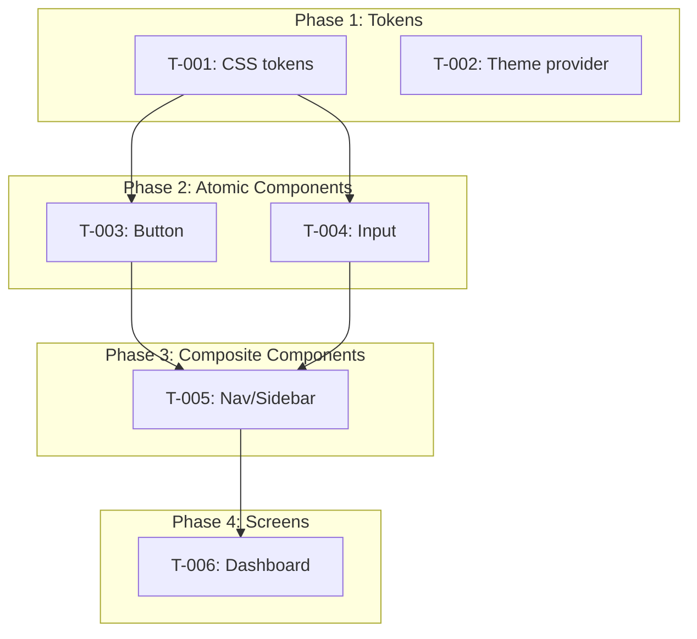

## Build Plan Mode

Generates a phased implementation task breakdown from the design system and screen mockups.
Each task maps to a design artifact with clear acceptance criteria.

## Variables

| Variable | Source | Required | Description |
|----------|--------|----------|-------------|
| docsRoot | `.clarity-loop.json` | Yes | Root directory for design artifacts |
| DESIGN_SYSTEM.md | `{docsRoot}/specs/` | Yes | Token catalog, component catalog, traceability |
| UI_SCREENS.md | `{docsRoot}/specs/` | No | Screen inventory, component usage, navigation flow (recommended but not required) |
| PRD | `docs/system/` or equivalent | Yes | Feature context and priorities |
| Architecture doc | `docs/system/` or equivalent | Yes | Tech stack details (framework, styling approach, component library) |
| DESIGN_PROGRESS.md | `{docsRoot}/designs/` | Yes | Must show Tokens status Complete |

## Workflow

### Step 1: Validate gates and read design artifacts

1. Verify `{docsRoot}/specs/DESIGN_SYSTEM.md` exists (required gate).

   **Verify**: DESIGN_SYSTEM.md exists and contains token catalog + component catalog.

   **On failure**: "Design system hasn't been generated yet. Run `/cl-designer tokens` first."

2. Check if `{docsRoot}/specs/UI_SCREENS.md` exists (recommended but not required).

   **Verify**: UI_SCREENS.md exists with screen inventory.

   **On failure**: "No screen mockups found. I can generate a build plan for the design system (tokens + components) without screen layouts. Run `/cl-designer mockups` first if you want screen implementation tasks included. Proceed with tokens-only build plan?"

3. Read `{docsRoot}/specs/DESIGN_SYSTEM.md` — token catalog, component catalog, traceability.

4. Read `{docsRoot}/specs/UI_SCREENS.md` (if exists) — screen inventory, component usage, navigation flow.

5. Read the PRD for feature context and priorities.

6. Read Architecture doc for tech stack details (framework, styling approach, component library if any).

7. Build a dependency graph:
   - Tokens -> Components (components depend on tokens)
   - Atomic components -> Composite components (composites use atomics)
   - Components -> Screens (screens use components)
   - Navigation -> Screens (nav connects screens)

   **Verify**: Dependency graph covers all design artifacts with no orphan nodes.

   **On failure**: Flag missing connections and ask user whether to proceed or fix design artifacts first.

### Step 2: Generate Phase 1 tasks — Token/Theme Setup + Accessibility Infrastructure

8. Configure CSS custom properties or Tailwind theme values.
9. Set up theme provider (if dark/light mode).
10. Create spacing/typography utility classes or tokens.
11. **Set up focus indicator tokens** (outline color, offset, width) as CSS custom properties.
12. **Verify contrast ratios** of color token combinations (text on backgrounds: 4.5:1; UI components: 3:1). If any fail, note in the task for user decision.
13. One task per token category unless they're trivially small.

**Verify**: Every token category from DESIGN_SYSTEM.md has a corresponding task. Focus indicator and contrast verification tasks exist.

**On failure**: Add missing tasks for uncovered token categories.

### Step 3: Generate Phase 2 tasks — Atomic Components (with behavioral states)

14. Create one task per individual UI primitive (Button, Input, Select, Checkbox, Badge, etc.), or split if a component has many complex variants.
15. Order by dependency — standalone components first, then ones that use others.
16. **Acceptance criteria include behavioral states from DESIGN_SYSTEM.md**: a Button task includes "renders loading state with spinner, disables during loading, shows `aria-busy` attribute" — not just "renders primary/secondary/ghost variants".
17. **Acceptance criteria include accessibility**: keyboard interaction (Enter/Space activates), ARIA attributes (`aria-disabled`, `aria-busy`), focus visible styling.
18. **Acceptance criteria include boundary behavior**: truncation, overflow handling, min/max constraints from DESIGN_SYSTEM.md.

**Verify**: Every atomic component in DESIGN_SYSTEM.md has a task. Each task includes behavioral, accessibility, and boundary acceptance criteria.

**On failure**: Add missing component tasks or fill in missing acceptance criteria.

### Step 4: Generate Phase 3 tasks — Composite Components (with interaction behavior)

19. Create one task per composite component (Nav/Sidebar, Modal/Dialog, Form groups, etc.).
20. Dependencies on Phase 2 components are explicit.
21. **Acceptance criteria include composite behavioral contracts**: Modal traps focus and returns on close; Form group tracks dirty/pristine/submitting states; Nav highlights active route.
22. **Acceptance criteria include accessibility**: focus trap for modals, `aria-expanded` for dropdowns, `aria-current="page"` for active nav.

**Verify**: Every composite component in DESIGN_SYSTEM.md has a task with explicit Phase 2 dependencies.

**On failure**: Add missing composite tasks or dependency references.

### Step 5: Generate Phase 4 tasks — Screen Layouts / Pages + Navigation (conditional)

23. Only generate this phase if UI_SCREENS.md exists.
24. Create one task per screen (or split for very complex screens).
25. Assemble components into page layouts.
26. **Acceptance criteria include behavioral contracts from UI_SCREENS.md**: screen states (empty, loading, error), interaction flows (form submission behavior, delete confirmation), content for non-default states.
27. **Navigation and routing as a cross-cutting task in this phase**: URL structure, route guards, auth redirects, back behavior, focus management on navigation. If UI_SCREENS.md has navigation context per screen, generate a routing task that covers the full URL structure and auth requirements.
28. **Test scenarios from UI_SCREENS.md** become acceptance criteria: "submit empty form -> inline validation" is a verifiable condition.

**Verify**: Every screen in UI_SCREENS.md has a task. Navigation/routing task exists. Test scenarios are mapped to acceptance criteria.

**On failure**: Add missing screen or routing tasks.

### Step 6: Generate Phase 5 tasks — Integration Behavior + Responsive

29. **Cross-screen behavioral flows** — interactions that span multiple screens: navigation transitions, state persistence across routes, shared state (badge counts, filters), unsaved changes warnings.
30. Responsive breakpoint behavior (layout changes, feature adaptation, touch vs. mouse differences if specified).
31. Animations and transitions (if specified in behavioral walkthrough or design tokens).
32. This phase is for behaviors that can't be verified in isolation — they require multiple screens working together.

**Verify**: All cross-screen interactions identified in UI_SCREENS.md have corresponding tasks. Responsive requirements from PRD are covered.

**On failure**: Add missing integration or responsive tasks.

### Step 7: Assemble per-task metadata

33. For each task, include:
    - **Task number**: Sequential (T-001, T-002, ...)
    - **Name**: Imperative form (e.g., "Implement Button component")
    - **Phase**: Which phase (1-5)
    - **Description**: What to build, including design context
    - **Design reference**: Component or screen name + design file reference (.pen node ID or DESIGN_SYSTEM.md section)
    - **Dependencies**: Which other tasks must complete first (by task number)
    - **Acceptance criteria**: Concrete, verifiable conditions for completion. Must include behavioral criteria from DESIGN_SYSTEM.md (component states, accessibility) and UI_SCREENS.md (screen states, interaction flows, content) — not just visual rendering. Each behavioral contract documented in the design artifacts becomes an acceptance criterion in the build plan task.
    - **Estimated complexity**: Simple / Medium / Complex (for prioritization, not time estimates)

**Verify**: Every task has all metadata fields populated. No task references a nonexistent dependency.

**On failure**: Fill in missing metadata or fix broken dependency references.

### Step 8: Generate DESIGN_TASKS.md

34. Write `{docsRoot}/specs/DESIGN_TASKS.md` with the following structure:

```markdown
# Design Implementation Tasks

**Generated**: [date]
**Design system**: specs/DESIGN_SYSTEM.md
**UI screens**: specs/UI_SCREENS.md [or "Not generated — tokens-only build plan"]
**PRD reference**: [filename]
**Tech stack**: [from Architecture doc — e.g., "Next.js 15, Tailwind CSS v4, shadcn/ui"]

## Dependency Graph



## Summary

| Phase | Tasks | Description |
|-------|-------|-------------|
| 1 — Tokens | N | Token/theme infrastructure |
| 2 — Atomic | N | Individual UI components |
| 3 — Composite | N | Composed components |
| 4 — Screens | N | Page layouts |
| 5 — Interactive | N | States + responsive |
| **Total** | **N** | |

## Tasks

### Phase 1: Token/Theme Setup

#### T-001: [Task Name]
- **Description**: [what to build]
- **Design reference**: [DESIGN_SYSTEM.md section or .pen node ID]
- **Dependencies**: None
- **Acceptance criteria**:
  - [ ] [concrete condition]
  - [ ] [concrete condition]
- **Complexity**: Simple

[Repeat for all tasks in phase]

### Phase 2: Atomic Components

[Same format]

### Phase 3: Composite Components

[Same format]

### Phase 4: Screen Layouts

[Same format — only if UI_SCREENS.md exists]

### Phase 5: Interactive States + Responsive

[Same format]

## Implementation Notes

[Any cross-cutting concerns: shared patterns, testing approach, accessibility requirements]
```

**Verify**: DESIGN_TASKS.md written successfully with all phases, dependency graph, and summary table.

**On failure**: Retry file write. If structural issues, fix task list and regenerate.

### Step 9: Present to user for review

35. Present the task list summary to the user:
    - Total tasks per phase
    - Dependency graph (the Mermaid diagram)
    - Highlight any tasks that seem unusually complex

36. Ask: "Here's the implementation plan: [summary]. You can reorder tasks within phases, split complex tasks, merge simple ones, or remove tasks. Any changes?"

37. Apply adjustments and regenerate DESIGN_TASKS.md if needed.

**Verify**: User confirms the build plan.

**On failure**: Apply user's requested changes and regenerate.

### Step 10: Update tracking

38. Update DESIGN_PROGRESS.md:
    - Set `Build Plan` status to `Complete`
    - Record task count per phase
    - Add `Last updated` date

**Verify**: DESIGN_PROGRESS.md updated with Build Plan status Complete.

**On failure**: Retry the update.

## Report

```
BUILD-PLAN: COMPLETE | Tasks: N | Phases: 5
```

or

```
BUILD-PLAN: INCOMPLETE | Reason: [reason]
```

**Note**: DESIGN_TASKS.md is a design artifact — the output of this build-plan mode.
The `cl-implementer` skill's `start` mode reads it as one of its inputs and merges the
tasks into a unified `TASKS.md` alongside tasks derived from tech specs. DESIGN_TASKS.md
remains as the build-plan source reference; TASKS.md becomes the working implementation
copy.

**Next step**: "Build plan complete. DESIGN_TASKS.md generated at `{docsRoot}/specs/DESIGN_TASKS.md` with [N] tasks across [M] phases. Run `/cl-reviewer design-review` to validate designs against the PRD, then `/cl-implementer start` to generate a unified implementation plan that merges these design tasks with tasks from tech specs."
