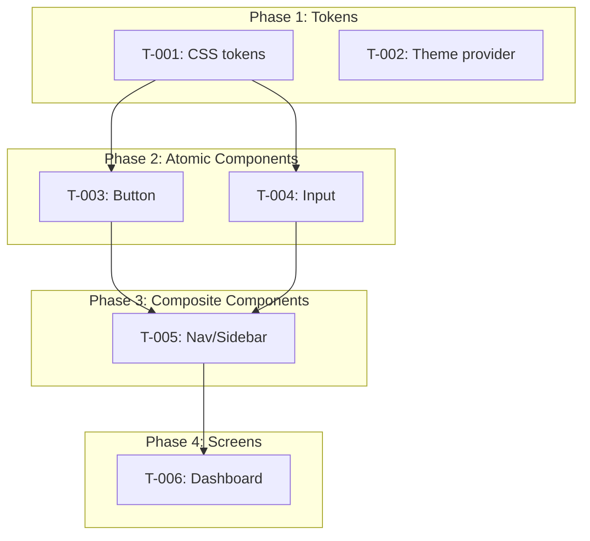

## Build Plan Mode

Generates a phased implementation task breakdown from the design system and screen mockups.
Each task maps to a design artifact with clear acceptance criteria.

**Gate**: Tokens mode must be complete (`{docsRoot}/specs/DESIGN_SYSTEM.md` exists).
Mockups mode is recommended but not required — if `UI_SCREENS.md` doesn't exist, the build
plan covers tokens and components only, without screen/layout tasks.

If tokens are incomplete: "Design system hasn't been generated yet. Run `/cl-designer tokens`
first."

If mockups are missing (but tokens exist): "No screen mockups found. I can generate a build
plan for the design system (tokens + components) without screen layouts. Run
`/cl-designer mockups` first if you want screen implementation tasks included. Proceed
with tokens-only build plan?"

---

### Step 1: Read Design Artifacts

1. Read `{docsRoot}/specs/DESIGN_SYSTEM.md` — token catalog, component catalog, traceability
2. Read `{docsRoot}/specs/UI_SCREENS.md` (if exists) — screen inventory, component usage,
   navigation flow
3. Read the PRD for feature context and priorities
4. Read Architecture doc for tech stack details (framework, styling approach, component
   library if any)

Build a dependency graph:
- Tokens → Components (components depend on tokens)
- Atomic components → Composite components (composites use atomics)
- Components → Screens (screens use components)
- Navigation → Screens (nav connects screens)

---

### Step 2: Generate Phased Task List

Organize tasks bottom-up by dependency. Five phases:

#### Phase 1: Token/Theme Setup + Accessibility Infrastructure
- Configure CSS custom properties or Tailwind theme values
- Set up theme provider (if dark/light mode)
- Create spacing/typography utility classes or tokens
- **Set up focus indicator tokens** (outline color, offset, width) as CSS custom properties
- **Verify contrast ratios** of color token combinations (text on backgrounds: 4.5:1;
  UI components: 3:1). If any fail, note in the task for user decision.
- One task per token category unless they're trivially small

#### Phase 2: Atomic Components (with behavioral states)
- Individual UI primitives (Button, Input, Select, Checkbox, Badge, etc.)
- Each component is one task (or split if it has many complex variants)
- Order by dependency — standalone components first, then ones that use others
- **Acceptance criteria include behavioral states from DESIGN_SYSTEM.md**: a Button task
  includes "renders loading state with spinner, disables during loading, shows
  `aria-busy` attribute" — not just "renders primary/secondary/ghost variants"
- **Acceptance criteria include accessibility**: keyboard interaction (Enter/Space
  activates), ARIA attributes (`aria-disabled`, `aria-busy`), focus visible styling
- **Acceptance criteria include boundary behavior**: truncation, overflow handling,
  min/max constraints from DESIGN_SYSTEM.md

#### Phase 3: Composite Components (with interaction behavior)
- Components that compose atomics (Nav/Sidebar, Modal/Dialog, Form groups, etc.)
- Each composite is one task
- Dependencies on Phase 2 components are explicit
- **Acceptance criteria include composite behavioral contracts**: Modal traps focus and
  returns on close; Form group tracks dirty/pristine/submitting states; Nav highlights
  active route
- **Acceptance criteria include accessibility**: focus trap for modals, `aria-expanded`
  for dropdowns, `aria-current="page"` for active nav

#### Phase 4: Screen Layouts / Pages + Navigation
- Only generated if UI_SCREENS.md exists
- Each screen is one task (or split for very complex screens)
- Assembles components into page layouts
- **Acceptance criteria include behavioral contracts from UI_SCREENS.md**: screen states
  (empty, loading, error), interaction flows (form submission behavior, delete
  confirmation), content for non-default states
- **Navigation and routing as a cross-cutting task in this phase**: URL structure, route
  guards, auth redirects, back behavior, focus management on navigation. If UI_SCREENS.md
  has navigation context per screen, generate a routing task that covers the full URL
  structure and auth requirements.
- **Test scenarios from UI_SCREENS.md** become acceptance criteria: "submit empty form
  → inline validation" is a verifiable condition

#### Phase 5: Integration Behavior + Responsive
- **Cross-screen behavioral flows** — interactions that span multiple screens: navigation
  transitions, state persistence across routes, shared state (badge counts, filters),
  unsaved changes warnings
- Responsive breakpoint behavior (layout changes, feature adaptation, touch vs. mouse
  differences if specified)
- Animations and transitions (if specified in behavioral walkthrough or design tokens)
- This phase is for behaviors that can't be verified in isolation — they require multiple
  screens working together

**Per task, include:**
- **Task number**: Sequential (T-001, T-002, ...)
- **Name**: Imperative form (e.g., "Implement Button component")
- **Phase**: Which phase (1–5)
- **Description**: What to build, including design context
- **Design reference**: Component or screen name + design file reference (.pen node ID or
  DESIGN_SYSTEM.md section)
- **Dependencies**: Which other tasks must complete first (by task number)
- **Acceptance criteria**: Concrete, verifiable conditions for completion. Must include
  behavioral criteria from DESIGN_SYSTEM.md (component states, accessibility) and
  UI_SCREENS.md (screen states, interaction flows, content) — not just visual rendering.
  Each behavioral contract documented in the design artifacts becomes an acceptance
  criterion in the build plan task.
- **Estimated complexity**: Simple / Medium / Complex (for prioritization, not time estimates)

---

### Step 3: Generate DESIGN_TASKS.md

Write `{docsRoot}/specs/DESIGN_TASKS.md`:

```markdown
# Design Implementation Tasks

**Generated**: [date]
**Design system**: specs/DESIGN_SYSTEM.md
**UI screens**: specs/UI_SCREENS.md [or "Not generated — tokens-only build plan"]
**PRD reference**: [filename]
**Tech stack**: [from Architecture doc — e.g., "Next.js 15, Tailwind CSS v4, shadcn/ui"]

## Dependency Graph



## Summary

| Phase | Tasks | Description |
|-------|-------|-------------|
| 1 — Tokens | N | Token/theme infrastructure |
| 2 — Atomic | N | Individual UI components |
| 3 — Composite | N | Composed components |
| 4 — Screens | N | Page layouts |
| 5 — Interactive | N | States + responsive |
| **Total** | **N** | |

## Tasks

### Phase 1: Token/Theme Setup

#### T-001: [Task Name]
- **Description**: [what to build]
- **Design reference**: [DESIGN_SYSTEM.md section or .pen node ID]
- **Dependencies**: None
- **Acceptance criteria**:
  - [ ] [concrete condition]
  - [ ] [concrete condition]
- **Complexity**: Simple

[Repeat for all tasks in phase]

### Phase 2: Atomic Components

[Same format]

### Phase 3: Composite Components

[Same format]

### Phase 4: Screen Layouts

[Same format — only if UI_SCREENS.md exists]

### Phase 5: Interactive States + Responsive

[Same format]

## Implementation Notes

[Any cross-cutting concerns: shared patterns, testing approach, accessibility requirements]
```

---

### Step 4: User Review

Present the task list summary to the user:
- Total tasks per phase
- Dependency graph (the Mermaid diagram)
- Highlight any tasks that seem unusually complex

Ask: "Here's the implementation plan: [summary]. You can reorder tasks within phases,
split complex tasks, merge simple ones, or remove tasks. Any changes?"

Apply adjustments and regenerate DESIGN_TASKS.md if needed.

---

### Update Tracking

1. Update DESIGN_PROGRESS.md:
   - Set `Build Plan` status to `Complete`
   - Record task count per phase
   - Add `Last updated` date
2. Update `{docsRoot}/STATUS.md` if it tracks design state

Tell the user: "Build plan complete. DESIGN_TASKS.md generated at
`{docsRoot}/specs/DESIGN_TASKS.md` with [N] tasks across [M] phases. Run
`/cl-reviewer design-review` to validate designs against the PRD, then
`/cl-implementer start` to generate a unified implementation plan that merges these
design tasks with tasks from tech specs."

**Note**: DESIGN_TASKS.md is a design artifact — the output of this build-plan mode.
The `cl-implementer` skill's `start` mode reads it as one of its inputs and merges the
tasks into a unified `TASKS.md` alongside tasks derived from tech specs. DESIGN_TASKS.md
remains as the build-plan source reference; TASKS.md becomes the working implementation
copy.
