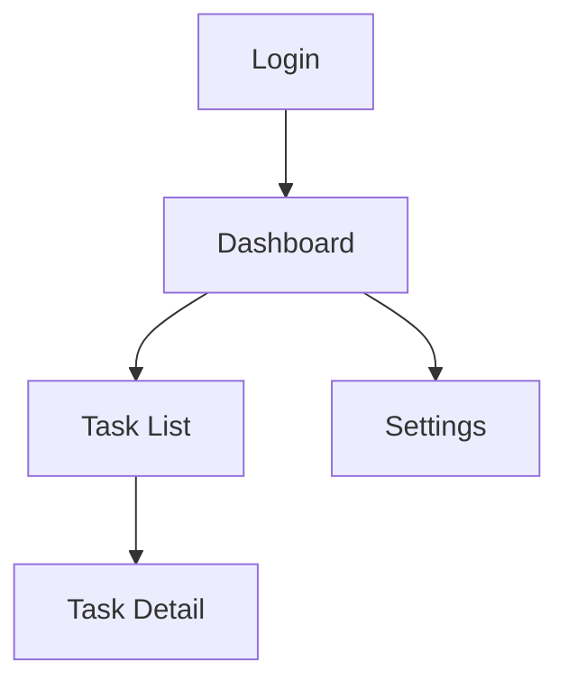

## Mockups Mode

Generates screen mockups using the design system. Produces UI_SCREENS.md with
screen-to-feature mappings and navigation flow.

**Gate**: Tokens mode must be complete. Check for:
- `{docsRoot}/specs/DESIGN_SYSTEM.md` exists
- DESIGN_PROGRESS.md shows `Tokens` status is `Complete`

If tokens are incomplete: "Design system hasn't been generated yet. Run `/cl-designer tokens`
first to create the component library, then come back for mockups."

---

### Step 1: Screen Inventory (All Paths)

Read the PRD features and cross-reference with DESIGN_SYSTEM.md components to identify all
screens/views needed.

For each screen, identify:
- **Name**: Descriptive name (e.g., "Dashboard", "Task List", "Settings")
- **PRD feature(s)**: Which features this screen serves
- **Components used**: Which design system components appear on this screen
- **Navigation**: How users get to/from this screen
- **Key interactions**: Primary user actions on this screen

Present the screen inventory: "Based on the PRD, here are the screens I'll design:

| Screen | PRD Features | Key Components |
|--------|-------------|----------------|
| [name] | [features] | [components] |
| ... | ... | ... |

Add, remove, or reorder?"

Wait for user confirmation.

---

### Pencil Path

#### Step 2: Generate Mockups

**File setup** — reuse the existing .pen file (one canvas, everything together):

1. Read `DESIGN_PROGRESS.md` for the .pen filename chosen during tokens mode (e.g.,
   `todo-app.pen`). Call `open_document("{docsRoot}/designs/{project-name}.pen")` — the
   tokens and components are already here. Mockups go on the same infinite canvas so `ref`
   nodes can reference components directly. Do NOT create a separate .pen file.
   For large projects (10+ screens), ask user if they want per-screen overflow files.

2. **Create separate top-level frames per screen group in a grid layout.** Same principle
   as the token/component frames: a single container frame forces constant zooming. Instead:
   - Create one top-level frame per feature area or user flow (e.g., "Auth Flow",
     "Dashboard", "Settings", "Task Management")
   - Size each group frame to fit its screens side-by-side (not oversized)
   - **Arrange group frames in a 2-column grid on the canvas**, not a vertical column.
     Use `find_empty_space_on_canvas` for placement. Screen groups that share navigation
     (e.g., Dashboard and Settings are both top-level nav destinations) work well side by
     side for visual comparison.
   - The user can click any group frame and zoom to fit just that flow

**Per-screen generation:**

3. For each screen in the confirmed inventory:
   - Create a labeled frame inside the correct group at the appropriate viewport size
     (desktop: 1440×900, mobile: 390×844)
   - **Use `ref` nodes to instantiate design system components — never recreate components
     from raw shapes.** A `ref` node references a reusable component created during tokens
     mode. This means: if the user later updates a Button in the design system, every screen
     that uses that Button updates automatically. Recreating components from scratch on each
     screen defeats the purpose of the design system and creates maintenance nightmares.
   - Apply layout using auto-layout properties where possible
   - Add real-ish content (not "Lorem ipsum" — use plausible text that reflects the feature)
   - **Keep every element inside its screen frame.** No floating elements on the canvas.
   - Keep `batch_design` calls to ~25 operations each

4. **Call `snapshot_layout` immediately after `batch_design` — before screenshotting.**
   Check computed bounding boxes for any elements that overlap. Common issues:
   - Text labels overlapping adjacent components (especially with long text content)
   - Nav items packed too tightly with no gap
   - Form labels overlapping input fields below them
   - Cards or list items stacked without adequate vertical gap
   If overlaps are found, fix them with another `batch_design` call before proceeding.
   Use auto-layout (`layoutMode` + `gap`) on all container elements to prevent this.
5. Call `get_screenshot` of the individual screen (zoomed in, not the full canvas)
6. Present to user with:
   - Screen name and which PRD features it covers
   - Which design system components are used and where
   - Brief walkthrough of the layout: "Top bar with nav, sidebar with filters, main area
     showing a card grid of tasks"

**Feedback loop per screen:**
- **Approved**: Record in DESIGN_PROGRESS.md with screenshot reference, move to next
- **Needs changes**: Note specific feedback, apply updates via `batch_design`, re-screenshot
- **Major rework**: Discuss layout direction before regenerating
- Record all iterations in DESIGN_PROGRESS.md

**Don't overwhelm the user.** Present one screen at a time. Explain the layout choices
briefly — why things are positioned where they are, what the user flow looks like. The user
can't evaluate a screen they don't understand.

**Batch efficiency**: For screens that share a layout pattern (e.g., list views, form pages),
generate one, get approval on the pattern, then apply it to similar screens with less
iteration.

**Parallel screen generation** (for projects with many screens):

When 5+ screens are confirmed and all reusable components exist in the design system, you
can parallelize screen generation — but carefully:

1. **Split into separate .pen files** for true parallelism. Ask the user: "You have [N]
   screens. I can generate them faster by working on multiple screens in parallel using
   separate overflow .pen files (one per screen group). This is safer than concurrent
   writes to a single file. Proceed?" The main {project-name}.pen remains the primary file.

2. **Dispatch subagents for planning, not MCP writes.** The safest parallelization pattern:
   - Dispatch subagents to plan each screen's layout (which components, where placed, what
     content) — this is pure research, no MCP calls
   - Collect all plans back to the main context
   - Execute `batch_design` calls sequentially in the main context, using the subagent plans
   - This gives you full control over MCP operations while still saving time on the
     planning-heavy part of screen generation

3. **If using per-screen .pen files**, subagents can each write to their own file safely.
   Each subagent: create file → open_document → batch_design → get_screenshot. But the
   feedback loop still happens in the main context — subagents generate, main context
   presents screenshots and gathers feedback.

4. **Never have two agents write to the same .pen file.** Pencil MCP does not support
   concurrent writes. If a subagent starts a `batch_design` operation, you cannot interrupt
   or revert it until it completes.

5. **Sequential is fine for <5 screens.** Don't over-optimize. The generate → screenshot →
   feedback loop is inherently sequential per screen anyway. Parallelization helps most
   when you can batch the generation and then review sequentially.

---

### Markdown Fallback

#### Step 2: Document Screens

For each screen, produce a structured description:

```markdown
### [Screen Name]

**Features**: [PRD features this serves]
**Route**: [suggested URL path, e.g., /dashboard]
**Viewport**: [desktop | mobile | responsive]

**Layout**:
- Header: [Nav component] with [content]
- Main: [layout type — single column, sidebar+content, grid]
  - [Section]: [Component] showing [content]
  - [Section]: [Component] showing [content]
- Footer: [if applicable]

**Components Used**:
| Component | Usage | Variant |
|-----------|-------|---------|
| Button | "Create Task" action | primary, lg |
| Card | Task items | default |
| ... | ... | ... |

**Key Interactions**:
1. [User action] → [result]
2. [User action] → [result]
```

Present each screen spec to the user for feedback.

---

### All Paths: Responsive States

If the user requested responsive design or the PRD specifies multiple viewports:

1. Identify which screens need responsive variants
2. For each responsive screen:
   - **Pencil**: Generate additional frames at mobile/tablet breakpoints
   - **Markdown**: Document layout changes per breakpoint
3. Focus on layout shifts, component visibility changes, and navigation pattern changes
   (e.g., sidebar → hamburger menu)

Ask the user: "Which screens need responsive variants? All of them, or specific ones?"

### All Paths: Generate UI_SCREENS.md

After all screens are complete, generate `{docsRoot}/specs/UI_SCREENS.md`:

```markdown
# UI Screens

**Generated**: [date]
**Source**: [Pencil (.pen file) | Manual specification]
**Design system**: specs/DESIGN_SYSTEM.md
**PRD reference**: [filename]

## Screen Inventory

| Screen | PRD Features | Route | Viewport(s) | Design Reference |
|--------|-------------|-------|-------------|-----------------|
| [name] | [features] | [path] | [desktop, mobile] | [.pen node ID | "markdown"] |
| ... | ... | ... | ... | ... |

## Navigation Flow

[Mermaid flowchart showing screen-to-screen navigation]



## Screen Details

### [Screen Name]

- **Features**: [PRD feature list]
- **Route**: [URL path]
- **Design reference**: [.pen node ID | "markdown"]

**Component Usage**:
| Component | Usage | Variant | Design System Ref |
|-----------|-------|---------|------------------|
| [name] | [how used] | [variant] | [DESIGN_SYSTEM.md section] |

**Layout Structure**:
[Brief description of layout hierarchy]

**Responsive Behavior** (if applicable):
| Breakpoint | Changes |
|-----------|---------|
| < 768px | [layout changes] |
| < 1024px | [layout changes] |

[Repeat for each screen]

## Component Coverage

| Design System Component | Used In Screens | Not Used |
|------------------------|----------------|----------|
| Button | Dashboard, Task List, Task Detail | — |
| Card | Dashboard, Task List | — |
| [unused component] | — | Not used in any screen |
```

### Checklist Gate

Read `references/design-checklist.md` and run the Mockups Checklist. Present results to user.

### Update Tracking

1. Update DESIGN_PROGRESS.md:
   - Set `Mockups` status to `Complete`
   - Record screen list with approval status
   - Add `Last updated` date
2. Update `{docsRoot}/STATUS.md` if it tracks design state

Tell the user: "Screen mockups complete. UI_SCREENS.md generated at
`{docsRoot}/specs/UI_SCREENS.md`. Run `/cl-designer build-plan` to generate implementation
tasks from the design system and screens."
