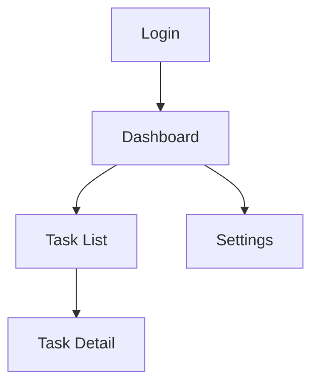

## Mockups Mode

Generates screen mockups using the design system. Produces UI_SCREENS.md with
screen-to-feature mappings and navigation flow.

**Gate**: Tokens mode must be complete. Check for:
- `{docsRoot}/specs/DESIGN_SYSTEM.md` exists
- DESIGN_PROGRESS.md shows `Tokens` status is `Complete`

If tokens are incomplete: "Design system hasn't been generated yet. Run `/cl-designer tokens`
first to create the component library, then come back for mockups."

---

### Step 1: Screen Inventory (All Paths)

Read the PRD features and cross-reference with DESIGN_SYSTEM.md components to identify all
screens/views needed.

For each screen, identify:
- **Name**: Descriptive name (e.g., "Dashboard", "Task List", "Settings")
- **PRD feature(s)**: Which features this screen serves
- **Components used**: Which design system components appear on this screen
- **Navigation**: How users get to/from this screen
- **Key interactions**: Primary user actions on this screen

Present the screen inventory: "Based on the PRD, here are the screens I'll design:

| Screen | PRD Features | Key Components |
|--------|-------------|----------------|
| [name] | [features] | [components] |
| ... | ... | ... |

Add, remove, or reorder?"

Wait for user confirmation.

---

### Pencil Path

#### Step 2: Generate Mockups

**File setup** — reuse the existing .pen file (one canvas, everything together):

1. Read `DESIGN_PROGRESS.md` for the .pen filename chosen during tokens mode (e.g.,
   `todo-app.pen`). Call `open_document("{docsRoot}/designs/{project-name}.pen")` — the
   tokens and components are already here. Mockups go on the same infinite canvas so `ref`
   nodes can reference components directly. Do NOT create a separate .pen file.
   For large projects (10+ screens), ask user if they want per-screen overflow files.

2. **Create separate top-level frames per screen group in a grid layout.** Same principle
   as the token/component frames: a single container frame forces constant zooming. Instead:
   - Create one top-level frame per feature area or user flow (e.g., "Auth Flow",
     "Dashboard", "Settings", "Task Management")
   - Size each group frame to fit its screens side-by-side (not oversized)
   - **Arrange group frames in a 2-column grid on the canvas**, not a vertical column.
     Use `find_empty_space_on_canvas` for placement. Screen groups that share navigation
     (e.g., Dashboard and Settings are both top-level nav destinations) work well side by
     side for visual comparison.
   - The user can click any group frame and zoom to fit just that flow

**Per-screen generation:**

3. For each screen in the confirmed inventory:
   - Create a labeled frame inside the correct group at the appropriate viewport size
     (desktop: 1440×900, mobile: 390×844)
   - **Use `ref` nodes to instantiate design system components — never recreate components
     from raw shapes.** A `ref` node references a reusable component created during tokens
     mode. This means: if the user later updates a Button in the design system, every screen
     that uses that Button updates automatically. Recreating components from scratch on each
     screen defeats the purpose of the design system and creates maintenance nightmares.
   - Apply layout using auto-layout properties where possible
   - Add real-ish content (not "Lorem ipsum" — use plausible text that reflects the feature)
   - **Keep every element inside its screen frame.** No floating elements on the canvas.
   - Keep `batch_design` calls to ~25 operations each
   - **Apply Gestalt constraints during layout composition** (see
     `references/visual-quality-rules.md`):
     - **Proximity**: Use smaller gaps within groups (8–12px), larger gaps between groups
       (24–32px). A form label and its input use 4–8px gap; adjacent form groups use 16–24px.
       Related actions (Save + Cancel) share a tight container; unrelated sections have ≥32px.
     - **Similarity**: Same-function elements share visual treatment. All nav items use the
       same font size + weight. All cards at the same level share shadow + radius + padding.
       If you're placing three feature cards side by side, they must be visually identical
       in structure — only content differs.
     - **Closure**: Group related content inside container frames. A form section gets its own
       frame with padding. A metrics row gets its own frame. Don't scatter related elements
       as siblings of a flat parent — add intermediate grouping frames.
     - **Hierarchy**: One focal point per section. The page title is the largest text. The
       primary CTA is the most visually prominent button. Section headings are visibly larger
       than body text (see spatial hierarchy rules in visual-quality-rules.md).

4. **Run the visual verification protocol after each `batch_design` call** (see
   `references/visual-quality-rules.md` for the full protocol):

   **Step 1 — Layout integrity**: Call `snapshot_layout`. Check for overlapping bounding
   boxes, elements escaping containers, zero-size elements. Common issues:
   - Text labels overlapping adjacent components (especially with long text content)
   - Nav items packed too tightly with no gap
   - Form labels overlapping input fields below them
   - Cards or list items stacked without adequate vertical gap
   Fix overlaps with another `batch_design` call before proceeding.

   **Step 2 — Gestalt compliance**: Review the layout structure:
   - Are related elements grouped with tight spacing, unrelated ones separated wider?
   - Do same-function elements share visual attributes?
   - Are related groups contained in bounded parent frames?
   - Is there one clear focal point per section?

   **Step 3 — Accessibility spot check**:
   - Text contrast against backgrounds (especially secondary text, disabled states, text
     on colored cards or banners)
   - Interactive element sizes ≥ 24×24px
   - Every input has a visible label
   - Heading sizes descend correctly (H1 > H2 > H3)

   **Step 4 — Visual confirmation**: Call `get_screenshot` and self-check before presenting.

   If any step reveals issues, fix before proceeding to the next screen or presenting to
   the user. Don't accumulate quality debt across screens.

5. Present the screenshot from Step 4 to user with:
   - Screen name and which PRD features it covers
   - Which design system components are used and where
   - Brief walkthrough of the layout: "Top bar with nav, sidebar with filters, main area
     showing a card grid of tasks"

#### Screen Review

**Check the review style** from `.clarity-loop.json` (`ux.reviewStyle`). Default is
`"batch"`. If `"serial"`, use the serial path below. If the value is unrecognized, fall
back to `"batch"` and warn the user.

##### Batch Review (Default)

Generate ALL screens before presenting any for review:

1. **Generate all screens** (Step 2 per-screen generation above). Run `snapshot_layout`
   after each `batch_design` call. Fix overlaps immediately but don't stop for user
   feedback.

2. **Present the batch.** Take one screenshot per screen group (feature area), or a
   grid if the screen count is small (<=6). Present with a summary:

   | Screen | PRD Features | Components Used | Screenshots |
   |--------|-------------|-----------------|-------------|
   | Dashboard | Task overview, metrics | Card, Badge, Nav | [screenshot link] |
   | Task List | CRUD, filtering, bulk | Card, Button, Select, Input | [screenshot link] |
   | Settings | User prefs, theme | Input, Select, Toggle | [screenshot link] |

   "Here are all [N] screens. Review the layouts and flag any that need changes."

3. **Gather batch feedback.** User responds: "Dashboard card layout is wrong, Settings
   page needs more spacing, rest looks good."

4. **Revise flagged screens.** Discuss the specific issue, apply updates, re-screenshot.

5. **Record** batch-approved and revised screens in DESIGN_PROGRESS.md.

##### Serial Review (Opt-in)

When `ux.reviewStyle` is `"serial"`: present one screen at a time with the existing
feedback loop (Approved / Needs changes / Major rework).

**Parallel screen generation** (for projects with many screens):

When 5+ screens are confirmed and all reusable components exist in the design system, you
can parallelize screen generation — but carefully:

1. **Split into separate .pen files** for true parallelism. Ask the user: "You have [N]
   screens. I can generate them faster by working on multiple screens in parallel using
   separate overflow .pen files (one per screen group). This is safer than concurrent
   writes to a single file. Proceed?" The main {project-name}.pen remains the primary file.

2. **Dispatch subagents for planning, not MCP writes.** The safest parallelization pattern:
   - Dispatch subagents to plan each screen's layout (which components, where placed, what
     content) — this is pure research, no MCP calls
   - Collect all plans back to the main context
   - Execute `batch_design` calls sequentially in the main context, using the subagent plans
   - This gives you full control over MCP operations while still saving time on the
     planning-heavy part of screen generation

3. **If using per-screen .pen files**, subagents can each write to their own file safely.
   Each subagent: create file → open_document → batch_design → get_screenshot. But the
   feedback loop still happens in the main context — subagents generate, main context
   presents screenshots and gathers feedback.

4. **Never have two agents write to the same .pen file.** Pencil MCP does not support
   concurrent writes. If a subagent starts a `batch_design` operation, you cannot interrupt
   or revert it until it completes.

5. **Sequential is fine for <5 screens.** Don't over-optimize. The generate → screenshot →
   feedback loop is inherently sequential per screen anyway. Parallelization helps most
   when you can batch the generation and then review sequentially.

#### Step 3: Behavioral Walkthrough (Per Screen)

After visual approval, run the behavioral walkthrough for each screen. For the full
walkthrough process, read `references/behavioral-walkthrough.md`.

---

### Markdown Fallback

#### Step 2: Document Screens

For each screen, produce a structured description:

```markdown
### [Screen Name]

**Features**: [PRD features this serves]
**Route**: [suggested URL path, e.g., /dashboard]
**Viewport**: [desktop | mobile | responsive]

**Layout**:
- Header: [Nav component] with [content]
- Main: [layout type — single column, sidebar+content, grid]
  - [Section]: [Component] showing [content]
  - [Section]: [Component] showing [content]
- Footer: [if applicable]

**Components Used**:
| Component | Usage | Variant |
|-----------|-------|---------|
| Button | "Create Task" action | primary, lg |
| Card | Task items | default |
| ... | ... | ... |

**Key Interactions**:
1. [User action] → [result]
2. [User action] → [result]
```

Present all screen specs as a set with a summary table. The user flags items needing
changes rather than reviewing each screen sequentially. Same batch/serial/minimal review
pattern as the Pencil path above applies here.

#### Step 3: Behavioral Walkthrough (Per Screen)

Same behavioral walkthrough process as the Pencil path. For the full walkthrough process,
read `references/behavioral-walkthrough.md`. The only difference is that all states are
described in structured text rather than generated as visual variants.

---

#### Behavioral Walkthrough

After screen review, run the behavioral walkthrough. Read
`references/behavioral-walkthrough.md` for the full process, including batch mode
(generate-confirm, default), serial mode (conversational, opt-in), and hybrid approaches.

---

### All Paths: Responsive States

If the user requested responsive design or the PRD specifies multiple viewports:

1. Identify which screens need responsive variants
2. For each responsive screen:
   - **Pencil**: Generate additional frames at mobile/tablet breakpoints
   - **Markdown**: Document layout changes per breakpoint
3. Focus on layout shifts, component visibility changes, and navigation pattern changes
   (e.g., sidebar → hamburger menu)

Ask the user: "Which screens need responsive variants? All of them, or specific ones?"

### All Paths: Generate UI_SCREENS.md

After all screens are complete, generate `{docsRoot}/specs/UI_SCREENS.md`:

```markdown
# UI Screens

**Generated**: [date]
**Source**: [Pencil (.pen file) | Manual specification]
**Design system**: specs/DESIGN_SYSTEM.md
**PRD reference**: [filename]

## Screen Inventory

| Screen | PRD Features | Route | Viewport(s) | Design Reference |
|--------|-------------|-------|-------------|-----------------|
| [name] | [features] | [path] | [desktop, mobile] | [.pen node ID | "markdown"] |
| ... | ... | ... | ... | ... |

## Navigation Flow

[Mermaid flowchart showing screen-to-screen navigation]



## Screen Details

### [Screen Name]

- **Features**: [PRD feature list]
- **Route**: [URL path] — **Auth**: [required | optional | none] — **Back**: [browser back to previous | in-app to parent]
- **Focus on arrival**: [element that receives focus, e.g., page heading, search input, first list item]
- **State persistence**: [what's preserved when navigating away and returning: scroll position, filter state, form data, etc.]
- **Design reference**: [.pen node ID | "markdown"]

**Component Usage**:
| Component | Usage | Variant | Design System Ref |
|-----------|-------|---------|------------------|
| [name] | [how used] | [variant] | [DESIGN_SYSTEM.md section] |

**Layout Structure**:
[Brief description of layout hierarchy]

**Screen States**:
| State | Trigger | Visual | Content | Components Used |
|-------|---------|--------|---------|-----------------|
| Default | Data loaded | [default mockup ref] | — | [primary components] |
| Empty (first-use) | No data | [variant ref or "described"] | "[actual copy, e.g., Create your first task]" | EmptyState, Button |
| Empty (filtered) | No filter matches | [variant ref or "described"] | "[actual copy, e.g., No tasks match your filters]" | EmptyState |
| Loading | Fetch in progress | [variant ref or "described"] | — | Skeleton |
| Error | Fetch failed | [variant ref or "described"] | "[actual copy, e.g., Couldn't load tasks. Try again?]" | ErrorBanner, Button |

States that don't apply to this screen are omitted (not marked N/A).

**Interaction Flows**:
| User Action | Expected Behavior | Error Case | Accessibility |
|-------------|-------------------|------------|---------------|
| [action] | [what happens — be specific] | [what happens on failure] | [focus, ARIA, keyboard notes] |
| [action] | [behavior] | [error behavior] | [a11y notes] |

**Test Scenarios** (derived from screen states and interactions):
- [scenario: expected outcome]
- [scenario: expected outcome]
- [scenario: expected outcome]

**Responsive Behavior** (if applicable):
| Breakpoint | Changes |
|-----------|---------|
| < 768px | [layout changes] |
| < 1024px | [layout changes] |

[Repeat for each screen]

## Component Coverage

| Design System Component | Used In Screens | Not Used |
|------------------------|----------------|----------|
| Button | Dashboard, Task List, Task Detail | — |
| Card | Dashboard, Task List | — |
| [unused component] | — | Not used in any screen |
```

### Parallelization Hints

When `ux.parallelGeneration` is `true` (default):

| User is reviewing... | Skill can pre-generate... | Invalidation risk |
|---------------------|--------------------------|-------------------|
| Screen inventory confirmation | Start generating confirmed screens | Low -- inventory is usually approved as-is |
| Screen batch (visual review) | Behavioral specs for all screens | Medium -- screen changes may affect behavioral specs |
| Behavioral spec batch review | UI_SCREENS.md output file | Low |
| Build plan review | Spec generation prep (read all system docs) | Medium -- build plan changes may affect spec approach |

**Key opportunity**: While the user reviews the visual mockup batch, pre-generate ALL
behavioral specs. This is the highest-value parallelization -- behavioral specs are
derived from DECISIONS.md + PRD + mockups, and the mockup batch is rarely rejected wholesale.

### Checklist Gate

Read `references/design-checklist.md` and run the Mockups Checklist. Present results to user.

### Update Tracking

1. Update DESIGN_PROGRESS.md:
   - Set `Mockups` status to `Complete`
   - Record screen list with approval status
   - Add `Last updated` date
2. Update `{docsRoot}/STATUS.md` if it tracks design state

Tell the user: "Screen mockups complete. UI_SCREENS.md generated at
`{docsRoot}/specs/UI_SCREENS.md`. Run `/cl-designer build-plan` to generate implementation
tasks from the design system and screens."
