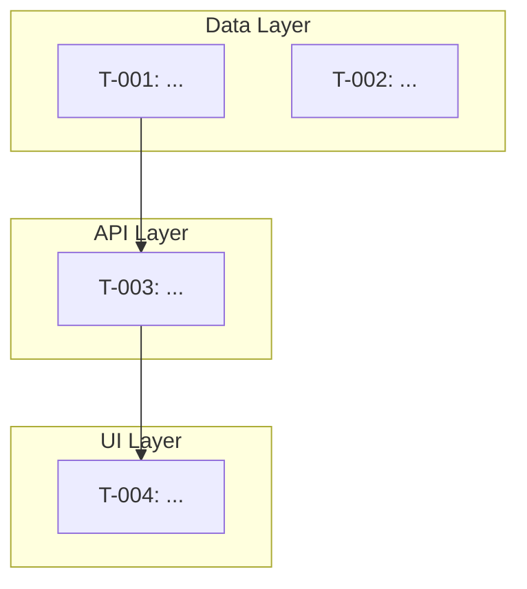

## Start Mode

Generates a unified `TASKS.md` from all spec artifacts. This is the entry point for
implementation — run it once after specs are generated and reviewed.

If TASKS.md already exists: "An implementation plan already exists with [N] tasks ([M]
complete). Re-running start will regenerate from current specs and reset incomplete tasks.
Continue? This is usually only needed if specs were regenerated from scratch."

---

### Step 1: Pre-Checks

Run these checks before generating anything:

1. **Specs exist** — Read `{docsRoot}/specs/.spec-manifest.md`. If it doesn't exist:
   "No specs found. Run `/cl-implementer spec` first to create implementation specs."
   Stop.

2. **Spec review** — Check if any spec review output exists (from `/cl-implementer spec-review`).
   If not: "Specs haven't been reviewed for consistency. Consider running `/cl-implementer
   review` before implementation to catch cross-spec issues. Continue anyway? [Y/n]"

3. **Git repository** — Check if the project root is a git repository (`git rev-parse
   --git-dir`). If not:
   "This project isn't a git repository. Git enables implementation tracking — change
   detection, reconciliation on resume, regression identification. Initialize now? [Y/n]"
   - If yes: run `git init`. Offer to create an initial commit: "Create an initial commit
     with the current project state? This gives reconciliation a clean baseline. [Y/n]"
   - If no: warn "Without git, reconciliation accuracy is reduced. External changes may be
     missed or misattributed. The implementer will fall back to file modification timestamps."

4. **Spec coverage** — Cross-reference system doc areas against spec coverage. Read the
   system doc manifest (`{docsRoot}/system/.manifest.md`) and compare topics covered in
   system docs vs topics covered in specs. Warn on significant gaps:
   - "Your PRD describes [X] but no spec covers it. This area won't have implementation
     tasks. Intentional?"
   - Special case: if `TEST_SPEC.md` exists in `{docsRoot}/specs/`, test tasks will be
     generated automatically (see Step 3). If `TEST_SPEC.md` does NOT exist but system docs
     mention testing requirements (search PRD for "test", "coverage", "CI", "CI/CD"), warn:
     "System docs mention testing but no TEST_SPEC.md exists. Options:
     a) Regenerate specs with `/cl-implementer spec` — this will produce TEST_SPEC.md
     b) Add test tasks manually to TASKS.md after generation
     c) Skip — implement features first, address testing later"

5. **Context freshness** — If `{docsRoot}/context/.context-manifest.md` exists:
   - Read the manifest, get all library entries
   - For each library: compare version in `_meta.md` against `package.json` (or equivalent
     dependency file). Flag mismatches:
     "Context for [library] covers version [X] but package.json has [Y]. Context may be
     stale. Options:
     a) Run `/cl-researcher context [library]` to update
     b) Continue with current context (your call — may cause build issues)
     c) Skip context for this library"
   - Check `Last verified` dates against freshness thresholds (default: 7 days). Warn on
     stale context but don't block.
   - If no context manifest exists: "No context files found. Context files help avoid stale
     library knowledge during implementation. Run `/cl-researcher context` to create them,
     or continue without. [Continue/Create context]"

6. **Transition advisory** — Read PARKING.md Active section. If any `architectural` items
   exist, surface them:
   "There are [N] architectural items parked: [list]. These may affect implementation tasks."
   Never block. The user can always say "proceed."

**Batch presentation**: Present all pre-check results as a single status table:

| Check | Status | Action Needed |
|-------|--------|--------------|
| Specs exist | Pass | -- |
| Spec review | Advisory | Not reviewed yet (recommend `/cl-implementer spec-review`) |
| Git repository | Pass / Action | [init or skip] |
| Spec coverage | Pass / Gaps | [list gaps with recommended action per gap] |
| Context freshness | Pass / Stale | [list stale libraries with recommended action] |
| Transition advisory | Pass / Advisory | [architectural items if any] |

"Pre-checks complete. [N items need attention]. Address now or proceed?"

For each gap or stale item, include a recommended action inline so the user can approve
the batch in one response: "Specs not reviewed: recommend running spec-review first but
not blocking. Git repo: initialized. Context for drizzle-orm: stale (7 days), recommend
refresh. Proceed with these defaults, or adjust?"

---

### Step 2: Read All Spec Artifacts

1. Parse `.spec-manifest.md` — extract the list of spec files, their source doc mappings,
   cross-spec dependencies, and the content hash.

2. Read each spec file in full. For each, extract:
   - Defined types, entities, interfaces, contracts
   - Behavioral rules and constraints
   - Dependencies on other specs
   - Acceptance-testable conditions (these become task acceptance criteria)

3. Read `{docsRoot}/specs/DESIGN_TASKS.md` if it exists (from cl-designer build-plan mode).
   Parse its task structure: IDs, phases, dependencies, acceptance criteria, design references.

4. Read Architecture doc for tech stack context (framework, language, styling approach) —
   this informs task descriptions and complexity estimates.

5. Read `{docsRoot}/specs/TEST_SPEC.md` if it exists. Parse its structure:
   - Test architecture (mock boundaries, test data strategy, environment requirements)
   - Per-module unit test cases
   - Cross-spec integration contracts
   - Contract test definitions

---

### Step 3: Generate Unified TASKS.md

Write `{docsRoot}/specs/TASKS.md` with this structure:

```markdown
# Implementation Tasks

**Generated**: [date]
**Spec version**: [content hash from .spec-manifest.md]
**Source specs**: [list of spec files used]
**Source design tasks**: [DESIGN_TASKS.md or "None"]

## Dependency Graph



## Area: Data Layer

### T-001: [Task Name]
- **Spec reference**: [spec-file.md], [Section or path]
- **Spec hash**: [hash of the referenced spec section]
- **Dependencies**: None
- **Status**: pending
- **Source**: spec-derived
- **Acceptance criteria**:
  - [ ] [concrete, verifiable condition from spec]
  - [ ] [another condition]
- **Complexity**: Simple | Medium | Complex

### T-002: [Task Name]
...

## Area: API Layer
...

## Area: UI Layer
...

## Session Log
| Date | Session | Tasks Touched | Spec Gaps Found | Files Modified |
|------|---------|--------------|-----------------|----------------|
```

**Task generation rules:**

1. **One task per bounded implementation unit.** A database table is one task. An API
   endpoint group (CRUD for one resource) is one task. A UI component is one task. Don't
   split too fine (individual columns) or too coarse (entire API layer).

2. **Areas, not phases.** Group by domain (Data, API, UI, Infrastructure, Testing), not by
   build order. The dependency graph handles ordering. Cross-area dependencies are the whole
   point — a screen task can depend on both a component task (UI) and an API task (backend).

3. **DESIGN_TASKS.md merge.** If DESIGN_TASKS.md exists, merge its tasks into the
   appropriate area (usually UI Layer). Renumber sequentially based on dependency-aware
   ordering. Preserve original DESIGN_TASKS.md references within task descriptions (e.g.,
   "Originally DESIGN_TASKS T-003"). DESIGN_TASKS.md remains as a design artifact; TASKS.md
   is the working implementation copy.

4. **Acceptance criteria from specs.** Each criterion must be concrete and verifiable —
   something that can be checked by reading code, running the app, or executing a test.
   "Implements the auth flow" is bad. "POST /auth/login returns a JWT with 1h expiry" is
   good.

5. **Spec hash per task.** Record the content hash of the specific spec section each task
   derives from. This enables validity checking during `sync` mode — if the spec section
   changes, the task's hash won't match.

6. **Task IDs are sequential.** T-001, T-002, T-003... regardless of area. The dependency
   graph provides ordering, not the ID numbers.

7. **Source marker.** All spec-derived tasks get `source: spec-derived`. Later, user-added
   tasks get `source: user-added` — they're tracked for progress but excluded from spec-based
   verification and sync.

8. **Test infrastructure task.** If TEST_SPEC.md exists, generate a test infrastructure
   task in the "Testing" area:

   ```markdown
   ## Area: Testing

   ### T-00X: Test Infrastructure Setup
   - **Spec reference**: TEST_SPEC.md, Test Architecture section
   - **Spec hash**: [hash]
   - **Dependencies**: None
   - **Status**: pending
   - **Source**: spec-derived
   - **Acceptance criteria**:
     - [ ] Test runner configured ([framework] from TEST_SPEC.md/DECISIONS.md)
     - [ ] Test database setup (if TEST_SPEC.md requires it for integration tests)
     - [ ] Mock server configured (if TEST_SPEC.md specifies external API mocking)
     - [ ] Factory functions created for each entity in TEST_SPEC.md Test Data table
     - [ ] Test helper utilities in place (e.g., `createAuthenticatedContext()`)
     - [ ] `npm test` (or equivalent) runs and passes with zero tests
   - **Complexity**: Medium
   ```

   This task has NO dependencies and can run in parallel with early implementation tasks.

9. **Unit test tasks.** For each per-module section in TEST_SPEC.md, generate a unit test
   task that FOLLOWS its corresponding implementation task:

   ```markdown
   ### T-005T: Auth Service Unit Tests
   - **Spec reference**: TEST_SPEC.md, Per-Module Test Cases > Auth Service
   - **Spec hash**: [hash of TEST_SPEC.md section]
   - **Dependencies**: T-005 (Auth Service implementation), T-00X (Test Infrastructure)
   - **Status**: pending
   - **Source**: spec-derived
   - **Acceptance criteria**:
     - [ ] Unit tests cover all functions in TEST_SPEC.md table for this module
     - [ ] Edge cases from TEST_SPEC.md table are tested
     - [ ] Mock boundaries match TEST_SPEC.md specification
     - [ ] All tests pass
   - **Complexity**: [derived from implementation task complexity]
   ```

   Unit test task IDs use the `T-NNNT` suffix convention — tied to their implementation
   task. This makes the relationship visible in TASKS.md and the dependency graph.

10. **Integration test tasks.** For each cross-spec integration contract in TEST_SPEC.md,
    generate an integration test task that depends on ALL implementation tasks it spans:

    ```markdown
    ### T-0XX: Data-API Integration Tests
    - **Spec reference**: TEST_SPEC.md, Cross-Spec Integration Contracts > Data ↔ API
    - **Spec hash**: [hash]
    - **Dependencies**: T-001 (DB schema), T-002 (Auth service), T-003 (API endpoints), T-00X (Test Infrastructure)
    - **Status**: pending
    - **Source**: spec-derived
    - **Acceptance criteria**:
      - [ ] Full request lifecycle flows tested per TEST_SPEC.md
      - [ ] Error propagation chains verified per TEST_SPEC.md
      - [ ] All integration tests pass against running test environment
    - **Complexity**: Complex
    ```

    Integration test tasks are placed in the "Testing" area and positioned in the
    dependency graph AFTER all implementation tasks they span.

11. **Contract test tasks.** For each contract in TEST_SPEC.md's Contract Tests section,
    generate a task verifying cross-layer contracts:

    ```markdown
    ### T-0XX: API-Frontend Contract Tests
    - **Spec reference**: TEST_SPEC.md, Contract Tests
    - **Spec hash**: [hash]
    - **Dependencies**: [API implementation tasks], [Frontend implementation tasks], T-00X (Test Infrastructure)
    - **Status**: pending
    - **Source**: spec-derived
    - **Acceptance criteria**:
      - [ ] Response shapes verified against consumer type expectations
      - [ ] All contract tests pass
    - **Complexity**: Medium
    ```

12. **Operational infrastructure tasks.** If operational specs exist (CONFIG_SPEC.md,
    observability sections, code conventions, migration notes), generate early
    infrastructure tasks in an "Infrastructure" area:

    ```markdown
    ## Area: Infrastructure

    ### T-00X: Project Scaffolding
    - **Spec reference**: CODE_CONVENTIONS section from operational specs
    - **Spec hash**: [hash of the referenced spec section]
    - **Dependencies**: None
    - **Status**: pending
    - **Source**: spec-derived
    - **Acceptance criteria**:
      - [ ] Directory structure created per code conventions spec
      - [ ] Path aliases configured (if specified)
      - [ ] Barrel exports set up (if specified)
      - [ ] .env.example created with all CONFIG_SPEC.md variables
    - **Complexity**: Simple

    ### T-00X: Config & Environment Setup
    - **Spec reference**: CONFIG_SPEC.md
    - **Spec hash**: [hash of the referenced spec section]
    - **Dependencies**: None
    - **Status**: pending
    - **Source**: spec-derived
    - **Acceptance criteria**:
      - [ ] Config validation runs at startup (crashes on missing required vars)
      - [ ] .env.example documents all variables with descriptions
      - [ ] Secrets are loaded from env vars (not hardcoded)
      - [ ] Feature flag system in place (if CONFIG_SPEC.md specifies flags)
    - **Complexity**: Simple

    ### T-00X: Observability Setup
    - **Spec reference**: Observability section from operational specs
    - **Spec hash**: [hash of the referenced spec section]
    - **Dependencies**: None
    - **Status**: pending
    - **Source**: spec-derived
    - **Acceptance criteria**:
      - [ ] Structured logger configured (JSON format in production)
      - [ ] Request correlation ID middleware in place
      - [ ] GET /health endpoint returns status with dependency checks
      - [ ] Log levels configurable via environment
    - **Complexity**: Simple
    ```

    These tasks have NO dependencies (or only depend on scaffolding) and can run in
    parallel with the test infrastructure task and early implementation tasks. The
    scaffolding task should be first — it creates the directory structure other tasks
    build in.

    **Conditional generation**: Only generate tasks for specs that exist. If no
    CONFIG_SPEC.md, skip the config task. If no observability section, skip that task.
    If no code conventions section, skip scaffolding.

13. **Migration tasks.** If data specs include migration notes, generate migration tasks
    that depend on the database schema implementation task:

    ```markdown
    ### T-00X: Database Migration Setup
    - **Spec reference**: Migration notes from [data-spec.md]
    - **Spec hash**: [hash of the referenced spec section]
    - **Dependencies**: T-[schema-task] (schema implementation)
    - **Status**: pending
    - **Source**: spec-derived
    - **Acceptance criteria**:
      - [ ] Migration tool configured per spec
      - [ ] Initial migration created and runs successfully
      - [ ] Rollback tested (migration can be reversed)
      - [ ] Seed data script creates required reference data
      - [ ] Development data script creates realistic sample data
    - **Complexity**: Medium
    ```

---

### Step 4: Identify Parallelizable Groups

Analyze the dependency graph and file paths to find independent task groups:

- Tasks with NO dependency relationship (direct or transitive) between them
- Tasks that modify different files/directories (no shared code surface area)
- Tasks that don't share interface boundaries (unless the interface is defined upfront in
  a spec)

Present identified groups:
"These task groups can run in parallel (no shared dependencies or files):
  Group A: T-001, T-002 (Data Layer)
  Group B: T-005, T-006 (UI tokens + components)
Parallel execution uses Claude Code's fork capability. Approve? [Y/n/disable]"

If user disables: note in TASKS.md Session Log that parallel execution is off.

---

### Step 5: User Review and Reordering

Present the full plan:
1. The dependency graph (Mermaid visualization)
2. The suggested implementation order (topological sort)
3. Parallelizable groups (if identified)
4. Total task count by area
5. Any spec coverage gaps found in pre-checks

"Here's the implementation plan: [N] tasks across [M] areas. You can reorder, split, merge,
skip, or add tasks. The dependency graph enforces hard constraints (can't build a component
before its tokens). Within those constraints, the order is yours. Any changes?"

Process user adjustments:
- **Reorder**: Move tasks, update dependency graph if needed
- **Split**: Break one task into subtasks, preserve spec references
- **Merge**: Combine tasks, union acceptance criteria
- **Skip**: Mark as `skipped` with reason. Check transitive dependents — if the requirement
  is satisfied externally (e.g., database already exists), mark `satisfied-externally` and
  unblock dependents. If not, flag dependents.
- **Add**: User-inserted tasks get `source: user-added` marker
- **Change dependencies**: Validate no circular deps, no orphaned references

After adjustments, regenerate the dependency graph if it changed.

---

### Step 6: Initialize TASKS.md Session Log

Add the Session Log section to `{docsRoot}/specs/TASKS.md` (generated in Step 3) with
initial metadata:

```markdown
## Session Log
| Date | Session | Tasks Touched | Spec Gaps Found | Files Modified |
|------|---------|--------------|-----------------|----------------|
| [date] | start | — | — | TASKS.md |
```

Record the spec version, git tracking status (from Step 1), and parallel execution
setting (from Step 4) as the first session entry.

---

### Step 7: Populate Claude Code Tasks

For each task in TASKS.md, create a Claude Code task via `TaskCreate`:
- `subject`: Task ID + name (e.g., "T-001: Create database schema")
- `description`: Full task details including spec reference and acceptance criteria
- `activeForm`: Present continuous (e.g., "Creating database schema")

Set up `blockedBy` relationships matching the dependency graph.

This is the dual-write pattern: TASKS.md is the persistent source of truth (survives
sessions, crashes, context compression). Claude Code tasks are the active session view
(progress spinner, status display). Every state change must update both.

**Parallelization hint**: While the user reviews the task list (Step 5), pre-populate
Claude Code tasks (Step 7) for tasks that are dependency-free. If the user reorders,
update the task dependencies but the basic task entries are already created.
Invalidation risk: Medium -- user may split/merge/reorder tasks.

---

### Completion

Tell the user:
"Implementation plan ready. {N} tasks across {M} areas. Run `/cl-implementer run` to start
processing the queue, or `/cl-implementer status` for an overview."
